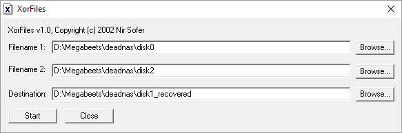
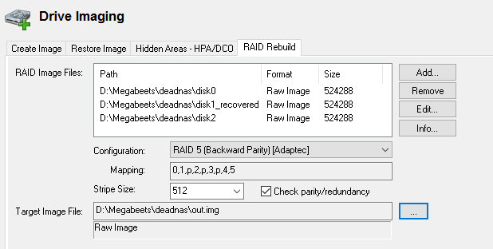
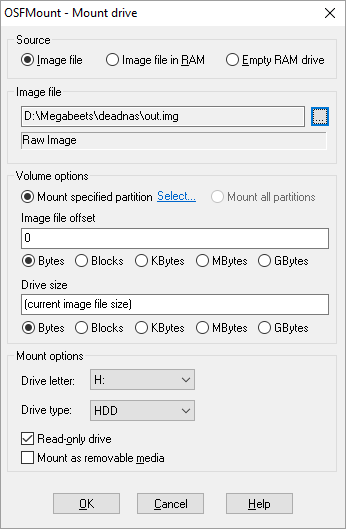
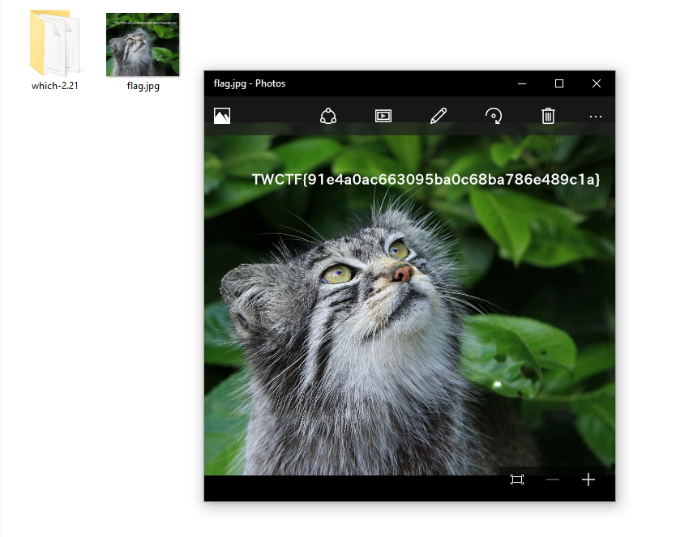

> **Challenge description:**
> 
> _Today, our 3-disk NAS has failed. Please recover flag._  
> _[deadnas.7z][1]{.attachment}_

* * *

We are given an archive containing 3 files:

```sh
D:\Megabeets\deadnas> dir 
Directory of D:\Megabeets\deadnas
        .
        ..
524,288 disk0
     12 disk1
524,288 disk2
```


3 Disk NAS and one has failed? This challenge is obviously about [RAID 5][2]. I was asked to find a way to recover the failed disk and there is no simpler way than just XOR disk0 with disk2 and recreate the original disk1. If you are right now in your &#8220;WTF?!&#8221; mode you better go read about RAID 5 until you understand how it works.

I used simple software called [XorFiles][3].

 

I then used OSForensics to rebuild the RAID:

 

Mounted the output file:

 

And accessed the new drive. The flag and a cute cat was waiting for me there.

 

<span style="font-size: 10pt; color: #ff0000;">* I know you tried using <strong>mdadm</strong> and <strong>ReclaiMe</strong>. Poor you.</span>


 [1]: https://twctf7qygt6ujk.azureedge.n./deadnas.7z-b1651b1230b507235cbb9c6f7e98ccc437f5f3675d02a5e70951e2cbcf9df407
 [2]: http://blog.open-e.com/how-does-raid-5-work/
 [3]: http://www.nirsoft.net/utils/xorfiles.html