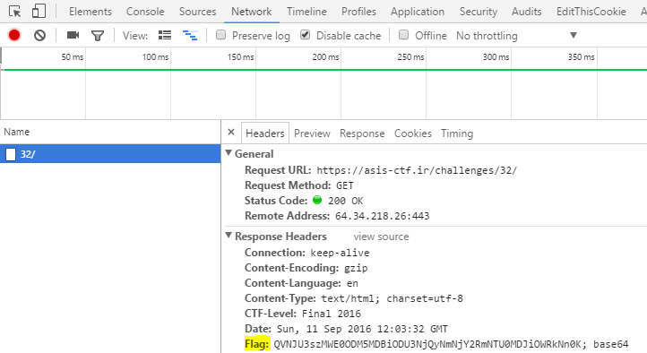

> _**Description:**http://www.megabeets.net/wp-admin/profile.php  
> Watch your heads!_

The description is telling the whole story. Simply look in the response&#8217;s header and you&#8217;ll find the flag. In order to do that open the browser&#8217;s Developer Tools (F12), bring to focus the Network tab and click the challenge. The HTTP requests will show up on the left panel. Select the request and the **Flag** header will be displayed on the right panel.

<div class="header-name">
  
</div>

&nbsp;

Decode the string with base64 and reveal the flag.

```sh
$ echo QVNJU3szMWE0ODM5MDBiODU3NjQyNmNjY2RmNTU0MDJiOWRkNn0K | base64 --decode
ASIS{31a483900b8576426cccdf55402b9dd6}

```


