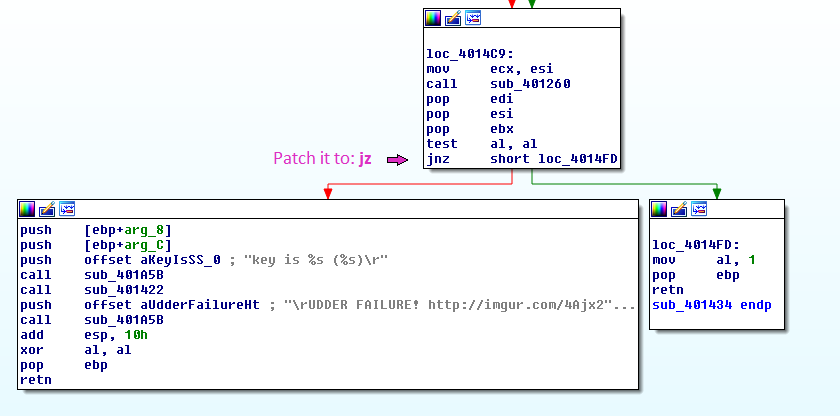
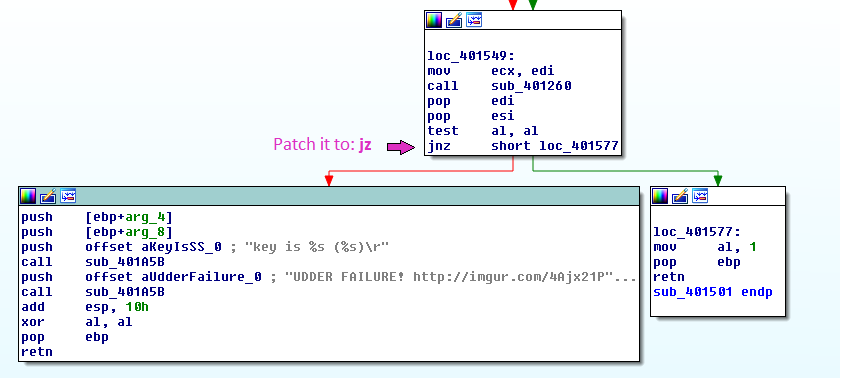

#### **Description:**

> _Guess what time it is! That&#8217;s right! Gametime! Wowwwwwwwwwwwwwwwwwwwwwwwwwwwwwwwwwwwwwwwwwwwwwwwwwww!!!!!!!!!!!!_
> 
> _Author: Brad Antoniewicz_
> 
> _note: flag is not in `flag{}` format_
> 
> _<a class="chal-file" href="https://ctf.csaw.io/stat./121e6daf97e57856de8183ba1e56e55b/gametime.exe" target="_blank">gametime.exe</a>_

<div class="chal-files">
</div>

<div class="chal-files">
  To be honest, I downloaded the file, played the game once and got the key. It is possible for humans to win the game, or maybe it&#8217;s just my Super-Vegan powers LOL.
</div>

<div class="chal-files">
  But I wanted, of course, to get the key using RE. I opened IDA and searched for interesting strings.
</div>

<div class="chal-files">
</div>

<div class="chal-files">
  ```asm
.rdata:00A17858 00000014 C \rGet ready to play\n                                     
.rdata:00A1786C 00000034 C \rZOMGZOMGOZMGKZOMGZOMGOZMGZOMGZOMGOZMGZOMGZOMGOZMG\n     
...     
.rdata:00A17970 00000033 C \rZOMGZOMG           YOU DID IT!!!        ZOMGOZMG\n      
.rdata:00A179A4 00000033 C \rZOMGZOMGOZMGZOMGZOMGOZMGZOMGZOMGOZMGZOMGZOMGOZMG\n      
...                                              
.rdata:00A179E0 0000000F C key is %s (%s)                                            
.rdata:00A179F4 0000002C C \nWhen you see an 's', press the space bar\n\n            
.rdata:00A17A20 0000002C C \nWhen you see an '%c', press the '%c' key\n\n            
.rdata:00A17A50 00000010 C key is %s (%s)\r                                          
.rdata:00A17A60 0000002B C \rUDDER FAILURE! http://imgur.com/4Ajx21P \n              
.rdata:00A17A8C 00000024 C \r                                 \r                     
.rdata:00A17AB0 0000002A C UDDER FAILURE! http://imgur.com/4Ajx21P \n                
.rdata:00A17ADC 00000005 C %02x                                                      
.rdata:00A17AEC 00000034 C \r\tZOMGZOMGOZMGZOMGZOMGOZMGZOMGZOMGOZMGZOMGZOMGOZMG\n    
.rdata:00A17B20 00000010 C \tkey is %s (%s)                                          
.rdata:00A17B30 00000034 C \r\tZOMGZOMG                                ZOMGZOMG\n    
.rdata:00A17B64 00000034 C \r\tZOMGZOMG     TAP TAP REVOLUTION!!!!!!!  ZOMGZOMG\n    
.rdata:00A17B98 00000036 C \r\tZOMGZOMGOZMGZOMGZOMGOZMGZOMGZOMGOZMGZOMGZOMGOZMG\n\n\n
.rdata:00A17BD0 00000020 C \r\t              R U READDY?!\n\n\n                      
.rdata:00A17BF0 0000001D C \rThe game is starting in...\n                            
.rdata:00A17C10 00000033 C \rTRAINING COMPLETE!                              \n      
.rdata:00A17C48 0000002A C \rNow you know everything you need to know                
.rdata:00A17C74 0000001F C \n\n\nfor the rest of your life!\n                        
.rdata:00A17C94 0000000D C LETS PLAY !\n                                             
.rdata:00A17CA4 00000016 C \rooooh, you fancy!!!\n                                   
.rdata:00A17CBC 00000011 C NIIICE JOB)!!!!\n                                         
.rdata:00A17CD0 00000012 C \rTURBO TIME!    \n
```

  
    I highlighted the important lines: The success message (I know, I got it when I played) and the failure messages. Using X-Refs I found where the failure messages are printed out and patched the program to jump to the success instead. Notice that you&#8217;ll need to change <strong>two</strong> functions.
  
    <strong>1st jump to change:</strong>
  
    
  
    <strong>2nd jump to change:</strong>
  
    
</div>

Now apply the patches to the program and run it. Let the game play alone and the key will be printed.

The key is: _(no5c30416d6cf52638460377995c6a8cf5)_

