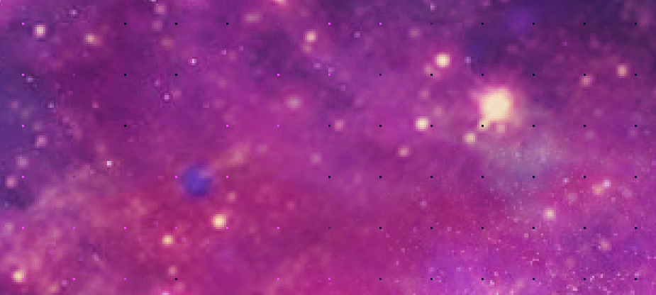
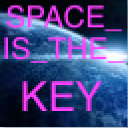

### **Description:**

> **Task: 1magePr1son- Nozambique- Stego- 150** 
> 
> <span style="font-weight: 400;">Implementing of the latest encryption system as always brought a set of problems for one of the known FSI services: they have lost the module which is responsible for decoding information. And some information has been already ciphered! Your task for today: to define a cryptoalgorithm and decode the message.</span>  
> <span style="font-weight: 400;">https://ctf.com.ua/data/attachments/planet_982680d78ab9718f5a335ec05ebc4ea2.png.zip</span>  
> <span style="font-weight: 400;">h4ck1t{str(flag).upper()}</span>  
> [<span style="font-weight: 400;">https://ctf.com.ua/data/attachments/planet_982680d78ab9718f5a335ec05ebc4ea2.png.zip</span>][1]

For the start we are given with a wallpaper image named _planet.png_ (2560&#215;1850)

 

Looking carefully at the image we can see a pattern of strange dots, such dots may be connected to the cryptosystem. Those are pixels in different colors that probably belongs to another image. My thought is that the pixels of the flag image was splitted into the wallpaper.

 

The dots exists every 24 pixels so I wrote a short pythons script in order to combine them into one image:

```python
from PIL import Image

original = Image.open("planet.png")
p_orig = original.load()
width, height = original.size
new_image = Image.new('RGBA',(width,height)) # The original image dimensions
p_flag = new_image.load()
cord_x, cord_y = 0, 0

# Collect the pixels and add them to the new image 
for j in range(0,height,24):
    for i in range(0,width,24):
        p_flag[cord_x,cord_y] = p_orig[i,j]
        cord_x+=1
    cord_y+=1
    cord_x=0
	
new_image.save('flag.png', 'PNG')

```


I ran it and got a big image (the wallpaper size) with this tiny image inside that contains the flag:

 

**Flag: **_h4ck1t{SPACE\_IS\_THE_KEY}_

<div class="nf-post-footer">
  <p style="text-align: right">
    <a href="https://www.megabeets.net/about.html#vegan">Eat Veggies</a>
  </p>
</div>

 [1]: https://ctf.com.ua/data/attachments/planet_982680d78ab9718f5a335ec05ebc4ea2.png.zip