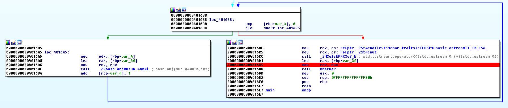

<h3 style="padding-left: 30px;">
  <strong>Description:</strong>
</h3>

> Long time ago one security module has been written. But for now its sources have been missed somehow. We have forgotten th3 access k3y, which, as we remember, has been hardcoded inside the module. Help us to recollect th3 k3y!11  
> [crypt0\_0perator\_56e0a9f07f54b3634ab5cc2b30e5b29e.exe][1]
> 
> <span style="font-weight: 400;">h4ck1t{&#8230;}</span>

This is a pretty basic reverse challenge. We can solve it in many different ways but I will show you only two of them. The first one is the quickest method that will work only for this challenge, and the second is for those of you who want to understand better how to solve such challenges in the future.

So, we got an exe file and we need to find the access key. We are given with a hint that the key is somehow hardcoded in the file itself. Let&#8217;s run the file and see what will happen.

```amigados
Megabeets D:\Downloads\h4ckit\ethiopia
> crypt0_0perator_56e0a9f07f54b3634ab5cc2b30e5b29e.exe
Enter th3 k3y :
> Megabeets

Denied
```


Seems like all it does is to ask for the key, let&#8217;s take a deeper look and see if we the key is stored clear-text in the file. Open the file in IDA pro and press Shift+F12 to open the Strings subview. The strings that written by the programmer will usually be stored in close adresses. Her&#8217;e are snip of the strings. I marked the most meaningful:

```default
.text:0000000000468093  00000005 C G u$E                                           
.data:0000000000472020  00000029 C o3dl6s|41a42344d110746d574e35c2f77ab6>3z        
.rdata:0000000000488000 00000008 C Allowed                                         
.rdata:000000000048800E 00000007 C Denied                                          
.rdata:0000000000488015 00000010 C Enter th3 k3y :                                 
.rdata:0000000000488070 00000011 C basic_ios::clear                                
.rdata:0000000000488090 00000025 C ios_base::_M_grow_words is not valid            
.rdata:00000000004880B8 0000002A C ios_base::_M_grow_words allocation failed       
.rdata:00000000004880F2 00000006 C POSIX                                           
.rdata:0000000000488100 00000012 C std::future_error                               
.rdata:0000000000488120 00000024 C __gnu_cxx::__concurrence_lock_error             
.rdata:0000000000488148 00000026 C __gnu_cxx::__concurrence_unlock_error                                          
...
...
```


We can easily notice the strings which we already faced when executing the program: &#8216;_Denied&#8217; _and &#8216;_Enter th3 k3y :&#8217;. _The _&#8216;Allowed&#8217;_ string will probably be printed after entering the right key. But what is this strange string:_ &#8216;o3dl6s|41a42344d110746d574e35c2f77ab6>3z&#8217;_? Is it the key? Let&#8217;s try.

```amigados
Megabeets D:\Downloads\h4ckit\ethiopia
> crypt0_0perator_56e0a9f07f54b3634ab5cc2b30e5b29e.exe
Enter th3 k3y :
> o3dl6s|41a42344d110746d574e35c2f77ab6>3z

Denied
```


No luck. It is not the key, but what is it? It should be meaningful somehow but I don&#8217;t yet know how the program is using this string. I decided to debug the program and set a breakpoint before the decision whether the input is the right key or not is made.

Let&#8217;s go to the _main _function and set a breakpoint before the calling to the _Checker _method:

 

&nbsp;

Now let&#8217;s run the program with that long string as the input and look at the registers. We can see that RAX is pushed to the _Checker_ function. The checker function is comparing RAX with the long string and if RAX==long_string we get the _Allowed_ message. But our RAX is different then the long string although we use the long string as our input what means that the inputted string is being manipulated and then compared to the original long string. So, what is our RAX? Let&#8217;s hover RAX with the cursor.

 

&nbsp;

Well, RAX is looking like the flag. We will get the _Denied_ message but at least we now have the flag.

```amigados
Megabeets D:\Downloads\h4ckit\ethiopia
> crypt0_0perator_56e0a9f07f54b3634ab5cc2b30e5b29e.exe
Enter th3 k3y :
> h4ck1t{36f35433c667031c203b42d5a00fe194}

Allowed
```


&nbsp;

So we solved the challenge but now let&#8217;s see what is happening behind the scenes of this program. We can find out what the program is doing without getting too deep into the assembly code. We already know that the program is taking our input and perform some manipulation on it. After that it compares the manipulated string to this long string &#8216;_o3dl6s|41a42344d110746d574e35c2f77ab6>3z&#8217;. _The best approach in this cases is to see what is the result of different inputs, I&#8217;ll show few examples that can teach us about the program:

&nbsp;

<div style="overflow-x: auto;">
  [table id=1 /]
</div>

&nbsp;

As you can see, this is probably a [Substitution cipher][2] implementation. Every character is replaced  always with the same another character. We can write a short python script to figure out what is the key using our a-z0-9{} input and the matching RAX string:

&nbsp;

```python
input = "abcdefghijklmnopqrstuvwxyz0123456789{}"     
rax = "fedcba`onmlkjihwvutsrqp_~}76543210?>|z"        
expected = "o3dl6s|41a42344d110746d574e35c2f77ab6>3z"                                       
flag= ''   

for c in expected:                                    
	flag += input[rax.index(c)]                       

print flag
# flag: h4ck1t{36f35433c667031c203b42d5a00fe194}
```


We got the flag 🙂

If you have any questions feel free to ask and I&#8217;ll explain more.

**Flag:** _h4ck1t{36f35433c667031c203b42d5a00fe194}_

&nbsp;


 [1]: https://ctf.com.ua/data/attachments/crypt0_0perator_56e0a9f07f54b3634ab5cc2b30e5b29e.exe
 [2]: https://en.wikipedia.org/wiki/Substitution_cipher