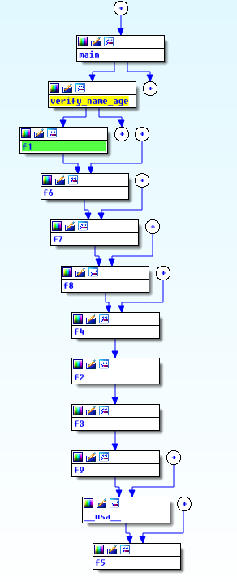
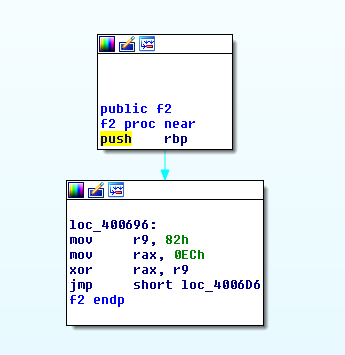

## Description:

> Bobby has been into Reverse Engineering and Binary Exploitation lately.  
> One day, he went to an amusement park in his city. It was very famouse for its Roller Coaster Rides.  
> But, Bobby, being 12 years old, was not allowed on those rides, as it was open for people who were 14 years or older.  
> This made Bobby very angry. On reaching home, he hacked into the servers of the amusement park, got hold of the validation software for the Roller Coaster rides, and modified it, so that nobody is allowed to have a ride on those Roller Coasters.
> 
> [validation][1]

&nbsp;

We are given with a file, lets run `file` command on it determine its type.

```default
Megabeets$ file validation
validation.elf: ELF 64-bit LSB  executable, x86-64, version 1 (SYSV), dynamically linked (uses shared libs), for GNU/Linux 2.6.24, BuildID[sha1]=f18f0acc149e2330b7549976f9e25c1b4e97e4f8, not stripped
```


Okay, it&#8217;s an ELF file. Lets execute it:

```default
Megabeets$ ./validation

 Authenticate yourself

 Enter your name :- Megabeets

 Enter your age :- 74

 You are not old enough !!
 Go home Megabeets, and complete your homework ..

 This is not your cup of tea !!   -_-    -_-
```


&nbsp;

Okay let&#8217;s disassemble the file and look at the functions call tree:

 

Oh, we have lot of functions. All of them looks something like this:

 

An hex value is moved to r9 (smetimes r8) and then xord with hex value that was moved to rax. I manually xord all the values by order of calls, turn the results to characters and end up with the flag:

```python
>>> flag = chr(0x1a^0x68)+chr(0x85^181)+chr(0xfc^0xcd)+chr(0xa0^0xcc)+chr(0x2a^1)+chr(0xe2^0x96)+chr(0x4d^0x25)+chr(0x84^0xb7)+chr(0x0^0x6d)+chr(0xc2^0x9d)+chr(0xf1^0xc5)+chr(0x2^0x33)+chr(0xbc^0x8d)+chr(0x14^0x39)+chr(0xde^0xae)+chr(0xf2^0x87)+chr(0xde^0xae)+chr(0x68^0x47)+chr(0xb0^0xf0)+chr(0x82^0xec)+chr(0x3a^0x5e)+chr(0x96^0xe8)+chr(0x89^0xbd)+chr(0xee^0x99)+chr(0x56^0x16)+chr(0x5c^0x25)
>>> print flag
r01l+th3m_411-pup/@nd~4w@y
```


The flag was **pragyanctf{r01l+th3m_411-up/@nd~4w@y}**

<div class="nf-post-footer">
  <p style="text-align: right">
    <a href="https://www.megabeets.net/about.html#vegan">Eat Veggies</a>
  </p>
</div>

 [1]: https://github.com/ks-is/CTFs/blob/b840a84cb9827f96f118e4f26d3c771b71037d3a/CTF_WriteUp/2017/Pragyan%20CTF/Binary%20Exploits/Roller%20Coaster%20Ride/validation