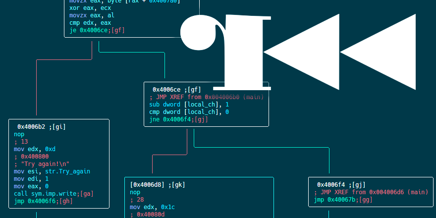
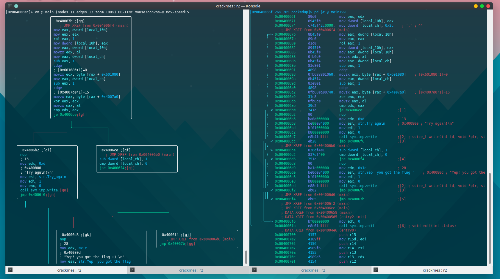

## Prologue

It took me three months to finish writing this article. I had so many tasks on my to-do list that sadly this one was pushed down to the bottom of the list. Last weekend I made a promise to myself that until Sunday I&#8217;m going to finish writing it, I successfully kept my word and here it is, another radare2 tutorial.

Today we&#8217;ll solve a very nice challenge, &#8220;packedup&#8221;, written by ad3l for r2con 2017 competition. It is not the first writeup that I publish from r2con competition, you can check out [&#8220;Reverse engineering a Gameboy ROM with radare2&#8221;][1] as well, make sure not to miss the cool swags I got from winning the competition.

This article is aimed to those of you who are familiar with radare2. If you are not, I suggest you to start from [part 1][2] of my series _“A Journey Into Radare2”._

So, without further ado, let&#8217;s dig into the binary.



&nbsp;

## Getting radare2

### Installation

Radare2’s development is pretty quick – the project evolves every day, therefore it&#8217;s recommended to use the current git version over the stable one. Sometimes the stable version is less stable than the current git version!

```sh
$ git clone https://github.com/radare/radare2.git
$ cd radare2
$ ./sys/install.sh
```


If you don&#8217;t want to install the git version or you want the binaries for another machine (Windows, OS X, iOS, etc.) check out the [download page at the radare2 website.][4]

### Updating

As I said before, it is highly recommended to always use the newest version of r2 from the git repository. All you need to do to update your r2 version from the git is to execute:

```sh
$ ./sys/install.sh
```


And you&#8217;ll have the latest version from git. I usually update my version of radare2 in the morning with a scheduled task, so I can wake up to the latest version available. If you&#8217;re using radare2 often, I recommend you do the same.

## packedup

You can download packedup from [here][5]. I suggest you to star (<span style="color: #ffcc00;">★</span>) the repository to get updates about more radare2 tutorials 🙂

First thing to do, obviously, is to execute the binary and get a basic feeling of what we are going to face.

```default
$ ./packedup 
Welcome to packedup for r2crackmes :)
Flag << MEGABEETS     
Try again!

```


_packedup_ is executed, it requests us to give it a flag. It then probably does some calculations at the backend to see if the inputted flag is the right one. I entered &#8220;MEGABEETS&#8221; which is likely not the correct flag and finished with the fail message &#8212; &#8220;Try again!&#8221;.

### Reversing time!

Now for our favorite part, let&#8217;s open the binary with radare2 and try to figure out how _packedup_ is checking the submitted flag:

<div style="overflow-x: auto; margin: 0 0 20px;">
  <table style="background-color: #4a3446; color: #fff; font-family: terminal, monaco, monospace; font-size: 10pt; margin: 0px;">
    <tr style="height: 19.8594px;">
      <td style="height: 19.8594px;">
        <span style="color: #468ee6;"><span style="color: #ffff99;">$</span> <span style="color: #ffffff;">r2</span> <span style="color: #00ccff;">./packedup</span><br /> </span>— Here be dragons.<span style="color: #468ee6;"><br /> [0x004004d0]></span> aaa<br /> <span style="color: #35d7c7;">[x]</span> Analyze all flags starting with sym. and entry0 (aa)<br /> <span style="color: #35d7c7;">[x]</span> Analyze len bytes of instructions for references (aar)<br /> <span style="color: #35d7c7;">[x]</span> Analyze function calls (aac)<br /> <span style="color: #468ee6;">[*]</span> Use -AA or aaaa to perform additional experimental analysis.<br /> <span style="color: #35d7c7;">[x]</span> Constructing a function name for fcn.* and sym.func.* functions (aan)
      </td>
    </tr>
  </table>
</div>

### Analysis

I usually begin with executing `aa` (**a**nalyze **a**ll) or with `aas` (to **a**nalyze functions, **s**ymbols and more). The name is misleading because there is a lot more to analyze (check `aa?`) but it&#8217;s enough to start with for most of the binaries I examined. This time we&#8217;ll start straight with `aaa` to make things simpler and due to the binary&#8217;s small size. You can also run radare2 with the `-A` flag to analyze the binary straight at startup using `aaa` (e.g `r2 -A ./packedup`).

> **Note:** as I mentioned in the previous posts, starting with `aaa` is not always the recommended approach since analysis is very complicated process. I wrote more about it in [this answer][6] — read it to better understand why.

### Getting Information

So now that we opened our binary with radare2, we have been located automatically at the program&#8217;s entrypoint. But before we start working on the code itself It&#8217;s a good approach to get to know our binary characteristics. radare2 can show us the information we need using the `i` command (I removed some information for the sake of readability):

```batch
[0x004004d0]> i
...
file ./packedup
format elf64
iorw false
mode -r-x
size 0x1878
humansz 6.1K
type EXEC (Executable file)
arch x86
...
bintype elf
bits 64
...
endian little
...
intrp /lib64/ld-linux-x86-64.so.2
lang c
...
machine AMD x86-64 architecture
stripped true
...
```


> The `i` command used for getting info about the opened file. It&#8217;s a wrapper around `rabin2` which is an information extractor tool in the radare2 framework. radare2 offers us tons amount of information about the binary. Check out `i?` to list the information&#8217;s subcommands.

_packedup_ is a 64-bit stripped ELF binary. Cool. Let&#8217;s move on.

<!--more-->

### Strings

One of my favorite ways to figure out where to start my analysis is to check the binary for indicative strings, and especially where they&#8217;re referenced from. To list all the strings in the data section we&#8217;ll use `iz`:

<div style="overflow-x: auto; margin: 0 0 20px;">
  <table style="background-color: #4a3446; color: #fff; font-family: terminal, monaco, monospace; font-size: 10pt; margin: 0px;">
    <tr style="height: 19.8594px;">
      <td style="height: 19.8594px;">
        <span style="color: #468ee6;">[0x004004d0]></span> iz<br /> 001 0x000007d0 0x004007d0 46 47 (.rodata) ascii Welcome to packedup for r2crackmes :)\nFlag <<<br /> 002 0x00000800 0x00400800 11 12 (.rodata) ascii Try again!\n<br /> 003 0x0000080d 0x0040080d 26 27 (.rodata) ascii Yep! you got the flag 🙂 \n
      </td>
    </tr>
  </table>
</div>

Nice! We have our &#8220;welcome&#8221; message and both the &#8220;Good-boy&#8221; and the &#8220;Bad-boy&#8221; messages. Let&#8217;s see where each is referenced from. To do this we&#8217;ll use a simple trick that radare2 has &#8211; built in loops:

<div style="overflow-x: auto; margin: 0 0 20px;">
  <table style="background-color: #4a3446; color: #fff; font-family: terminal, monaco, monospace; font-size: 10pt; margin: 0px;">
    <tr style="height: 19.8594px;">
      <td style="height: 19.8594px;">
        <span style="color: #468ee6;">[0x004004d0]></span> axt @@ str.*<br /> main 0x400619 [data] mov esi, <span style="color: #33cccc;">str.Welcome_to_packedup_for_r2crackmes_:___Flag</span><br /> main 0x4006b8 [data] mov esi, <span style="color: #33cccc;">str.Try_again</span><br /> main 0x4006de [data] mov esi, <span style="color: #33cccc;">str.Yep__you_got_the_flag_:</span>
      </td>
    </tr>
  </table>
</div>

> This command reveals us more of radare2 features. The `axt` command is used to _&#8220;find data/code references to this address&#8221;_ (see `ax?`).  
> `@@` is like foreach iterator sign, used to repeat a command over a list of offsets (see `@@?`), and `str.*` is a wildcard for all the flags that start with `str.`.
> 
> This combination helps me not just to list the strings but also to list the function name, where they&#8217;re used and the referenced instruction.

### Seeking

As I mentioned before, all this time we were at the entrypoint of the program, now it&#8217;s time to move on. The strings we just listed are all referenced by &#8216;main&#8217;. In order to navigate from offset to offset we need to use the &#8216;seek&#8217; command, represented by `s`. As you already know, appending `?` to (almost) every command is the answer to all your problems.

<div style="overflow-x: auto; margin: 0 0 20px;">
  <table style="background-color: #4a3446; color: #fff; font-family: terminal, monaco, monospace; font-size: 10pt; margin: 0px;">
    <tr style="height: 19.8594px;">
      <td style="height: 19.8594px;">
        <span style="color: #468ee6;">[0x08048370]></span> s?<br /> |<span style="color: #35d3c4;">Usage: s  # Seek commands</span><br /> | s                 <span style="color: #35d3c4;">Print current address</span><br /> | s<span style="color: #458ce2;"> addr</span>            <span style="color: #35d3c4;">Seek to address</span><br /> | s-                <span style="color: #35d3c4;">Undo seek</span><br /> | s-<span style="color: #458ce2;"> n</span>              <span style="color: #35d3c4;">Seek n bytes backward</span><br /> | s&#8211;                <span style="color: #35d3c4;">Seek blocksize bytes backward</span><br /> | s+                <span style="color: #35d3c4;">Redo seek</span><br /> | s+<span style="color: #458ce2;"> n</span>              <span style="color: #35d3c4;">Seek n bytes forward</span><br /> | s++               <span style="color: #35d3c4;">Seek blocksize bytes forward</span><br /> | s[j*=]            <span style="color: #35d3c4;">List undo seek history (JSON, =list, *r2)</span><br /> | s/<span style="color: #458ce2;"> DATA</span>           <span style="color: #35d3c4;">Search for next occurrence of &#8216;DATA&#8217;</span><br /> | s/x<span style="color: #458ce2;"> 9091</span>          <span style="color: #35d3c4;">Search for next occurrence of \x90\x91</span><br /> | s.<span style="color: #458ce2;">hexoff</span>          <span style="color: #35d3c4;">Seek honoring a base from core->offset</span><br /> | sa<span style="color: #458ce2;"> [[+-]a] [asz]</span>  <span style="color: #35d3c4;">Seek asz (or bsize) aligned to addr</span><br /> | sb                <span style="color: #35d3c4;">Seek aligned to bb start</span><br /> | sC<span style="color: #458ce2;">[?] string</span>      <span style="color: #35d3c4;">Seek to comment matching given string</span><br /> | sf                <span style="color: #35d3c4;">Seek to next function (f->addr+f->size)</span><br /> | sf<span style="color: #458ce2;"> function</span>       <span style="color: #35d3c4;">Seek to address of specified function</span><br /> | sg/sG             <span style="color: #35d3c4;">Seek begin (sg) or end (sG) of section or file</span><br /> | sl<span style="color: #458ce2;">[?] [+-]line</span>    <span style="color: #35d3c4;">Seek to line</span><br /> | sn/sp             <span style="color: #35d3c4;">Seek next/prev scr.nkey</span><br /> | so<span style="color: #458ce2;"> [N]</span>            <span style="color: #35d3c4;">Seek to N next opcode(s)</span><br /> | sr<span style="color: #458ce2;"> pc</span>             <span style="color: #35d3c4;">Seek to register</span>
      </td>
    </tr>
  </table>
</div>

So basically, the seek command accepts an address or math expression as an argument. The expression can be math operations, flag, or memory access operations. Since we want to seek to the main function, we don&#8217;t need anything special, we can do it by executing `s main`.

<div style="overflow-x: auto; margin: 0 0 20px;">
  <table style="background-color: #4a3446; color: #fff; font-family: terminal, monaco, monospace; font-size: 10pt; margin: 0px;">
    <tr style="height: 19.8594px;">
      <td style="height: 19.8594px;">
        <span style="color: #468ee6;">[0x004004d0]></span> s main<br /> <span style="color: #468ee6;">[0x0040060c]></span>
      </td>
    </tr>
  </table>
</div>

### Disassembly

Now that we are at the `main` function we want to print its disassembly to examine it. There are many ways to disassemble a function using radare. You can use `pdf` (**p**rint **d**isassembly **f**unction) or you can use more interactive ways &#8211; the Visual Mode (`v`) and the Visual Graph Mode (`VV`). You can use the way you find most comfortable to you. I usually use the visual modes since they&#8217;re more rich and interactive. Sadly, because this is not radare2 101 writeup I&#8217;m not going to explain how to use it, I explained it thoroughly in the [previous][2] articles.


Visual Graph Mode vs Visual Mode


Let&#8217;s start with having a look at the first block of main:

<div style="overflow-x: auto; margin: 0 0 20px;">
  <table style="background-color: #4a3446; color: #fff; font-family: terminal, monaco, monospace; font-size: 10pt; margin: 0px;">
    <tr style="height: 19.8594px;">
      <td style="height: 19.8594px;">
        <span style="color: #2d8698;"><span style="color: #468ee6;">[0x0040060c]> <span style="color: #ffffff;">pdf</span></span><br /> ╭</span> <span style="color: #fa645c;">(fcn) main</span> 244<br /> <span style="color: #2d8698;">│</span>  <span style="color: #fa645c;"> main</span> ();<br /> <span style="color: #2d8698;">│</span> <span style="color: #2d8698;">          </span><span style="color: #ffffff;">; var int local_10h @ rbp-0x10</span><br /> <span style="color: #2d8698;">│</span> <span style="color: #2d8698;">          </span><span style="color: #ffffff;">; var int local_ch @ rbp-0xc</span><br /> <span style="color: #2d8698;">│</span> <span style="color: #2d8698;">          </span><span style="color: #ffffff;">; var int local_8h @ rbp-0x8</span><br /> <span style="color: #2d8698;">│</span> <span style="color: #2d8698;">          </span>   <span style="color: #fa645c;">; JMP XREF from 0x00400605 (entry2.init)</span><br /> <span style="color: #2d8698;">│</span> <span style="color: #2d8698;">          </span>   <span style="color: #fa645c;">; DATA XREF from 0x004004ed (entry0)</span><br /> <span style="color: #2d8698;">│</span> <span style="color: #2d8698;">          </span><span style="color: #35d3c4;">0x0040060c</span>      <span style="color: #458ce2;">55</span>             <span style="color: #935798;">push</span><span style="color: #2d8698;"> rbp</span><br /> <span style="color: #2d8698;">│</span> <span style="color: #2d8698;">          </span><span style="color: #35d3c4;">0x0040060d</span>      <span style="color: #458ce2;">48</span><span style="color: #ffffff;">89</span><span style="color: #ffffff;">e5</span>         <span style="color: #ffffff;">mov</span><span style="color: #2d8698;"> rbp</span>,<span style="color: #2d8698;"> rsp</span><br /> <span style="color: #2d8698;">│</span> <span style="color: #2d8698;">          </span><span style="color: #35d3c4;">0x00400610</span>      <span style="color: #458ce2;">48</span><span style="color: #ffffff;">83</span><span style="color: #ffffff;">ec</span><span style="color: #ffffff;">10</span>       <span style="color: #458ce2;">sub</span><span style="color: #2d8698;"> rsp</span>,<span style="color: #2d8698;"> </span><span style="color: #458ce2;">0x10</span><br /> <span style="color: #2d8698;">│</span> <span style="color: #2d8698;">          </span>   <span style="color: #fa645c;">; DATA XREF from 0x00400653 (main)</span><br /> <span style="color: #2d8698;">│</span> <span style="color: #2d8698;">          </span>   <span style="color: #fa645c;">; DATA XREF from 0x004005e7 (entry2.init)</span><br /> <span style="color: #2d8698;">│</span> <span style="color: #2d8698;">          </span><span style="color: #35d3c4;">0x00400614</span>      <span style="color: #ffffff;">ba</span><span style="color: #458ce2;">30</span><span style="color: #35d3c4;">00</span><span style="color: #35d3c4;">00</span><span style="color: #35d3c4;">00</span>     <span style="color: #ffffff;">mov</span><span style="color: #2d8698;"> edx</span>,<span style="color: #2d8698;"> </span><span style="color: #458ce2;">0x30</span><br /> <span style="color: #2d8698;">│</span> <span style="color: #2d8698;">          </span><span style="color: #35d3c4;">0x00400619</span>      <span style="color: #ffffff;">be</span><span style="color: #ffffff;">d0</span><span style="color: #ffffff;">07</span><span style="color: #458ce2;">40</span><span style="color: #35d3c4;">00</span>     <span style="color: #ffffff;">mov</span><span style="color: #2d8698;"> esi</span>,<span style="color: #2d8698;"> </span><span style="color: #458ce2;">str.Welcome_to_packedup_for_r2crackmes_:___Flag</span><span style="color: #fa645c;"> ; 0x4007d0</span><span style="color: #fa645c;"> ; &#8220;Welcome to packedup for r2crackmes :)\nFlag << &#8220;</span><br /> <span style="color: #2d8698;">│</span> <span style="color: #2d8698;">          </span><span style="color: #35d3c4;">0x0040061e</span>      <span style="color: #ffffff;">bf</span><span style="color: #ffffff;">01</span><span style="color: #35d3c4;">00</span><span style="color: #35d3c4;">00</span><span style="color: #35d3c4;">00</span>     <span style="color: #ffffff;">mov</span><span style="color: #2d8698;"> edi</span>,<span style="color: #2d8698;"> </span><span style="color: #458ce2;">1</span><br /> <span style="color: #2d8698;">│</span> <span style="color: #2d8698;">          </span><span style="color: #35d3c4;">0x00400623</span>      <span style="color: #ffffff;">b8</span><span style="color: #35d3c4;">00</span><span style="color: #35d3c4;">00</span><span style="color: #35d3c4;">00</span><span style="color: #35d3c4;">00</span>     <span style="color: #ffffff;">mov</span><span style="color: #2d8698;"> eax</span>,<span style="color: #2d8698;"> </span><span style="color: #458ce2;"></span><br /> <span style="color: #2d8698;">│</span> <span style="color: #2d8698;">          </span><span style="color: #35d3c4;">0x00400628</span>      <span style="color: #ffffff;">e8</span><span style="color: #458ce2;">53</span><span style="color: #ffffff;">fe</span><span style="color: #fa645c;">ff</span><span style="color: #fa645c;">ff</span>     <span style="color: #35d3c4;">call sym.imp.write</span><span style="color: #fa645c;">      ; ssize_t write(int fd, void *ptr, size_t nbytes)</span><br /> <span style="color: #2d8698;">│</span> <span style="color: #2d8698;">          </span><span style="color: #35d3c4;">0x0040062d</span>      <span style="color: #ffffff;">ba</span><span style="color: #458ce2;">2c</span><span style="color: #35d3c4;">00</span><span style="color: #35d3c4;">00</span><span style="color: #35d3c4;">00</span>     <span style="color: #ffffff;">mov</span><span style="color: #2d8698;"> edx</span>,<span style="color: #2d8698;"> </span><span style="color: #458ce2;">0x2c</span><span style="color: #fa645c;">           ; &#8216;,&#8217;</span><span style="color: #fa645c;"> ; 44</span><br /> <span style="color: #2d8698;">│</span> <span style="color: #2d8698;">          </span><span style="color: #35d3c4;">0x00400632</span>      <span style="color: #ffffff;">be</span><span style="color: #ffffff;">80</span><span style="color: #ffffff;">10</span><span style="color: #458ce2;">60</span><span style="color: #35d3c4;">00</span>     <span style="color: #ffffff;">mov</span><span style="color: #2d8698;"> esi</span>,<span style="color: #2d8698;"> </span><span style="color: #458ce2;">0x601080</span><br /> <span style="color: #2d8698;">│</span> <span style="color: #2d8698;">          </span><span style="color: #35d3c4;">0x00400637</span>      <span style="color: #ffffff;">bf</span><span style="color: #35d3c4;">00</span><span style="color: #35d3c4;">00</span><span style="color: #35d3c4;">00</span><span style="color: #35d3c4;">00</span>     <span style="color: #ffffff;">mov</span><span style="color: #2d8698;"> edi</span>,<span style="color: #2d8698;"> </span><span style="color: #458ce2;"></span><br /> <span style="color: #2d8698;">│</span> <span style="color: #2d8698;">          </span><span style="color: #35d3c4;">0x0040063c</span>      <span style="color: #ffffff;">b8</span><span style="color: #35d3c4;">00</span><span style="color: #35d3c4;">00</span><span style="color: #35d3c4;">00</span><span style="color: #35d3c4;">00</span>     <span style="color: #ffffff;">mov</span><span style="color: #2d8698;"> eax</span>,<span style="color: #2d8698;"> </span><span style="color: #458ce2;"></span><br /> <span style="color: #2d8698;">│</span> <span style="color: #2d8698;">          </span><span style="color: #35d3c4;">0x00400641</span>      <span style="color: #ffffff;">e8</span><span style="color: #458ce2;">4a</span><span style="color: #ffffff;">fe</span><span style="color: #fa645c;">ff</span><span style="color: #fa645c;">ff</span>     <span style="color: #35d3c4;">call sym.imp.read</span><span style="color: #fa645c;">       ; ssize_t read(int fildes, void *buf, size_t nbyte)</span><br /> <span style="color: #2d8698;">│</span> <span style="color: #2d8698;">          </span><span style="color: #35d3c4;">0x00400646</span>      <span style="color: #458ce2;">48</span><span style="color: #ffffff;">98</span>           <span style="color: #ffffff;">cdqe</span><br /> <span style="color: #2d8698;">│</span> <span style="color: #2d8698;">          </span><span style="color: #35d3c4;">0x00400648</span>      <span style="color: #458ce2;">48</span><span style="color: #ffffff;">89</span><span style="color: #458ce2;">45</span><span style="color: #ffffff;">f8</span>       <span style="color: #ffffff;">mov qword</span><span style="color: #2d8698;"> </span>[<span style="color: #2d8698;">local_8h</span>],<span style="color: #2d8698;"> rax</span><br /> <span style="color: #2d8698;">│</span> <span style="color: #2d8698;">          </span><span style="color: #35d3c4;">0x0040064c</span>      <span style="color: #ffffff;">c7</span><span style="color: #458ce2;">45</span><span style="color: #ffffff;">f0</span><span style="color: #35d3c4;">00</span><span style="color: #35d3c4;">00</span><span style="color: #35d3c4;">00</span><span style="color: #ffffff;">.</span>  <span style="color: #ffffff;">mov dword</span><span style="color: #2d8698;"> </span>[<span style="color: #2d8698;">local_10h</span>],<span style="color: #2d8698;"> </span><span style="color: #458ce2;"></span><br /> <span style="color: #2d8698;">│</span> <span style="color: #2d8698;">          </span><span style="color: #35d3c4;">0x00400653</span>      <span style="color: #ffffff;">b8</span><span style="color: #ffffff;">14</span><span style="color: #ffffff;">06</span><span style="color: #458ce2;">40</span><span style="color: #35d3c4;">00</span>     <span style="color: #ffffff;">mov</span><span style="color: #2d8698;"> eax</span>,<span style="color: #2d8698;"> </span><span style="color: #458ce2;">0x400614</span><br /> <span style="color: #2d8698;">│</span> <span style="color: #2d8698;">          </span><span style="color: #35d3c4;">0x00400658</span>      <span style="color: #ffffff;">bb</span><span style="color: #ffffff;">f6</span><span style="color: #ffffff;">06</span><span style="color: #458ce2;">40</span><span style="color: #35d3c4;">00</span>     <span style="color: #ffffff;">mov</span><span style="color: #2d8698;"> ebx</span>,<span style="color: #2d8698;"> </span><span style="color: #458ce2;">0x4006f6</span><br /> <span style="color: #2d8698;">│</span> <span style="color: #2d8698;">          </span><span style="color: #35d3c4;">0x0040065d</span>      <span style="color: #458ce2;">29</span><span style="color: #ffffff;">c3</span>           <span style="color: #458ce2;">sub</span><span style="color: #2d8698;"> ebx</span>,<span style="color: #2d8698;"> eax</span><br /> <span style="color: #2d8698;">│</span> <span style="color: #2d8698;">          </span><span style="color: #35d3c4;">0x0040065f</span>      <span style="color: #458ce2;">31</span><span style="color: #ffffff;">c9</span>           <span style="color: #2d8698;">xor</span><span style="color: #2d8698;"> ecx</span>,<span style="color: #2d8698;"> ecx</span>
      </td>
    </tr>
  </table>
</div>

After the function&#8217;s prologue, we can see arguments passed ([System V AMD64 ABI][8]) to `write()` to print the &#8220;Welcome&#8221; message and then another arguments passed to `read()` to read _stdin_ input. `read()` is reading 0x2c (Decimal: 44) bytes from _stdin_ and stores them into a buffer at _0x601080_. We can assume that the flag would probably be 44 characters long. Let&#8217;s rename the address of our input so it&#8217;ll be better for us to recognize this address in the disassembly:

<div style="overflow-x: auto; margin: 0px;">
  <table style="background-color: #4a3446; color: #fff; font-family: terminal, monaco, monospace; font-size: 10pt; margin: 0px;">
    <tr style="height: 19.8594px;">
      <td style="height: 19.8594px;">
        <span style="color: #2d8698;"><span style="color: #468ee6;">[0x0040060c]> <span style="color: #ffffff;">f loc.our_input = 0x601080</span></span><br /> </span>
      </td>
    </tr>
  </table>
</div>

> `f` is used to create flags, a &#8220;bookmark&#8221; to a certain address. For more information check `f?` and read the [chapter about flags][9] in radare2book.

Then the program stores the number of bytes read into a local variable. At _0x400653 _the program is moving an address (_0x400614)_ to _`eax` _and another address (_0x4006f6__) _to `ebx`. The first address is the first instruction after `main`&#8216;s prologue and the second is the last instruction before `main` exits. So basically we can say that `eax` and `ebx` are storing the start and the end of `main`. Immediately after that `eax` is subtracted from `ebx` so now `ebx` will store the difference between these two addresses.

<span style="font-size: 16px;">In the next block, the program uses the bytes of the code itself in a<span style="font-weight: 400;"> loop until it finishes to calculate some initial value.</span></span>

<div style="overflow-x: auto; margin: 0px;">
  <table style="background-color: #4a3446; color: #fff; font-family: terminal, monaco, monospace; font-size: 10pt; margin: 0px;">
    <tr style="height: 9.79688px;">
      <td style="height: 9.79688px;">
        <span style="font-family: terminal, monaco, monospace;"><span style="color: #2d8698;"><span style="color: #ffffff;">&#8230;<br /> </span><br /> │</span> <span style="color: #2d8698;">          </span><span style="color: #35d3c4;">0x00400653</span>      <span style="color: #ffffff;">b8</span><span style="color: #ffffff;">14</span><span style="color: #ffffff;">06</span><span style="color: #458ce2;">40</span><span style="color: #35d3c4;">00</span>     <span style="color: #ffffff;">mov</span><span style="color: #2d8698;"> eax</span>,<span style="color: #2d8698;"> </span><span style="color: #458ce2;">0x400614</span></span><br /> <span style="font-family: terminal, monaco, monospace;"><span style="color: #2d8698;">│</span> <span style="color: #2d8698;">          </span><span style="color: #35d3c4;">0x00400658</span>      <span style="color: #ffffff;">bb</span><span style="color: #ffffff;">f6</span><span style="color: #ffffff;">06</span><span style="color: #458ce2;">40</span><span style="color: #35d3c4;">00</span>     <span style="color: #ffffff;">mov</span><span style="color: #2d8698;"> ebx</span>,<span style="color: #2d8698;"> </span><span style="color: #458ce2;">0x4006f6</span></span><br /> <span style="font-family: terminal, monaco, monospace;"><span style="color: #2d8698;">│</span> <span style="color: #2d8698;">          </span><span style="color: #35d3c4;">0x0040065d</span>      <span style="color: #458ce2;">29</span><span style="color: #ffffff;">c3</span>           <span style="color: #458ce2;">sub</span><span style="color: #2d8698;"> ebx</span>,<span style="color: #2d8698;"> eax</span></span><br /> <span style="font-family: terminal, monaco, monospace;"><span style="color: #2d8698;">│</span> <span style="color: #2d8698;">          </span><span style="color: #35d3c4;">0x0040065f</span>      <span style="color: #458ce2;">31</span><span style="color: #ffffff;">c9</span>           <span style="color: #2d8698;">xor</span><span style="color: #2d8698;"> ecx</span>,<span style="color: #2d8698;"> ecx</span></span><br /> <span style="font-family: terminal, monaco, monospace;"><span style="color: #2d8698;">│</span> <span style="color: #2d8698;">          </span>   <span style="color: #fa645c;">; JMP XREF from 0x0040066b (main)</span></span><br /> <span style="font-family: terminal, monaco, monospace;"><span style="color: #2d8698;">│</span> <span style="color: #2d8698;">      ╭─> </span><span style="color: #35d3c4;">0x00400661</span>      <span style="color: #458ce2;">67</span><span style="color: #ffffff;">02</span><span style="color: #ffffff;">08</span>         <span style="color: #458ce2;">add</span><span style="color: #2d8698;"> cl</span>,<span style="color: #2d8698;"> byte</span><span style="color: #2d8698;"> </span>[<span style="color: #2d8698;">eax</span>]</span><br /> <span style="font-family: terminal, monaco, monospace;"><span style="color: #2d8698;">│</span> <span style="color: #2d8698;">      </span><span style="color: #2d8698;">⁝</span><span style="color: #2d8698;">   </span><span style="color: #35d3c4;">0x00400664</span>      <span style="color: #ffffff;">c1</span><span style="color: #ffffff;">c9</span><span style="color: #ffffff;">04</span>         <span style="color: #2d8698;">ror</span><span style="color: #2d8698;"> ecx</span>,<span style="color: #2d8698;"> </span><span style="color: #458ce2;">4</span></span><br /> <span style="font-family: terminal, monaco, monospace;"><span style="color: #2d8698;">│</span> <span style="color: #2d8698;">      </span><span style="color: #2d8698;">⁝</span><span style="color: #2d8698;">   </span><span style="color: #35d3c4;">0x00400667</span>      <span style="color: #fa645c;">ff</span><span style="color: #ffffff;">c0</span>           <span style="color: #458ce2;">inc</span><span style="color: #2d8698;"> eax</span></span><br /> <span style="font-family: terminal, monaco, monospace;"><span style="color: #2d8698;">│</span> <span style="color: #2d8698;">      </span><span style="color: #2d8698;">⁝</span><span style="color: #2d8698;">   </span><span style="color: #35d3c4;">0x00400669</span>      <span style="color: #fa645c;">ff</span><span style="color: #ffffff;">cb</span>           <span style="color: #458ce2;">dec</span><span style="color: #2d8698;"> ebx</span></span><br /> <span style="font-family: terminal, monaco, monospace;"><span style="color: #2d8698;">│</span> <span style="color: #2d8698;">      ╰─< </span><span style="color: #35d3c4;">0x0040066b</span>      <span style="color: #458ce2;">75</span><span style="color: #ffffff;">f4</span>           <span style="color: #35d3c4;">jne 0x400661</span></span><br /> <span style="font-family: terminal, monaco, monospace;"><span style="color: #2d8698;">│</span> <span style="color: #2d8698;">          </span><span style="color: #35d3c4;">0x0040066d</span>      <span style="color: #ffffff;">89</span><span style="color: #ffffff;">ca</span>           <span style="color: #ffffff;">mov</span><span style="color: #2d8698;"> edx</span>,<span style="color: #2d8698;"> ecx<br /> <span style="color: #ffffff;"><br /> &#8230;</span></span></span>
      </td>
    </tr>
  </table>
</div>

Now for a fun part. In the next loop we can see how to program is validating our input. First, let&#8217;s have a look at the most relevant part of the code:

<div style="overflow-x: auto; margin: 0px;">
  <table style="background-color: #4a3446; color: #fff; font-family: terminal, monaco, monospace; font-size: 10pt; margin: 0px;">
    <tr style="height: 19.8594px;">
      <td style="height: 19.8594px;">
        <span style="color: #2d8698;">│</span> <span style="color: #2d8698;">          </span><span style="color: #35d3c4;">0x0040066d</span>      <span style="color: #ffffff;">89</span><span style="color: #ffffff;">ca</span>           <span style="color: #ffffff;">mov</span><span style="color: #2d8698;"> edx</span>,<span style="color: #2d8698;"> ecx</span><br /> <span style="color: #2d8698;">│</span> <span style="color: #2d8698;">          </span><span style="color: #35d3c4;">0x0040066f</span>      <span style="color: #ffffff;">89</span><span style="color: #ffffff;">d0</span>           <span style="color: #ffffff;">mov</span><span style="color: #2d8698;"> eax</span>,<span style="color: #2d8698;"> edx</span><br /> <span style="color: #2d8698;">│</span> <span style="color: #2d8698;">          </span><span style="color: #35d3c4;">0x00400671</span>      <span style="color: #ffffff;">89</span><span style="color: #458ce2;">45</span><span style="color: #ffffff;">f0</span>         <span style="color: #ffffff;">mov dword</span><span style="color: #2d8698;"> </span>[<span style="color: #2d8698;">local_10h</span>],<span style="color: #2d8698;"> eax</span><br /> <span style="color: #2d8698;">│</span> <span style="color: #2d8698;">          </span><span style="color: #35d3c4;">0x00400674</span>      <span style="color: #ffffff;">c7</span><span style="color: #458ce2;">45</span><span style="color: #ffffff;">f4</span><span style="color: #458ce2;">2c</span><span style="color: #35d3c4;">00</span><span style="color: #35d3c4;">00</span><span style="color: #ffffff;">.</span>  <span style="color: #ffffff;">mov dword</span><span style="color: #2d8698;"> </span>[<span style="color: #2d8698;">local_ch</span>],<span style="color: #2d8698;"> </span><span style="color: #458ce2;">0x2c</span><span style="color: #fa645c;">  ; &#8216;,&#8217;</span><span style="color: #fa645c;"> ; 44</span><br /> <span style="color: #2d8698;">│</span> <span style="color: #2d8698;">          </span>   <span style="color: #fa645c;">; JMP XREF from 0x004006f4 (main)</span><br /> <span style="color: #2d8698;">│</span> <span style="color: #2d8698;">          </span><span style="color: #35d3c4;">0x0040067b</span>      <span style="color: #ffffff;">8b</span><span style="color: #458ce2;">45</span><span style="color: #ffffff;">f0</span>         <span style="color: #ffffff;">mov</span><span style="color: #2d8698;"> eax</span>,<span style="color: #2d8698;"> dword</span><span style="color: #2d8698;"> </span>[<span style="color: #2d8698;">local_10h</span>]<br /> <span style="color: #2d8698;">│</span> <span style="color: #2d8698;">          </span><span style="color: #35d3c4;">0x0040067e</span>      <span style="color: #ffffff;">89</span><span style="color: #ffffff;">c0</span>           <span style="color: #ffffff;">mov</span><span style="color: #2d8698;"> eax</span>,<span style="color: #2d8698;"> eax</span><br /> <span style="color: #2d8698;">│</span> <span style="color: #2d8698;">          </span><span style="color: #35d3c4;">0x00400680</span>      <span style="color: #ffffff;">d1</span><span style="color: #ffffff;">c0</span>           <span style="color: #2d8698;">rol</span><span style="color: #2d8698;"> eax</span>,<span style="color: #2d8698;"> </span><span style="color: #458ce2;">1</span><br /> <span style="color: #2d8698;">│</span> <span style="color: #2d8698;">          </span><span style="color: #35d3c4;">0x00400682</span>      <span style="color: #ffffff;">89</span><span style="color: #458ce2;">45</span><span style="color: #ffffff;">f0</span>         <span style="color: #ffffff;">mov dword</span><span style="color: #2d8698;"> </span>[<span style="color: #2d8698;">local_10h</span>],<span style="color: #2d8698;"> eax</span><br /> <span style="color: #2d8698;">│</span> <span style="color: #2d8698;">          </span><span style="color: #35d3c4;">0x00400685</span>      <span style="color: #ffffff;">8b</span><span style="color: #458ce2;">45</span><span style="color: #ffffff;">f0</span>         <span style="color: #ffffff;">mov</span><span style="color: #2d8698;"> eax</span>,<span style="color: #2d8698;"> dword</span><span style="color: #2d8698;"> </span>[<span style="color: #2d8698;">local_10h</span>]<br /> <span style="color: #2d8698;">│</span> <span style="color: #2d8698;">          </span><span style="color: #35d3c4;">0x00400688</span>      <span style="color: #ffffff;">0f</span><span style="color: #ffffff;">b6</span><span style="color: #ffffff;">d0</span>         <span style="color: #ffffff;">movzx</span><span style="color: #2d8698;"> edx</span>,<span style="color: #2d8698;"> al</span><br /> <span style="color: #2d8698;">│</span> <span style="color: #2d8698;">          </span><span style="color: #35d3c4;">0x0040068b</span>      <span style="color: #ffffff;">8b</span><span style="color: #458ce2;">45</span><span style="color: #ffffff;">f4</span>         <span style="color: #ffffff;">mov</span><span style="color: #2d8698;"> eax</span>,<span style="color: #2d8698;"> dword</span><span style="color: #2d8698;"> </span>[<span style="color: #2d8698;">local_ch</span>]<br /> <span style="color: #2d8698;">│</span> <span style="color: #2d8698;">          </span><span style="color: #35d3c4;">0x0040068e</span>      <span style="color: #ffffff;">83</span><span style="color: #ffffff;">e8</span><span style="color: #ffffff;">01</span>         <span style="color: #458ce2;">sub</span><span style="color: #2d8698;"> eax</span>,<span style="color: #2d8698;"> </span><span style="color: #458ce2;">1</span><br /> <span style="color: #2d8698;">│</span> <span style="color: #2d8698;">          </span><span style="color: #35d3c4;">0x00400691</span>      <span style="color: #458ce2;">48</span><span style="color: #ffffff;">98</span>           <span style="color: #ffffff;">cdqe</span><br /> <span style="color: #2d8698;">│</span> <span style="color: #2d8698;">          </span><span style="color: #35d3c4;">0x00400693</span>      <span style="color: #ffffff;">0f</span><span style="color: #ffffff;">b6</span><span style="color: #ffffff;">88</span><span style="color: #ffffff;">80</span><span style="color: #ffffff;">10</span><span style="color: #458ce2;">60</span><span style="color: #ffffff;">.</span>  <span style="color: #ffffff;">movzx</span><span style="color: #2d8698;"> ecx</span>,<span style="color: #2d8698;"> byte </span>[<span style="color: #2d8698;">rax </span>+<span style="color: #2d8698;"> </span><span style="color: #458ce2;">0x601080</span>]<span style="color: #fa645c;"> ; [0x601080:1]=0</span><br /> <span style="color: #2d8698;">│</span> <span style="color: #2d8698;">          </span><span style="color: #35d3c4;">0x0040069a</span>      <span style="color: #ffffff;">8b</span><span style="color: #458ce2;">45</span><span style="color: #ffffff;">f4</span>         <span style="color: #ffffff;">mov</span><span style="color: #2d8698;"> eax</span>,<span style="color: #2d8698;"> dword</span><span style="color: #2d8698;"> </span>[<span style="color: #2d8698;">local_ch</span>]<br /> <span style="color: #2d8698;">│</span> <span style="color: #2d8698;">          </span><span style="color: #35d3c4;">0x0040069d</span>      <span style="color: #ffffff;">83</span><span style="color: #ffffff;">e8</span><span style="color: #ffffff;">01</span>         <span style="color: #458ce2;">sub</span><span style="color: #2d8698;"> eax</span>,<span style="color: #2d8698;"> </span><span style="color: #458ce2;">1</span><br /> <span style="color: #2d8698;">│</span> <span style="color: #2d8698;">          </span><span style="color: #35d3c4;">0x004006a0</span>      <span style="color: #458ce2;">48</span><span style="color: #ffffff;">98</span>           <span style="color: #ffffff;">cdqe</span><br /> <span style="color: #2d8698;">│</span> <span style="color: #2d8698;">          </span><span style="color: #35d3c4;">0x004006a2</span>      <span style="color: #ffffff;">0f</span><span style="color: #ffffff;">b6</span><span style="color: #ffffff;">80</span><span style="color: #ffffff;">a0</span><span style="color: #ffffff;">07</span><span style="color: #458ce2;">40</span><span style="color: #ffffff;">.</span>  <span style="color: #ffffff;">movzx</span><span style="color: #2d8698;"> eax</span>,<span style="color: #2d8698;"> byte </span>[<span style="color: #2d8698;">rax </span>+<span style="color: #2d8698;"> </span><span style="color: #458ce2;">0x4007a0</span>]<span style="color: #fa645c;"> ; [0x4007a0:1]=15</span><br /> <span style="color: #2d8698;">│</span> <span style="color: #2d8698;">          </span><span style="color: #35d3c4;">0x004006a9</span>      <span style="color: #458ce2;">31</span><span style="color: #ffffff;">c8</span>           <span style="color: #2d8698;">xor</span><span style="color: #2d8698;"> eax</span>,<span style="color: #2d8698;"> ecx</span><br /> <span style="color: #2d8698;">│</span> <span style="color: #2d8698;">          </span><span style="color: #35d3c4;">0x004006ab</span>      <span style="color: #ffffff;">0f</span><span style="color: #ffffff;">b6</span><span style="color: #ffffff;">c0</span>         <span style="color: #ffffff;">movzx</span><span style="color: #2d8698;"> eax</span>,<span style="color: #2d8698;"> al</span><br /> <span style="color: #2d8698;">│</span> <span style="color: #2d8698;">          </span><span style="color: #35d3c4;">0x004006ae</span>      <span style="color: #458ce2;">39</span><span style="color: #ffffff;">c2</span>           <span style="color: #2d8698;">cmp</span><span style="color: #2d8698;"> edx</span>,<span style="color: #2d8698;"> eax</span><br /> <span style="color: #2d8698;">│</span> <span style="color: #2d8698;">      ╭─< </span><span style="color: #35d3c4;">0x004006b0</span>      <span style="color: #458ce2;">74</span><span style="color: #ffffff;">1c</span>           <span style="color: #35d3c4;">je 0x4006ce</span>
      </td>
    </tr>
  </table>
</div>

The value that was calculated in the previous loop is now moved into `edx` (at _0x40066d_), which in turn is moving it to `eax` which is moving it to `[local_10h]`. Confused? me too. To put things simple, the value that was calculated in the previous loop is now at `[local_10h]`. Now we are starting the validation loop. The first instruction of this loop moves the value of `[local_10h]` to `eax`, then, at _0x400680_ the value at `eax` is being left-rotated with 1 byte and assigned again to `[local_10h]`. At _0x400688_ the lower byte (`al`) of the value is moved into `edx`. <span style="font-weight: 400;">At address <em>0x400693</em> the program takes one char from our input and assign it to <code>ecx</code>. </span><span style="font-weight: 400;">After that, at <em>0x4006a2</em> the program takes one byte from <code>[rax + 0x4007a0]</code> and assigns it to <code>eax</code>. Let&#8217;s see what we have at <code>0x4007a0</code>:</span>

<div style="overflow-x: auto; margin: 0 0 20px;">
  <table style="background-color: #4a3446; color: #fff; font-family: terminal, monaco, monospace; font-size: 10pt; margin: 0px;">
    <tr style="height: 19.8594px;">
      <td style="height: 19.8594px;">
        <span style="color: #458ce2;">[0x0040060c]></span> px 44 @ 0x4007a0<br /> &#8211; offset &#8211;   0 1  2 3  4 5  6 7  8 9  A B  C D  E F  0123456789ABCDEF<br /> <span style="color: #35d3c4;">0x004007a0</span>  <span style="color: #ffffff;">0f</span><span style="color: #ffffff;">c9</span> <span style="color: #ffffff;">a8</span><span style="color: #ffffff;">86</span> <span style="color: #ffffff;">ac</span><span style="color: #ffffff;">e0</span> <span style="color: #ffffff;">18</span><span style="color: #ffffff;">93</span> <span style="color: #ffffff;">8a</span><span style="color: #ffffff;">af</span> <span style="color: #ffffff;">91</span><span style="color: #ffffff;">a2</span> <span style="color: #ffffff;">e4</span><span style="color: #458ce2;">64</span> <span style="color: #458ce2;">7a</span><span style="color: #458ce2;">5a</span>  <span style="color: #ffffff;">.</span><span style="color: #ffffff;">.</span><span style="color: #ffffff;">.</span><span style="color: #ffffff;">.</span><span style="color: #ffffff;">.</span><span style="color: #ffffff;">.</span><span style="color: #ffffff;">.</span><span style="color: #ffffff;">.</span><span style="color: #ffffff;">.</span><span style="color: #ffffff;">.</span><span style="color: #ffffff;">.</span><span style="color: #ffffff;">.</span><span style="color: #ffffff;">.</span><span style="color: #458ce2;">d</span><span style="color: #458ce2;">z</span><span style="color: #458ce2;">Z</span><br /> <span style="color: #35d3c4;">0x004007b0</span>  <span style="color: #ffffff;">08</span><span style="color: #ffffff;">8b</span> <span style="color: #ffffff;">a8</span><span style="color: #ffffff;">9a</span> <span style="color: #ffffff;">b4</span><span style="color: #ffffff;">d1</span> <span style="color: #ffffff;">1f</span><span style="color: #ffffff;">84</span> <span style="color: #ffffff;">b4</span><span style="color: #ffffff;">d1</span> <span style="color: #458ce2;">71</span><span style="color: #458ce2;">52</span> <span style="color: #ffffff;">1c</span><span style="color: #ffffff;">8a</span> <span style="color: #ffffff;">80</span><span style="color: #ffffff;">d2</span>  <span style="color: #ffffff;">.</span><span style="color: #ffffff;">.</span><span style="color: #ffffff;">.</span><span style="color: #ffffff;">.</span><span style="color: #ffffff;">.</span><span style="color: #ffffff;">.</span><span style="color: #ffffff;">.</span><span style="color: #ffffff;">.</span><span style="color: #ffffff;">.</span><span style="color: #ffffff;">.</span><span style="color: #458ce2;">q</span><span style="color: #458ce2;">R</span><span style="color: #ffffff;">.</span><span style="color: #ffffff;">.</span><span style="color: #ffffff;">.</span><span style="color: #ffffff;">.</span><br /> <span style="color: #35d3c4;">0x004007c0</span>  <span style="color: #ffffff;">14</span><span style="color: #ffffff;">95</span> <span style="color: #ffffff;">82</span><span style="color: #ffffff;">97</span> <span style="color: #ffffff;">80</span><span style="color: #ffffff;">d2</span> <span style="color: #ffffff;">1f</span><span style="color: #ffffff;">90</span> <span style="color: #ffffff;">8f</span><span style="color: #ffffff;">91</span> <span style="color: #ffffff;">93</span><span style="color: #ffffff;">a6</span>            <span style="color: #ffffff;">.</span><span style="color: #ffffff;">.</span><span style="color: #ffffff;">.</span><span style="color: #ffffff;">.</span><span style="color: #ffffff;">.</span><span style="color: #ffffff;">.</span><span style="color: #ffffff;">.</span><span style="color: #ffffff;">.</span><span style="color: #ffffff;">.</span><span style="color: #ffffff;">.</span><span style="color: #ffffff;">.</span><span style="color: #ffffff;">.</span>
      </td>
    </tr>
  </table>
</div>

<span style="font-weight: 400;">Cool! It is a predefined byte array of length 44. It is obviously been used somehow in the comparison. Let&#8217;s flag it to <code>loc.predefined_array</code> using:</span>

<div style="overflow-x: auto; margin: 0 0 20px;">
  <table style="background-color: #4a3446; color: #fff; font-family: terminal, monaco, monospace; font-size: 10pt; margin: 0px;">
    <tr style="height: 17.7969px;">
      <td style="height: 17.7969px;">
        <span style="color: #458ce2;">[0x0040060c]></span> f loc.predefined_array = 0x4007a0
      </td>
    </tr>
  </table>
</div>

<span style="font-weight: 400;">Just for a reminder before we continue. <code>edx</code> now contains the lower byte of  <code>rol(initial_value)</code>, <code>eax</code> contains the byte in index <em>0x2C</em> (Decimal: 44) of the byte array at <code>loc.predefined_array</code> and <code>ecx</code> holds the last character of our input.</span>

At _0x<span style="font-weight: 400;">4006a9, </span>_`ecx` (the last char of our input) is bitwise XOR&#8217;d with `eax` (last value of the predefined array), the result is stored in `eax`. Then `al` is zero-extended moved into `eax` and then `eax` is compared with `edx` (The lower byte of <span style="font-weight: 400;"><code>rol(initial_value)</code>). It will be easier to understand this operation using the following pseudo-python example:</span>

```python
key = 0x???????? # Our initial_value
our_input = "A" * 44
predefined_array = [0x0fc9, ... ,0x93a6]

if ( ord(our_input[-1]) ^ predefined_array[-1] ) == ( key & 0xff ):
    return True


```


If the result is indeed equal, i.e. `ECX ^ EAX == EDX` the loop is repeating itself with the next character from our input (2nd from the end), the next character from the predefined array (again, 2nd from the end) and with the result of `rol(key)`. `key` is actually the result of performing left-rotation on `initial_value`, since this value changed in every rotation it isn&#8217;t &#8220;initial&#8221; anymore so now we&#8217;ll call it `key`.

### The solution: 1st try

Now that we understood the logic of the program we can move to find a solution for this crackme. The key insight from the previous paragraphs is the understanding that there is a loop that contains an equation with three variables: `ECX ^ EAX = EDX`. We know that both `EAX` and `EDX` are predictable since they should always stays the same. `EAX` is coming from the static-predefined byte-array and `EDX` is the result of  `n` times `key = rol(key)` where `n` equals the number of the current iteration in our loop. The only variable that changes is `EAX` which is coming from our input.

So how can we know what input should we give to the program in order to make the equation true? We&#8217;ll use one of the coolest properties of Bitwise XOR &#8212; XOR is an [involutory function][10] (well, [not exactly][11]). Thus, and bear with me for a simple math, that means:

> ECX ^ EAX == EDX
> 
> EAX ^ EDX == ECX
> 
> ECX ^ EDX == EAX

And that is awesome, right?! That&#8217;s mean that given `ECX` and `EDX` we can know what the value of `EAX` should be, in order to make the comparison return true. All we need to do is to **write a python script** and figure out **what is the value of** `initial_value` (i.e. `EDX`, `key`). We&#8217;ll start from the python script and then we will figure out the initial value of the key.

First we&#8217;ll define a lambda function for rotate left:

```python
# Rotate left lambda
rol = lambda val, r_bits, max_bits: \
    (val << r_bits%max_bits) & (2**max_bits-1) | \
    ((val & (2**max_bits-1)) >> (max_bits-(r_bits%max_bits)))
```


Then, we&#8217;ll create our predefined array. We&#8217;ll use radare for this:

<div style="overflow-x: auto; margin: 0 0 20px;">
  <table style="background-color: #4a3446; color: #fff; font-family: terminal, monaco, monospace; font-size: 10pt; margin: 0px;">
    <tr style="height: 17.7969px;">
      <td style="height: 17.7969px;">
        <span style="color: #458ce2;">[0x0040060c]></span>  pcp 44 @ 0x4007a0<br /> import struct<br /> buf = struct.pack (&#8220;44B&#8221;, *[<br /> 0x0f,0xc9,0xa8,0x86,0xac,0xe0,0x18,0x93,0x8a,0xaf,0x91,<br /> 0xa2,0xe4,0x64,0x7a,0x5a,0x08,0x8b,0xa8,0x9a,0xb4,0xd1,<br /> 0x1f,0x84,0xb4,0xd1,0x71,0x52,0x1c,0x8a,0x80,0xd2,0x14,<br /> 0x95,0x82,0x97,0x80,0xd2,0x1f,0x90,0x8f,0x91,0x93,0xa6])
      </td>
    </tr>
  </table>
</div>

> The `pc` subcommands (check `pc?`) is used to output the bytes in code formats of different languages as C, Python, Javascript and others.

We&#8217;ll add it to the script and define two more variables:

```python
# Byte array from 0x004007A0, modified from the generated results of `pcp 44 @ 0x4007a0`
arr =[0x0F, 0xC9, 0xA8, 0x86, 0xAC, 0xE0, 0x18, 0x93, 0x8A, 0xAF, 0x91, 0xA2, 0xE4, 0x64, 0x7A, 0x5A, 0x08, 0x8B, 0xA8, 0x9A, 0xB4, 0xD1, 0x1F, 0x84, 0xB4, 0xD1, 0x71, 0x52, 0x1C, 0x8A, 0x80, 0xD2, 0x14, 0x95, 0x82, 0x97, 0x80, 0xD2, 0x1F, 0x90, 0x8F, 0x91, 0x93, 0xA6]

# Initial key value 
key = 0xdc77df87

flag = []
```


And the last thing is to implement the logic and combine it all together:

```python
# Rotate left lambda
rol = lambda val, r_bits, max_bits: \
    (val << r_bits%max_bits) & (2**max_bits-1) | \
    ((val & (2**max_bits-1)) >> (max_bits-(r_bits%max_bits)))

# Byte array from 0x004007A0, modified from the generated results of `pcp 44 @ 0x4007a0`
arr =[0x0F, 0xC9, 0xA8, 0x86, 0xAC, 0xE0, 0x18, 0x93, 0x8A, 0xAF, 0x91, 0xA2, 0xE4, 0x64, 0x7A, 0x5A, 0x08, 0x8B, 0xA8, 0x9A, 0xB4, 0xD1, 0x1F, 0x84, 0xB4, 0xD1, 0x71, 0x52, 0x1C, 0x8A, 0x80, 0xD2, 0x14, 0x95, 0x82, 0x97, 0x80, 0xD2, 0x1F, 0x90, 0x8F, 0x91, 0x93, 0xA6]

# Initial key value 
key = 0x????????

flag = []

# Iterate the array backwards
for b in reversed(arr):
    # rol the key 
    key = rol(key,1,32)
    # xor the 8 lower bits of the key with current byte in array
    char = chr(b ^ (key & 0xff))
    # Add char to final flag
    flag.insert(0, char)


print '[+] Flag: ', ''.join(flag)
```


&nbsp;

Awesome! Now we just need to find the initial value for the key. How do we do this? We should put a breakpoint after the loop which generates the initial value and check what is the result of this loop. Let&#8217;s open radare2 in debug mode `r2 -d packedup` or if your radare2 shell is still open you can use the `ood` command.

<div style="overflow-x: auto; margin: 0 0 20px;">
  <table style="background-color: #4a3446; color: #fff; font-family: terminal, monaco, monospace; font-size: 10pt; margin: 0px;">
    <tr style="height: 17.7969px;">
      <td style="height: 17.7969px;">
        <span style="color: #458ce2;">[0x0040060c]></span>  ood<br /> Process with PID 1236 started&#8230;<br /> File dbg:///home/beet/Desktop/Security/r2con/crackmes/packedup reopened in read-write mode<br /> = attach 1236 1236<br /> <span style="color: #458ce2;">[0x7fb45818cf30]></span>
      </td>
    </tr>
  </table>
</div>

> `ood` is used to re-open the current file in debug mode. It is a subcommand of `oo` which responsible of handling opened files. There&#8217;s also an alias for `ood` which is `doo`. I usually use `doo` since it&#8217;s easier to remember and more fun to say 😉

As you can see, our seek address changed to `0x7fb45818cf30` which is an address in the memory map of the dynamic loader ([ld.so][12]). We can know it by simply execute `dm.`:

<div style="overflow-x: auto; margin: 0 0 20px;">
  <table style="background-color: #4a3446; color: #fff; font-family: terminal, monaco, monospace; font-size: 10pt; margin: 0px;">
    <tr style="height: 17.7969px;">
      <td style="height: 17.7969px;">
        <span style="color: #458ce2;">[0x7fb45818cf30]> <span style="color: #ffffff;">dm.</span><br /> <span style="color: #ffffff;">/usr/lib/ld-2.26.so</span><br /> </span>
      </td>
    </tr>
  </table>
</div>

> `dm.` is used to show the map name of the current address. You can use `dm` to list the memory maps of the current process. You can see more subcommand by executing `dm?`.

We know that the end of the loop is at `0x0040066d`, this is where the result of the loop, which is in `ecx`, is moving into `edx`. Let&#8217;s put a breakpoint on this address and check the value of `ecx`:

<div style="overflow-x: auto; margin: 0 0 20px;">
  <table style="background-color: #4a3446; color: #fff; font-family: terminal, monaco, monospace; font-size: 10pt; margin: 0px;">
    <tr style="height: 24.1719px;">
      <td style="height: 24.1719px;">
        <span style="color: #458ce2;">[0x7fb45818cf30]><span style="color: #ffffff;"> db 0x40066d<br /> <span style="color: #458ce2;">[0x7fb45818cf30]></span> dc</span><br /> <span style="color: #ffffff;">Welcome to packedup for r2crackmes 🙂</span><br /> <span style="color: #ffffff;"> Flag << <span style="color: #00ccff;">Blah_blah_blah</span></span><br /> <span style="color: #00ffff;"><span style="color: #ffffff;">hit breakpoint at:</span> </span></span>40066d<br /> <span style="color: #458ce2;"><span style="color: #00ffff;"><br /> <span style="color: #458ce2;">[0x0040066d]></span><span style="color: #ffffff;"> dr ecx</span><br /> <span style="color: #ffffff;"> 0xd477d83e</span></span><br /> </span>
      </td>
    </tr>
  </table>
</div>

> the `d?` subcommand is used for anything related to debug session.
> 
> `db` stands for **d**ebug **b**reakpoint and is used to define a breakpoint. Check `db?` for its subcommands.
> 
> `dc` stands for **d**ebug **c**ontinue and responsible to continue the execution.
> 
> `dr`, **d**ebug **r**egisters, is used to display the value of a register. There are tons of subcommand to `dr`, check it out by executing `dr?`

Great! So now that we have the initial value of the key we can fill the missing part of the script `<span style="font-size: 16px;">key = 0xd477d83e</span>` and execute it:

```default
beet:~$ python answer.py
[+] Flag:  Hj.xIgYj{u]J*l=ok\S6?TJbgh
```


What? This flag doesn&#8217;t make any sense. We must have made a mistake somewhere along the way, but where?

OH right! Silly me! Remember this sentence I wrote before?

> <span style="font-size: 16px;">In the next block, the program uses the bytes of the code itself in a<span style="font-weight: 400;"> loop until it finishes to calculate some initial value.</span></span>

It totally slipped my mind. Using a software breakpoint as we did when executed `db 0x40066d` is adding `CC` (INT3) to the instruction and thus it changed the result of the calculation that is done by the loop at `0x400661`. The INT 3 instruction generates a special one-byte opcode (`CC`) that is intended for calling the debug exception handler.


### The solution: 2nd try

So, we need to find a way to get the initial value of the key without changing the code itself. That&#8217;s where [Hardware Breakpoints][13] come in handy. <span style="font-weight: 400;">Let&#8217;s disable the software breakpoint and put a hardware breakpoint just at the same address:</span>

<div style="overflow-x: auto; margin: 0 0 20px;">
  <table style="background-color: #4a3446; color: #fff; font-family: terminal, monaco, monospace; font-size: 10pt; margin: 0px;">
    <tr style="height: 24.1719px;">
      <td style="height: 24.1719px;">
        <span style="color: #458ce2;">[0x40066d]><span style="color: #ffffff;"> db- 0x40066d<br /> <span style="color: #458ce2;">[0x40066d]></span> doo<br /> </span></span>Process with PID 1317 started&#8230;<br /> File dbg:///home/beet/Desktop/Security/r2con/crackmes/packedup reopened in read-write mode<br /> = attach 1317 1317<br /> <span style="color: #458ce2;"><span style="color: #00ffff;"><br /> </span>[0x7fcb28f77f30]> <span style="color: #ffffff;">drx 1 0x0040066d 1 x</span><br /> <span style="color: #ffffff;"><span style="color: #458ce2;"> [0x7fcb28f77f30]></span> dc</span><br /> <span style="color: #ffffff;"> Welcome to packedup for r2crackmes 🙂</span><br /> <span style="color: #ffffff;"> Flag << <span style="color: #00ccff;">Blah_Megabeets_Blahaaa<br /> </span></span><br /> <span style="color: #ffffff;"><span style="color: #458ce2;"> [0x0040066d]></span> dr ecx</span><br /> <span style="color: #ffffff;"> 0xdc77df87</span><br /> </span>
      </td>
    </tr>
  </table>
</div>

<span style="font-weight: 400;">Awesome! This time we found the right initial value, let&#8217;s put it in the python script and find the flag:</span>

```default
beet:~$ python answer.py
[+] Flag: ['\xc8', '*', '\xd9', '>', 'p', '\x0e', '\xef', 'h', '\xf7', '\x91', '\x8e', '\xad', 'c', '\xa7', '\x9b', '\xaa', '\xf0', 'w', '\xd6', '%', 'k', '>', '\xe8', '\x7f', '\xc9', 'o', '\xae', '\xbd', 'k', '\xb1', '\x9d', '\\', '\xd3', 'v', '\xf3', '/', '\\', '<', '\xe8', 'k', '\xf2', '\xaf', '\x8c', '\xa9']
```


Come on&#8230; bummer. We failed again. So, what&#8217;s now? What are we missing? I&#8217;m sure the initial value is correct now that we used a hardware breakpoint. It is probably something in the algorithm that we missed, but what?

Now that we&#8217;re still in debug mode let&#8217;s seek again to the start of the checking loop at `0x0040067b`, follow each step slowly and compare it with quotations from before where I explained it:

**The assembly:** `0x0040067b 8b45f0 mov eax, dword [rbp - 0x10]`  
**The explanation:**

> [<span style="font-size: 14pt;"><strong><span style="color: #00ff00;">✓</span></strong></span>] Now we are starting the validation loop. The first instruction of this loop moves the value of `[local_10h]` to `eax`

**The assembly:** `0x00400680 d1c8 ror eax, 1`  
**The explanation:**

> [<span style="font-size: 14pt; color: #ff0000;">X</span>] Then, at _0x400680_ the value at `eax` is being left-rotated with 1 byte.

Wait a minute! It was **left-**rotated (`rol eax, 1`, now it&#8217;s **right**-rotated (`ror eax, 1`)?! Of course we&#8217;ll get a wrong flag, our algorithm was all wrong. But how did it changed?  
To understand that we should first put a hardware breakpoint on _write_ access to this address (`0x00400680`) to see where this address is changed from.

<div style="overflow-x: auto; margin: 0 0 20px;">
  <table style="background-color: #4a3446; color: #fff; font-family: terminal, monaco, monospace; font-size: 10pt; margin: 0px;">
    <tr style="height: 24.1719px;">
      <td style="height: 24.1719px;">
        <span style="color: #458ce2;"><span style="color: #ffffff;"><span style="color: #458ce2;">[0x40066d]></span> doo<br /> </span></span>Process with PID 1611 started&#8230;<br /> File dbg:///home/beet/Desktop/Security/r2con/crackmes/packedup reopened in read-write mode<br /> = attach 1611 1611<br /> <span style="color: #00ffff;"><br /> </span><span style="color: #458ce2;">[0x7fc43ae24f30]> </span><span style="color: #ffffff;">drx 1 0x00400680 1 w</span><br /> <span style="color: #ffffff;"><span style="color: #458ce2;"> [0x7fc43ae24f30]></span> dc</span><br /> <span style="color: #458ce2;">[0x00400600]></span>
      </td>
    </tr>
  </table>
</div>

The debug stopped at `0x400600`, let&#8217;s print the instruction in this address:

<div style="overflow-x: auto; margin: 0 0 20px;">
  <table style="background-color: #4a3446; color: #fff; font-family: terminal, monaco, monospace; font-size: 10pt; margin: 0px;">
    <tr style="height: 19.8594px;">
      <td style="height: 19.8594px;">
        <span style="color: #458ce2;">[0x00400600]></span> pd 1<br /> <span style="color: #35d3c4;">0x00400600</span>   <span style="color: #458ce2;">67</span><span style="color: #ffffff;">c6</span><span style="color: #458ce2;">40</span><span style="color: #458ce2;">6d</span><span style="color: #ffffff;">c8</span>   <span style="color: #ffffff;">mov byte </span>[<span style="color: #2d8698;">eax </span>+<span style="color: #2d8698;"> </span><span style="color: #458ce2;">0x6d</span>],<span style="color: #2d8698;"> </span><span style="color: #458ce2;">0xc8</span>
      </td>
    </tr>
  </table>
</div>

That&#8217;s it! It modify the instruction on this address. If before the opcodes of `rol eax, 1` were `d1c0`, now it changes it to `d1c8`! We can use another great feature of radare2 to disassemble hex-string:

<div style="overflow-x: auto; margin: 0 0 20px;">
  <table style="background-color: #4a3446; color: #fff; font-family: terminal, monaco, monospace; font-size: 10pt; margin: 0px;">
    <tr style="height: 19.8594px;">
      <td style="height: 19.8594px;">
        <span style="color: #458ce2;">[0x00400600]><span style="color: #ffffff;"> pad d1c0</span><br /> <span style="color: #ffffff;"> rol eax, 1</span><br /> [0x00400600]><span style="color: #ffffff;"> # changed to</span><br /> [0x00400600]> <span style="color: #ffffff;">pad d1c8</span><br /> <span style="color: #ffffff;">ror eax, 1</span></span>
      </td>
    </tr>
  </table>
</div>

Let&#8217;s print the whole function to understand it more thoroughly.

<div style="overflow-x: auto; margin: 0 0 20px;">
  <table style="background-color: #4a3446; color: #fff; font-family: terminal, monaco, monospace; font-size: 10pt; margin: 0px;">
    <tr style="height: 19.8594px;">
      <td style="height: 19.8594px;">
        <span style="color: #458ce2;">[0x00400600]></span> pdf<br /> <span style="color: #2d8698;">╭</span> <span style="color: #fa645c;">(fcn) entry2.init</span> 77<br /> <span style="color: #2d8698;">│</span>  <span style="color: #fa645c;"> entry2.init</span> ();<br /> <span style="color: #2d8698;">│</span> <span style="color: #2d8698;">          </span><span style="color: #35d3c4;">0x004005bd</span>      <span style="color: #ffffff;">90</span>             <span style="color: #55ffc4;">nop</span><br /> <span style="color: #2d8698;">│</span> <span style="color: #2d8698;">          </span><span style="color: #35d3c4;">0x004005be</span>      <span style="color: #ffffff;">90</span>             <span style="color: #55ffc4;">nop</span><br /> <span style="color: #2d8698;">│</span> <span style="color: #2d8698;">          </span><span style="color: #35d3c4;">0x004005bf</span>      <span style="color: #ffffff;">90</span>             <span style="color: #55ffc4;">nop</span><br /> <span style="color: #2d8698;">│</span> <span style="color: #2d8698;">          </span><span style="color: #35d3c4;">0x004005c0</span>      <span style="color: #ffffff;">90</span>             <span style="color: #55ffc4;">nop</span><br /> <span style="color: #2d8698;">│</span> <span style="color: #2d8698;">          </span><span style="color: #35d3c4;">0x004005c1</span>      <span style="color: #ffffff;">b8</span><span style="color: #458ce2;">7d</span><span style="color: #35d3c4;">00</span><span style="color: #35d3c4;">00</span><span style="color: #35d3c4;">00</span>     <span style="color: #ffffff;">mov</span><span style="color: #2d8698;"> eax</span>,<span style="color: #2d8698;"> </span><span style="color: #458ce2;">0x7d</span><span style="color: #fa645c;">               ; &#8216;}&#8217;</span><span style="color: #fa645c;"> ; 125</span><br /> <span style="color: #2d8698;">│</span> <span style="color: #2d8698;">          </span><span style="color: #35d3c4;">0x004005c6</span>      <span style="color: #ffffff;">bb</span><span style="color: #fa645c;">ff</span><span style="color: #ffffff;">0f</span><span style="color: #35d3c4;">00</span><span style="color: #35d3c4;">00</span>     <span style="color: #ffffff;">mov</span><span style="color: #2d8698;"> ebx</span>,<span style="color: #2d8698;"> </span><span style="color: #458ce2;">0xfff</span><br /> <span style="color: #2d8698;">│</span> <span style="color: #2d8698;">          </span><span style="color: #35d3c4;">0x004005cb</span>      <span style="color: #ffffff;">f7</span><span style="color: #ffffff;">db</span>           <span style="color: #458ce2;">neg</span><span style="color: #2d8698;"> ebx</span><br /> <span style="color: #2d8698;">│</span> <span style="color: #2d8698;">          </span><span style="color: #35d3c4;">0x004005cd</span>      <span style="color: #fa645c;">ff</span><span style="color: #ffffff;">cb</span>           <span style="color: #458ce2;">dec</span><span style="color: #2d8698;"> ebx</span><br /> <span style="color: #2d8698;">│</span> <span style="color: #2d8698;">          </span><span style="color: #35d3c4;">0x004005cf</span>      <span style="color: #ffffff;">81</span><span style="color: #ffffff;">e3</span><span style="color: #ffffff;">14</span><span style="color: #ffffff;">06</span><span style="color: #458ce2;">40</span><span style="color: #35d3c4;">00</span>   <span style="color: #2d8698;">and</span><span style="color: #2d8698;"> ebx</span>,<span style="color: #2d8698;"> </span><span style="color: #458ce2;">0x400614</span><br /> <span style="color: #2d8698;">│</span> <span style="color: #2d8698;">          </span><span style="color: #35d3c4;">0x004005d5</span>      <span style="color: #ffffff;">b9</span><span style="color: #ffffff;">f6</span><span style="color: #ffffff;">06</span><span style="color: #458ce2;">40</span><span style="color: #35d3c4;">00</span>     <span style="color: #ffffff;">mov</span><span style="color: #2d8698;"> ecx</span>,<span style="color: #2d8698;"> </span><span style="color: #458ce2;">0x4006f6</span><br /> <span style="color: #2d8698;">│</span> <span style="color: #2d8698;">          </span><span style="color: #35d3c4;">0x004005da</span>      <span style="color: #ffffff;">81</span><span style="color: #ffffff;">e9</span><span style="color: #ffffff;">14</span><span style="color: #ffffff;">06</span><span style="color: #458ce2;">40</span><span style="color: #35d3c4;">00</span>   <span style="color: #458ce2;">sub</span><span style="color: #2d8698;"> ecx</span>,<span style="color: #2d8698;"> </span><span style="color: #458ce2;">0x400614</span><br /> <span style="color: #2d8698;">│</span> <span style="color: #2d8698;">          </span><span style="color: #35d3c4;">0x004005e0</span>      <span style="color: #ffffff;">ba</span><span style="color: #ffffff;">07</span><span style="color: #35d3c4;">00</span><span style="color: #35d3c4;">00</span><span style="color: #35d3c4;">00</span>     <span style="color: #ffffff;">mov</span><span style="color: #2d8698;"> edx</span>,<span style="color: #2d8698;"> </span><span style="color: #458ce2;">7</span><br /> <span style="color: #2d8698;">│</span> <span style="color: #2d8698;">          </span><span style="color: #35d3c4;">0x004005e5</span>      <span style="color: #ffffff;">cd</span><span style="color: #ffffff;">80</span>           <span style="color: #935798;">int</span><span style="color: #2d8698;"> </span><span style="color: #458ce2;">0x80</span><br /> <span style="color: #2d8698;">│</span> <span style="color: #2d8698;">          </span><span style="color: #35d3c4;">0x004005e7</span>      <span style="color: #ffffff;">b8</span><span style="color: #ffffff;">14</span><span style="color: #ffffff;">06</span><span style="color: #458ce2;">40</span><span style="color: #35d3c4;">00</span>     <span style="color: #ffffff;">mov</span><span style="color: #2d8698;"> eax</span>,<span style="color: #2d8698;"> </span><span style="color: #458ce2;">0x400614</span><br /> <span style="color: #2d8698;">│</span> <span style="color: #2d8698;">          </span><span style="color: #35d3c4;">0x004005ec</span>      <span style="color: #458ce2;">67</span><span style="color: #ffffff;">c6</span><span style="color: #458ce2;">40</span><span style="color: #458ce2;">50</span><span style="color: #ffffff;">c1</span>     <span style="color: #ffffff;">mov byte </span>[<span style="color: #2d8698;">eax </span>+<span style="color: #2d8698;"> </span><span style="color: #458ce2;">0x50</span>],<span style="color: #2d8698;"> </span><span style="color: #458ce2;">0xc1</span><span style="color: #fa645c;"> ; [0xc1:1]=255</span><span style="color: #fa645c;"> ; 193</span><br /> <span style="color: #2d8698;">│</span> <span style="color: #2d8698;">          </span><span style="color: #35d3c4;">0x004005f1</span>      <span style="color: #458ce2;">67</span><span style="color: #ffffff;">c6</span><span style="color: #458ce2;">40</span><span style="color: #458ce2;">51</span><span style="color: #ffffff;">c1</span>     <span style="color: #ffffff;">mov byte </span>[<span style="color: #2d8698;">eax </span>+<span style="color: #2d8698;"> </span><span style="color: #458ce2;">0x51</span>],<span style="color: #2d8698;"> </span><span style="color: #458ce2;">0xc1</span><span style="color: #fa645c;"> ; [0xc1:1]=255</span><span style="color: #fa645c;"> ; 193</span><br /> <span style="color: #2d8698;">│</span> <span style="color: #2d8698;">          </span><span style="color: #35d3c4;">0x004005f6</span>      <span style="color: #458ce2;">67</span><span style="color: #ffffff;">c6</span><span style="color: #458ce2;">40</span><span style="color: #458ce2;">52</span><span style="color: #ffffff;">03</span>     <span style="color: #ffffff;">mov byte </span>[<span style="color: #2d8698;">eax </span>+<span style="color: #2d8698;"> </span><span style="color: #458ce2;">0x52</span>],<span style="color: #2d8698;"> </span><span style="color: #458ce2;">3</span><br /> <span style="color: #2d8698;">│</span> <span style="color: #2d8698;">          </span><span style="color: #35d3c4;">0x004005fb</span>      <span style="color: #458ce2;">67</span><span style="color: #ffffff;">c6</span><span style="color: #458ce2;">40</span><span style="color: #458ce2;">6c</span><span style="color: #ffffff;">d1</span>     <span style="color: #ffffff;">mov byte </span>[<span style="color: #2d8698;">eax </span>+<span style="color: #2d8698;"> </span><span style="color: #458ce2;">0x6c</span>],<span style="color: #2d8698;"> </span><span style="color: #458ce2;">0xd1</span><span style="color: #fa645c;"> ; [0xd1:1]=255</span><span style="color: #fa645c;"> ; 209<br /> ;&#8211; rip:</span><br /> <span style="color: #2d8698;">│</span> <span style="color: #2d8698;">          </span><span style="color: #35d3c4;">0x00400600</span>      <span style="color: #458ce2;">67</span><span style="color: #ffffff;">c6</span><span style="color: #458ce2;">40</span><span style="color: #458ce2;">6d</span><span style="color: #ffffff;">c8</span>     <span style="color: #ffffff;">mov byte </span>[<span style="color: #2d8698;">eax </span>+<span style="color: #2d8698;"> </span><span style="color: #458ce2;">0x6d</span>],<span style="color: #2d8698;"> </span><span style="color: #458ce2;">0xc8</span><span style="color: #fa645c;"> ; [0xc8:1]=255</span><span style="color: #fa645c;"> ; 200</span><br /> <span style="color: #2d8698;">╰</span> <span style="color: #2d8698;">      ╭─< </span><span style="color: #35d3c4;">0x00400605</span>      <span style="color: #ffffff;">e9</span><span style="color: #ffffff;">02</span><span style="color: #35d3c4;">00</span><span style="color: #35d3c4;">00</span><span style="color: #35d3c4;">00</span>     <span style="color: #35d3c4;">jmp main</span>
      </td>
    </tr>
  </table>
</div>

We see that this function named by radare2 as `entry2.init` and it contains a code that manipulates the `main` function. You can see how `0x7d` is moved into `eax` at `0x4005c1` and then a syscall (`int 80`) instruction is performed at `0x4005e5`. This syscall is for [`mprotect`][14] as can be found [here][15]. `mprotect` will make the code section writeable. After that, an address at the beginning of `main()` is moved to `eax` and some instructions are manipulated by the next instructions using `eax` and relative offsets. This is exactly where our `rol` became `ror` .

#### .init_array

So what is this `entry2.init` function and how we missed it? `entry2.init`, as hinted by its name, is an initialization function. The function is executed prior to the execution of `main`. I&#8217;ll explain it a bit more.

Before transferring control to the application, the runtime linker processes any initialization sections found in the program. The addresses of the functions which are executed by the dynamic linker are contained in the `.preinit_array` and `.init_array` sections. The `.init_array` section contains an array of pointers to functions which will be executed when the program starts. The section contains only function pointers and not code. These functions are also related as constructors. Like the initialization functions, there are also termination functions (destructors) which are contained in the `.fini_array` section. These functions will be executed when the program exits normally.

radare2 also recognized the `.init_array` section. Let&#8217;s print its contents:

<div style="overflow-x: auto; margin: 0 0 20px;">
  <table style="background-color: #4a3446; color: #fff; font-family: terminal, monaco, monospace; font-size: 10pt; margin: 0px;">
    <tr style="height: 19.8594px;">
      <td style="height: 19.8594px;">
        <span style="color: #458ce2;">[0x00400600]> <span style="color: #ffffff;">f~init_array</span><br /> <span style="color: #ffffff;">0x00600e08 16 section..init_array</span><br /> <span style="color: #ffffff;">0x00600e18 0 section_end..init_array</span><br /> [0x00400600]><span style="color: #ffffff;"> pxW 24 @ section..init_array</span><br /> <span style="color: #ffffff;">0x00600e08 <span style="color: #ff6666;">0x00400590 </span>entry1.init</span><br /> <span style="color: #ffffff;">0x00600e0c 0x00000000 section.</span><br /> <span style="color: #ffffff;">0x00600e10 <span style="color: #ff6666;">0x004005bd </span>entry2.init</span><br /> <span style="color: #ffffff;">0x00600e14 0x00000000 section.</span><br /> <span style="color: #ffffff;">0x00600e18 <span style="color: #ff6666;">0x00400570 </span>entry3.fini</span><br /> <span style="color: #ffffff;">0x00600e1c 0x00000000 section.</span><br /> </span>
      </td>
    </tr>
  </table>
</div>

> `f` is used to list the flags created by radare.  
> `~` is radare&#8217;s internal grep.  
> `pxW` is stands for **p**rint he**x**adecimal **W**ords (32bit).

We can see that there are two functions in this array, including our beloved `entry2.init`.

Just as an extra, you can define an initialization routine in a `gcc` compiled programs by using a template similar to this one:

```c
void __attribute__ ((constructor)) some_func() {

    // code goes here

}
```


&nbsp;

### The solution: 3rd try

So now that we know that `entry2.init` changed `rol` to `ror` we need to modify our script according to this new information. We&#8217;ll replace the `rol` lambda with `ror` and execute it again.

This is our new script:

```python
# Rotate right lambda
ror = lambda val, r_bits, max_bits: \
    ((val & (2**max_bits-1)) >> r_bits%max_bits) | \
    (val << (max_bits-(r_bits%max_bits)) & (2**max_bits-1))

# Byte array from 0x004007A0, modified from the generated results of `pcp 44 @ 0x4007a0`
arr = [
    0x0F, 0xC9, 0xA8, 0x86, 0xAC, 0xE0, 0x18, 0x93, 0x8A, 0xAF, 0x91, 0xA2,
    0xE4, 0x64, 0x7A, 0x5A, 0x08, 0x8B, 0xA8, 0x9A, 0xB4, 0xD1, 0x1F, 0x84,
    0xB4, 0xD1, 0x71, 0x52, 0x1C, 0x8A, 0x80, 0xD2, 0x14, 0x95, 0x82, 0x97,
    0x80, 0xD2, 0x1F, 0x90, 0x8F, 0x91, 0x93, 0xA6
]

# Initial key value
key = 0xdc77df87

flag = []

# Iterate the array backwards
for b in reversed(arr):
    # ror the key
    key = ror(key, 1, 32)
    # xor the 8 lower bits of the key with current byte in array
    char = chr(b ^ (key & 0xff))
    # Add char to final flag
    flag.insert(0, char)

print '[+] Flag: ', ''.join(flag)
```


And now let&#8217;s execute it for the third time:

```default
beet:~$ python answer.py
[+] Flag:  r2_is_for_packedup_things_like_linux_malware
```


ICE CREAM! 🙂


## Epilogue

Here another article about radare2 is coming to an end. In this writeup I showed you more of the powers within radare2, this time its capabilities to analyze a self-modifying binary. I’m aware that it’s hard, at first, to understand the powers within radare2 or why you should put aside some of your old habits and get used working with radare2. Having radare2 in your toolbox is a very smart step whether you’re a reverse engineer, an exploit writer, a CTF player or just a security enthusiast.

If you want to learn more about radare2 I suggest you to start from the [part 1][2] of my series _“A Journey Into Radare2”_ and from the [second part][16] which is more exploitation focused_._

As always, please post comments to this post or message me [privately][17] if something is wrong, not accurate, needs further explanation or you simply don’t get it. Don’t hesitate to share your thoughts with me.

**Subscribe on the left if you want to get the next articles straight in your inbox.**

&nbsp;


 [1]: https://www.megabeets.net/reverse-engineering-a-gameboy-rom-with-radare2/
 [2]: https://www.megabeets.net/a-journey-into-radare-2-part-1/
 [3]: https://www.megabeets.n./packedup_cover.png
 [4]: http://radare.org/r/down.html
 [5]: https://github.com/ITAYC0HEN/A-journey-into-Radare2/blob/master/Generic/packedup%20-%20Self-modifying%20binary/packedup
 [6]: https://reverseengineering.stackexchange.com/a/16115/18698
 [7]: https://www.megabeets.n./packedup_vv_vs_vp.png
 [8]: https://en.wikipedia.org/wiki/X86_calling_conventions#System_V_AMD64_ABI
 [9]: https://radare.gitbooks.io/radare2book/content/basic_commands/flags.html
 [10]: https://en.wikipedia.org/wiki/Involution_(mathematics)
 [11]: https://www.reddit.com/r/learnmath/comments/5ys3s6/logic_question_about_xor/desttbd/
 [12]: http://man7.org/linux/man-pages/man8/ld.so.8.html
 [13]: https://reverseengineering.stackexchange.com/questions/16544/detecting-hardware-breakpoints/16547#16547
 [14]: http://man7.org/linux/man-pages/man2/mprotect.2.html
 [15]: https://syscalls.kernelgrok.com/
 [16]: https://www.megabeets.net/a-journey-into-radare-2-part-2
 [17]: https://www.megabeets.net/about.html#contact