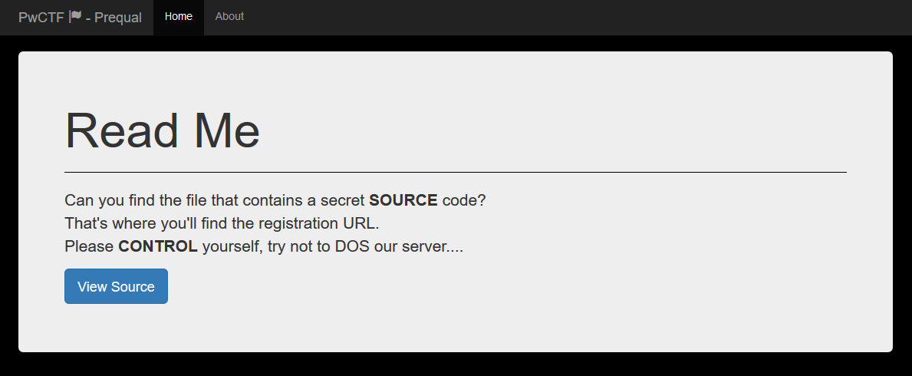
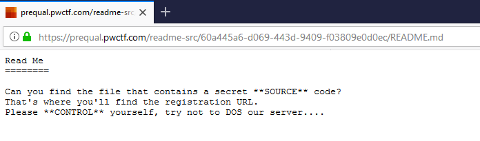
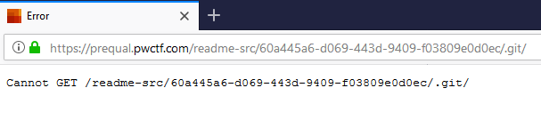
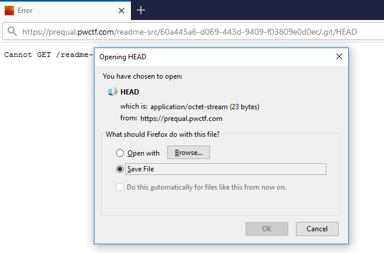
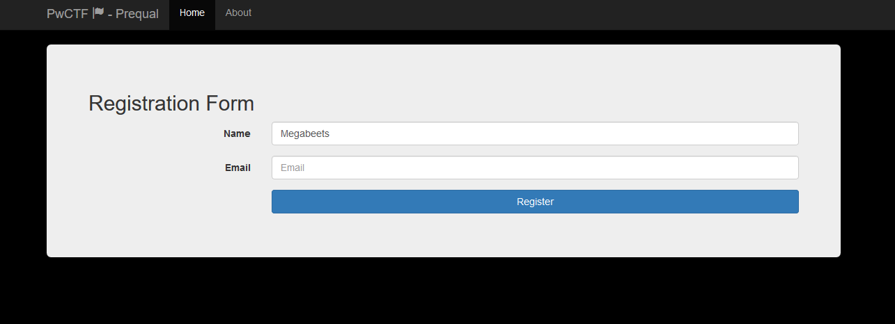

### Epilogue

PwCTF is an on-site CTF event in Israel. It will take part on January 29-31 in Cybertech Tel-Aviv 2018. Honestly I&#8217;ve never heard of it before but I thought I&#8217;ll give it a try and ended up to be **the first to finish the prequels**. In the following writeup I&#8217;ll go step by step on how I solved each challenge. Here we go.

&nbsp;

### The first challenge

It was a morning time, I was eating my breakfast while reading messages on my security groups. One of the messages, by my friend [Netanel Fisher][1], announced of the opening of CTF Prequalification Challenge. They said &#8220;challenge&#8221; and immediately caught my attention. I cannot say &#8220;no&#8221; to a challenge. So, I thought to myself that I&#8217;ll sign up and see what challenges are there. I clicked on the link to the [CTF&#8217;s website][2] and got into this lovely landing page:


It is clearly a login page, but since I didn&#8217;t have an account yet I (obviously) can&#8217;t log in. I searched for the register tab but couldn&#8217;t find it anywhere. There was only &#8220;Home&#8221; and &#8220;About&#8221; pages at the top navigation bar. I thought it might be a bug in the website so I changed the URL from `/login.php` to `/register.php`, ended up with &#8220;302 Not Found&#8221; and redirected back to the login page. There is where I started to think that the challenge is to register.

As every other initial web challenge, the first thing to do is to look at the source code. I pressed `F12` on my browser and opened the source code. First thing to see is tons of comments, here are the most important of them:

```xhtml
Line 1 <!DOCTYPE html>
Line 2 <html lang="en">
Line 3 <head>
    ...
Line 12 
Line 13     <!-- Rotation -->
    ...
Line 61 <script type="application/javascript" id="hintScript" src="/js/hintjs.js"></script>
Line 62 </body>
Line 63 </html>
Line 64 <!-- Line: Base -->
Line 65 <!-- Line: 65 -->
    ...
Line 127 <!-- Line: 127 -->
Line 128 <!-- Comments Are Awesome! -->
Line 129 <!-- Line: 129 -->
    ...
Line 255 <!-- Line: 255 -->
Line 256 <!-- Scroll! -->
Line 257 <!-- Line: 257 -->
    ...
Line 511 <!-- Line: 511 -->
Line 512 <!-- Scroll More! -->
Line 513 <!-- Line: 513 -->
    ...
Line 1023 <!-- Line: 1023 -->
Line 1024 <!-- It's Not Enough! -->
Line 1025 <!-- Line: 1025 -->
    ...
Line 1336 <!-- Line: 1336 -->
Line 1337 <!-- So You Think You Got What It Takes To Own The CTF? 3062303031313131303130623030313131313031306230313030303130303062303131313030313130623031303131303030306230303131303030303062303130313030313130623031303130313130306230313131303130303062303131303030313030623031313130313030306230313031303131303062303131303030313030623031313030303130306230313031303030313062303130313031313030623031313031303030306230313131313030313062303130303130313030623031303031313030306230313130303030313062303130313030313130623031303130313030306230313031303131303062303031313030303030623031313131303031306230313031303130303062303130313031313030623031313031303031306230313030303130313062303130313031303030623031303130313130306230313130313030313062303130303031303130623031303130313031306230313031303131303062303131313130303030623031303031303031306230313030313031303062303130303131303130623031313031303030306230313030313131313062303130313030303030623031313031313131306230313130303131303062303131313130303130623030313130303130306230313131303030313062303131313031303030623031303031303030306230303131303031313062303131303131313130623031303031313031306230313030313131313062303130313030303030623031303131303031306230313131313030303062303130303130303130623030313130303130306230313030313130313062303131303130303030623031303130303131306230313031303130303062303131303131313030623031313130313131306230313030313131313062303130303031313030623031303031313031306230313130303031313062303131303031313130623030313130303130306230313130313131313062303131303130303130623031303030303031306230313031303031303062303130313031313030623031313031303030306230303131313030313062303130303130313030623031313031313130306230313130313130313062303130303030303130623031303031303131306230313030313130313062303130303031313130623031303031313131306230313131303131303062303131313030303030623030313130303031306230303131313030313062303130303130313030623031313130303130306230313131303130303062303130303031303030623031313131303130306230313130313131313062303131313031303130623031303031313131306230313030303131303062303130303131303130623031313031313030306230313030313030313062303130313031303030623031313031313130306230313131303130303062303130303031303030623030313130303131306230313130313131313062303131303030303130623031303031313131306230313030303131303062303131313030303130623031313031303031306230313131313030313062303130313031303130623031303130313130306230313131313031303062303131313130303130623031313131303030306230313031303131303062303131313031303030623031303031313130306230313031303030303062303130313031313030623031313130313030306230313130303031303062303130303131313030623031303131303031306230313131303131303062303031313031303030623031313130313130306230313130313131313062303131303130303130623031313131303031306230303131303031303062303131313030303030623031313031313031306230313030313030313062303031313030313030623031303031303030306230313131303130303062303130313031313030623031303031303131306230313131303030313062303131303130303130623031313131303031306230313031303130313062303130313031313030623031313031303031306230313030303130313062303130313031303130623031303130313130306230313131313030303062303130303130303130623031303130313030306230313131303030313062303131313031303130623031303130313131306230313030313031313062303130303131303130623031313031303030306230313030313030313062303031313030313030623031303031313031306230313131303130303062303131313130303030623031303130313031306230313130313131313062303131303031313130623030313131303031306230313031303130303062303130303131303130623031313031303030306230313031303031313062303131313130313030623031313130303030306230313131303130303062303130313130313030623031303031303131306230313130313131303062303131313031303030623030313130313030306230303131303031303062303131303131313130623031313030303131306230313030303130313062303130303130313130623031313130303031306230313130303131303062303031313130303130623030313130303130306230313131303030303062303131313031303030623031313131303030306230313130303030313062303131313030303030623031313131303031306230313030313130313062303130303130313130623031303030313031306230313131303131303062303130303131313030623031303130303030306230313031303131303062303131313031303030623031303031313130306230313131303131303062303130313030303030623031313031313131306230313030313131313062303131313031313030623031303030303130306230313131303131303062303130313130313030623031303031303131306230313030313130313062303031313030303030623030313131303031306230313131313031303062303131303131313130623031313130313130306230313030313131303062303130313030303030623031303130313130306230313031313030303062303131303130313030623031313130313130306230313031303131303062303031313130303030623031313131303030306230313030313030303062303130313031313130623031303030313030306230313131303030313062303031313030303130623031303031313031306230313131303131303062303131303130313030623031303031303031306230313130313131313062303031313031303030623031313031303130306230313031303130303062303131303131313130623031303131303031306230303131313030313062303131303131303130623031303031313031306230313030313131303062303130313031313130623031303130303030306230313031303131303062303031313031313030623031303130313130306230313031303030303062303130303131303130623031313031313030306230303131313030313062303031313030313030623031313130303031306230313130313130313062303130303030303130623031303031303131306230313030313130303062303131303130313030623031303130313131306230313031303030303062303130313031313030623031313130313030306230313130303031303062303130303131313030623031303131303031306230313131303131303062303130303131303030623031303130313030306230313131303030313062303130313030303130623031313130303031306230313031303031313062303130303130303030623031313130313130306230313030313131303062303131313031313030623031303030303130306230313131303131303062303130303130303030623031303031303130306230313130313131313062303131313031303130623030313130313031306230313131313031303062303131313030303030623031313131303031306230313030303030313062303130303130313130623031313130303031306230313131303131303062303130303131313030623031303130303030306230313031303131303062303130313130303030623031313031303130306230313131303131303062303130313031313030623031313031303130306230313031313031303062303131303131303130623031303031313030306230313130313130303062303130313130313030623031303130313030306230313030303030313062303131313130313030623031303130303131306230313031303030313062303130313130313030623031313031313030306230313030303130303062303130303031313130623031303030303130306230303131303031313062303130313031313030623031313131303130306230313030313130303062303131313130303130623031303030303031306230313131303131313062303130303131303130623031313131303130306230313031303131313062303131313130313030623031303131303130306230313131303130313062303130303131303130623031303130313030306230313030303030313062303131313130313030623031303030303031306230313030303131313062303130303131303030623031313131303130306230313131313030313062303131303131303130623031303030303031306230313131313030313062303130303031303130623031303031303130306230313031313031303062303131313031303130623031303130303131306230313131313031303062303130313031313030623031313130313030306230313130303031303062303131313031313130623031303130313130306230313130303130313062303031313031303130623031303031303130306230313131303030313062303131303031303030623031303130313131306230313031303030303062303130313031313030623031313130313030306230313130303031303062303131303130313030623031313130303130 -->
Line 1338 <!-- Line: 1338 -->
    ...
Line 2047 <!-- Line: 2047 -->
Line 2048 <!-- I Think You Missed It :S. Bip, Bip, Bip, Reversing To Line esaB... -->
```


&nbsp;

From a quick glance, it is easy to spot some rows that seem like hints:

  * Line 13 says &#8220;<!&#8211; Rotation &#8211;>&#8221; ― Obviously [ROT13][4] cipher
  * Line 64 says &#8220;Base&#8221; ― What else if not [Base64][5]
  * Line 1337 ― This leet line contains long string of numbers (HEX?) and a challenging sentence
  * Line 2048 is the last line and says &#8220;Reversing To Line esaB&#8221; ― The reversed &#8220;Base&#8221; seems like another hint

I started from the long sequence of numbers. To me it seemed like hexadecimal representation of something. The sequence only contains three numbers which repeat themselves in different order: 30, 31, and 62. I also noticed that 62 always comes after 30. Another things that immediately pops to mind is that 0x30 and 0x31 are the ASCII representation of &#8220;0&#8221; and &#8220;1&#8221; accordingly. 0x62 is the letter &#8220;b&#8221;. With that in mind, we should probably see this HEX string decoded into a binary string of zeroes and ones.

Let&#8217;s use python to decode the sequence and confirm whether my first impression was right:

```python
# The HEX sequence was truncated for readability. The full line is in the source-code pasted above
>>> hx = "30623030313131313031306230303131313130313062303130303031303030623031313130303131"
>>> hx.decode('hex')
'0b001111010b001111010b010001000b01110011'
```


Just as we thought, it is a binary sequence where each byte is starting with &#8220;0b&#8221;, a [binary literal prefix][6]. Now we&#8217;ll try to decode the binary string. Again, I&#8217;ll use python for this:

```python
# Where "hx" contains the full hexadecimal sequence
>>> hx_decoded = hx.decode('hex')

# Split the binary string to an array and omit the "0b"
>>> binary = hx_decoded[2:].split("0b")
>>> bin_decode = ""
>>> for b in binary:
...     bin_decode += chr(int(b,2))
...
>>> print bin_decode
==DsX0SVtbtVbbQVhyJLaSTV0yTViETViEUVxIJMhOPofy2qtH3oMOPYxI2MhSTnwOFMcg2oiARVh9JnmAKMGOvp19JrtDzouOFMlITntD3oaOFqiyUVzyxVtNPVtbNYv4voiy2pmI2HtVKqiyUViEUVxITquWKMhI2MtxUog9TMhSzptZKnt42ocEKqf92ptxapyMKEvNPVtNvPoOvBvZKM09zovNPVXjvV8xHWDq1MvjIo4jToY9mMNWPV6VPMl92qmAKLjWPVtbNYvLTqQqSHvNvBvHJou5zpyAKqvNPVXjvVjZmLlZTAzSQZlDGB3VzLyAwMzWzZuMTAzAGLzymAyEJZuSzVtbwVe5JqdWPVtbjr
```


Cool! We decoded the binary string and came out with a Base64 sequence. Fit exactly to the hint on line #64. But wait a second, if a Base64 sequence has &#8220;==&#8221; [it should be at the end][7], not at the beginning. Remember the last hint? The one on line #2048: `<!-- I Think You Missed It :S. Bip, Bip, Bip, Reversing To Line esaB... -->` . The word &#8220;Base&#8221; is reversed here. We should reverse our output and then decode it:

```python
>>> bin_decode[::-1].decode('base64')
'\xae6\xedT\xf5\x9d\xa8\x9e^W\x06\xedW4\xaed\x912\x02l\xb3,`3\x013.g5\xb33\x002/5w\x04`\xe5e\x04\xb3\x016e.fcV\xf8\xd7T\xf3o\xa8\xa02\xa7>n\xa0\x91\xef\x06\xf3o\x1d*\x90\xa92\xef`\xd6\xedT\xf5\xa3,\xa0&\xaboe0\xf5zT\xf5\x8d2oX\xa18\xf8\xa0\x88\xef3Z\x83X||V\xf8\xd7T\xf3o\xa3?t0\xa6o\x06\xf3\xa8>\xf3mT\xf3o\x10\xa32\xa5\xacm\xa7o_\xa8\xa1\x1c\xa3n-\x9c\xa6m\xa74\xa11?`\xa1Lm3b!0\xa5\xae\xa921UA"UL\xa2\xa8\xa5m\x1fb&\xa7l\xa2\xa2\xfe/`\xd6\xedT\xf3mW\x1c\xb3UL\xa2\xa8S\x9a\xa3p\xed\x9d2%0S\xae\xa30\xed\xac\x9fu\xa6\xf3\x860\xa0&\x9c\x9faU\x10"\xa3h\x1c0S\xb0\x9d4\xa13b1`\xf3\x8c\xa3q\xed\xabl\x9f\xa0\xf3\xa10\x921UA"U1"U<\xb4U4\x9a,\x9c\xa1U\x06\xdbV\xd6\xedU-\x17\xb0'
```


We didn&#8217;t end up with an output that makes any sense. First I thought that it might be some type of file, but I checked the [list of file signatures][8] and nothing matched `0xae`. Then I remembered another hint which we didn&#8217;t use, the one about ROT13. Let&#8217;s rotate the characters and make another try with the decoding:

```python
>>> import codecs
>>> print codecs.encode(bin_decode[::-1], "rot13").decode('base64')
{
  "junk": "aa1de79fa3f4fa2bff3ebb794201f4c2c30",
  "username": "PWCtf",
  "password": "@g?Kll8m\"gWP%I<",
  "notes": [
    "Every solution is randomly generated to your Session.",
    "If you got here and your Session Cookie changed, You will need to do it again :("
  ]
}
```


HOORAY! We solved it and got the credentials. Now we can log into the website.

#### The final code

Here&#8217;s the final script to solve the first challenge. It receives a hexadecimal sequence and prints the answer:

```default
import codecs

# Where "hx" contains the full hexadecimal sequence
def decodeComment(hx) :
	hx_decoded = hx.decode('hex')
        # Split the binary string to an array and omit the "0b"
	binary = hx_decoded.split("0b")
	
	binary=binary[1:]
	bin_decode = ""
	
	for b in binary:
		bin_decode += chr(int(b,2))
	
	print codecs.encode(bin_decode, "rot-13")[::-1].decode('base64')

```


### The second challenge

After using these credentials to login, we are facing this screen:




It&#8217;s a simple README screen with a description. Two of the words in the description are bolded and combined into &#8220;[SOURCE CONTROL][10]&#8220;. There&#8217;s also a button, let&#8217;s click on it.



This is the source of a README.md file, a popular file that can be found in source-control repositories. This hint, along with the previous one, can tell us about the possible existent of a Source Control on this server. The most popular of them is [Git][12]. First thing I tried is to change &#8220;README.md&#8221; to &#8220;flag.md&#8221;, &#8220;flag.txt&#8221; et cetera,  but all I got was 404 messages. Next thing I wanted to try is if indeed the server contains a Git repository. So I tried to access `.git` and got a 302 error code.



Seems like I am on the right direction. Let&#8217;s see if we can access the HEAD file.

> **What is a HEAD file?  
>** The HEAD file is a symbolic reference to the branch you’re currently on. By symbolic reference, we mean that unlike a normal reference, it doesn’t generally contain a SHA-1 value but rather a pointer to another reference.



We successfully accessed `HEAD` and that means that the repository is downloadable. We can manually clone the repository file by file using `wget` but there&#8217;s better approach ― using `<a href="https://github.com/internetwache/GitTools/blob/master/Dumper/gitdumper.sh">GitDumper</a>` by [internetwache][15]. This is my favorite tool to dump Git repositories.

```sass
beet:/ctfs/pwctf/pre/chal2$ ./gitdumper.sh https://prequal.pwctf.com/readme-src/60a445a6-d069-443d-9409-f03809e0d0ec/.git/ dumped_pwctf
###########
# GitDumper is part of https://github.com/internetwache/GitTools
#
# Developed and maintained by @gehaxelt from @internetwache
#
# Use at your own risk. Usage might be illegal in certain circumstances.
# Only for educational purposes!
###########


[*] Destination folder does not exist
[+] Creating dumped_pwctf/.git/
[+] Downloaded: HEAD
...
...
...
```


It should take a few minutes and at the end we&#8217;ll have a folder with the repository contained. Let&#8217;s `cd` to it and execute `git status`:

> [git status][16]  
> Displays paths that have differences between the index file and the current HEAD commit, paths that have differences between the working tree and the index file, and paths in the working tree that are not tracked by Git.

```default
$ git status
On branch master
Changes not staged for commit:
  (use "git add/rm <file>..." to update what will be committed)
  (use "git checkout -- <file>..." to discard changes in working directory)

        deleted:    README.md
        deleted:    interesting.txt

no changes added to commit (use "git add" and/or "git commit -a")
```


It shows us that there are two files that were deleted from the repository. &#8220;interesting.txt&#8221; will probably contains the answer. Let&#8217;s find which commits changed the file:

> [git log  
>][17] <span style="font-size: 16px;">Shows the commit logs.</span>

```default
git log -- interesting.txt
commit e24a3a95d60b16038abb3a99b79629bda984b1b0
Author: Ubuntu <ubuntu@ip-172-31-38-33.eu-central-1.compute.internal>
Date:   Sun Jan 14 13:11:46 2018 +0000

    Commit 128

commit d72763151f4f2aa317cfa0aebfd55954821d940f
Author: Ubuntu <ubuntu@ip-172-31-38-33.eu-central-1.compute.internal>
Date:   Sun Jan 14 13:11:46 2018 +0000

    Commit 127

commit 25ed69be46b3fdf0a46dca227dcbe793e808b1be
Author: Ubuntu <ubuntu@ip-172-31-38-33.eu-central-1.compute.internal>
Date:   Sun Jan 14 13:11:46 2018 +0000

    Commit 126

commit 58836bee9eb9fbd617dc721309eb9bfa7f7d1130
Author: Ubuntu <ubuntu@ip-172-31-38-33.eu-central-1.compute.internal>
Date:   Sun Jan 14 13:11:46 2018 +0000

    Commit 125

...
...
...
```


We received a huge output, the file must have been changed in each of these commits to confuse us. We can write a quick bash one-liner to reveal all the versions of this file:

```default
$ git rev-list --all --objects -- interesting.txt  | cut -d ' ' -f1 | while read h; do (git cat-file -p $h:interesting.txt >> output.txt); done 2>/dev/null

$ cat output.txt
Not Mississippilessly? https://prequal.pwctf.com/register.php?token=f871b787bce10e6535988b0ddc424ebd 128 Mississippi127 Mississippi126 Mississippi125 Mississippi124 Mississippi123 Mississippi122 Mississippi121 Mississippi120 Mississippi119 Mississippi118  ... <TRUNACTED> ... Mississippi8 Mississippi7 Mississippi6 Mississippi5 Mississippi4 Mississippi3 Mississippi2 Mississippi1 Mississippib
```


Et voilà! We got a [link][18] to the registration form and successfully finished the prequels 🙂



&nbsp;

### Epilogue

The prequels to the PwCTF wasn&#8217;t highly technical, it didn&#8217;t involve hardcore reverse engineering, exploitation and similar, but there&#8217;s no doubt that it was challenging. Netanel which is responsible of creating this event and [Tomer][20] who helped writing the CTF’s challenges, are both invested time end efforts to make it as great as it was. Thank you guys, I really enjoyed solving it.


 [1]: https://www.linkedin.com/in/netanelfisher/
 [2]: https://prequal.pwctf.com
 [3]: https://www.megabeets.n./login_screen.png
 [4]: https://en.wikipedia.org/wiki/ROT13
 [5]: https://en.wikipedia.org/wiki/Base64
 [6]: https://en.wikipedia.org/wiki/Binary_number#Representation
 [7]: https://en.wikipedia.org/wiki/Base64#Output_padding
 [8]: https://en.wikipedia.org/wiki/List_of_file_signatures
 [9]: https://www.megabeets.n./chal2_screen.png
 [10]: https://en.wikipedia.org/wiki/Version_control#Source-management_models
 [11]: https://www.megabeets.n./readme.png
 [12]: https://en.wikipedia.org/wiki/Git
 [13]: https://www.megabeets.n./pwctf_.git_.png
 [14]: https://www.megabeets.n./pwctf_head_git.png
 [15]: https://github.com/internetwache
 [16]: https://git-scm.com/docs/git-status
 [17]: https://git-scm.com/docs/git-log
 [18]: https://prequal.pwctf.com/register.php?token=f871b787bce10e6535988b0ddc424ebd
 [19]: https://www.megabeets.n./registration_screen.png
 [20]: https://twitter.com/realgam3