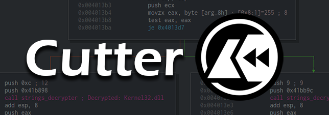
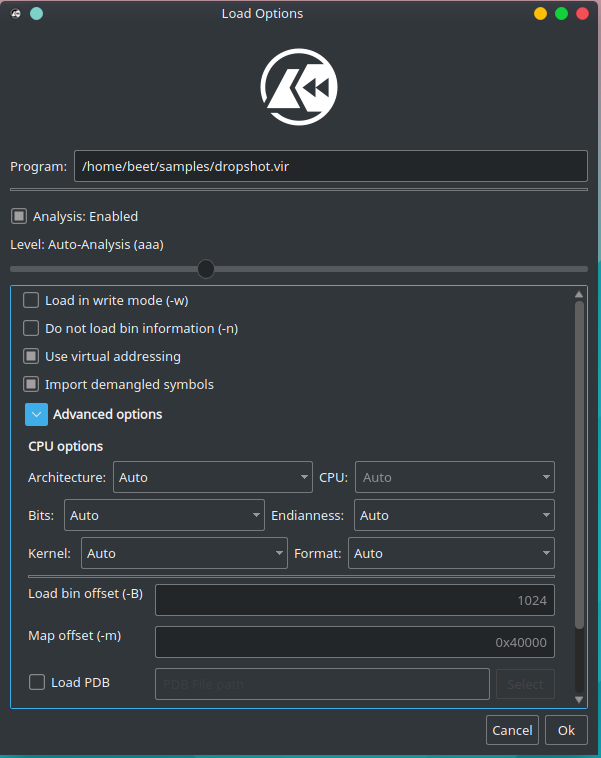
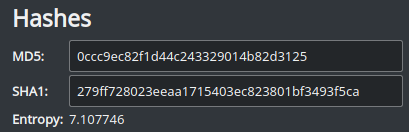
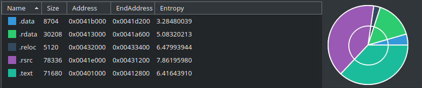
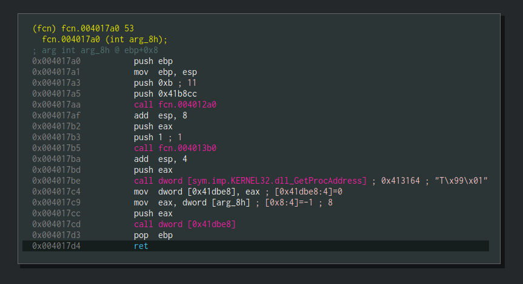
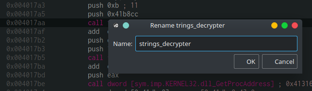
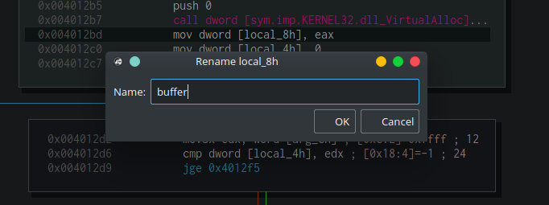
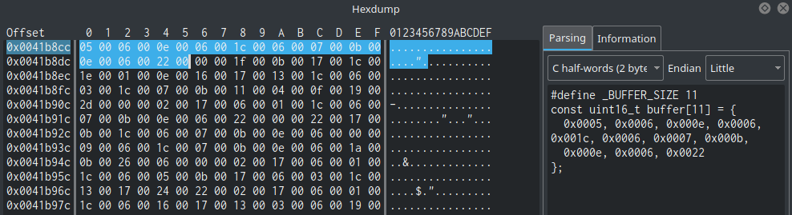
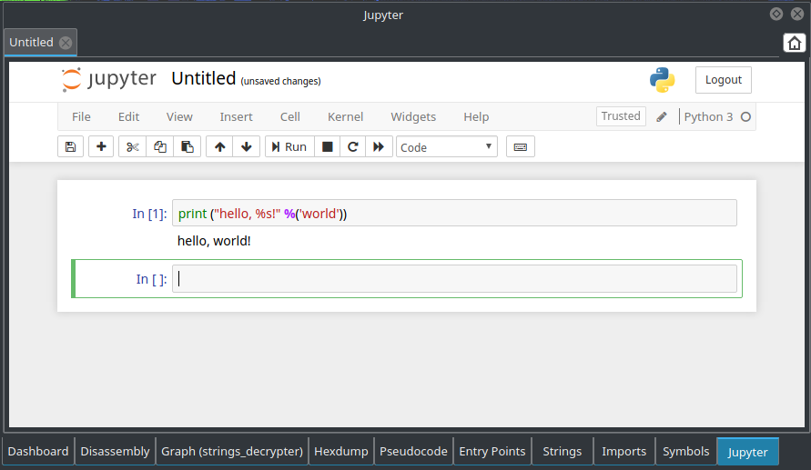
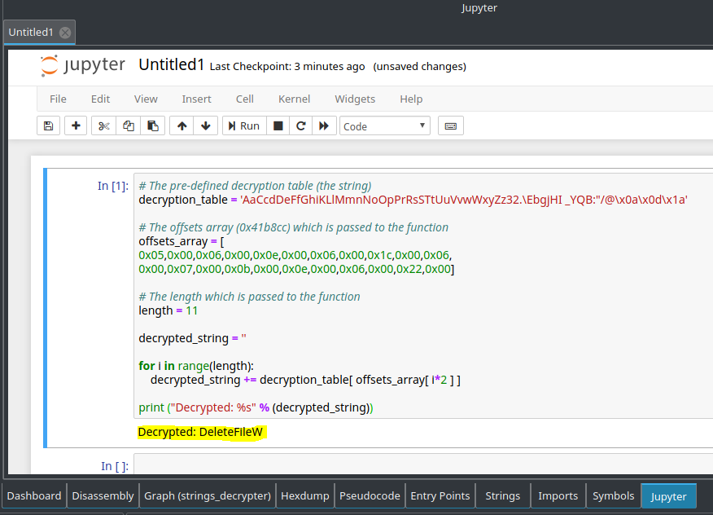

# Prologue

As a reverse engineer and malware researcher, the tools I use are super important for me. I have invested hours and hours in creating the best malware analysis environment for myself and chose the best tools for me and my needs. For the last two years, radare2 is my go-to tool for a lot of reverse-engineering tasks such as automating RE related work, scripting, CTFing, exploitation and more. That said, I almost never used radare2 for malware analysis, or more accurately, for analysis of malware for Windows. The main reason was that radare2 command-line interface felt too clumsy, complicated and an over-kill. IDA Pro was simply better for these tasks, a quick inspection of functions, data structures, renaming, commenting, et cetera. It felt more intuitive for me and that what I was searching for while doing malware analysis. And then came Cutter.




&nbsp;

# Cutter

Along the years, the radare2 community had tried to develop many different graphic-interfaces for radare2. None of them came even close to Cutter. Cutter is a QT C++ based GUI for radare2. In my opinion, it is the GUI that radare2 deserves. To quote from [Cutter&#8217;s Github page][1]:

> Cutter is not aimed at existing radare2 users. It instead focuses on those whose are not yet radare2 users because of the learning curve, because they don&#8217;t like CLI applications or because of the difficulty&#8230;

Cutter is a young project, only one-year-old, and it is the official GUI of radare2 (the first and only GUI to be announced &#8220;official&#8221;). Cutter is a cross-platform GUI that aims to export radare2&#8217;s plenty of functionality into a user-friendly and modern GUI. In this post, I&#8217;ll show you some of Cutter&#8217;s features and how I work with it. To be honest, Cutter is intuitive so you probably won&#8217;t need me to show you around, but just in case.

#### Downloading and installing Cutter

Cutter is available for all platforms (Linux, OS X, Windows). You can download the latest release [here][2]. If you are using Linux, the fastest way to use Cutter is to use the AppImage file.

If you want to use the newest version available, with new features and bug fixes, you should build Cutter from source by yourself. It isn&#8217;t a complicated task and it is the version I use.

First, you must clone the repository:

```default
git clone --recurse-submodules https://github.com/radareorg/cutter
cd cutter
```


Building on Linux:

<div class="highlight highlight-source-shell">
  ```default
./build.sh
```

  
    Building on Windows:
  
  ```default
prepare_r2.bat
build.bat
```

</div>

If any of those do not work, check the more detailed instruction page [here][3].

# Dropshot \ StoneDrill

Dropshot, also known as StoneDrill, is a wiper malware associated with the APT33 group which targeted mostly organizations in Saudi Arabia. Dropshot is a sophisticated malware sample, that employed advanced anti-emulation techniques and has a lot of interesting functionalities. The malware is most likely related to the infamous [Shamoon malware][4]. Dropshot was analyzed thoroughly by [Kaspersky][5] and later on by [FireEye][6]. In this article, we&#8217;ll focus on analyzing how Dropshot decrypted the strings inside it in order to evade analysis. In part 2 of this article, which will be published soon, we&#8217;ll focus on decrypting the encrypted resource of Dropshot which contains the actual payload of the malware.

The Dropshot sample can be downloaded from [here][7] <span style="font-size: 12pt;">(password: <em>infected</em>). I suggest you star (<span style="color: #ffcc00;">★</span>) <a href="https://github.com/ITAYC0HEN/A-journey-into-Radare2/">the repository</a> to get updates on more radare2 tutorials 🙂</span>

<span style="color: #ff0000;"><strong>Please, be careful when using this sample. It is a real malware, and more than that, a wiper! Use with caution!</strong></span>

_Since we&#8217;ll analyze Dropshot statically, you can use a Linux machine, as I did._


<!--more-->

<blockquote class="twitter-tweet" data-lang="en">
  <p dir="ltr" lang="en">
    Who said radare2 doesn&#8217;t have a decent GUI? | Decrypting the encrypted strings of APT33&#8217;s Dropshot malware using Cutter (<a href="https://twitter.com/r2gui?ref_src=twsrc%5Etfw">@r2gui</a>) and <a href="https://twitter.com/radareorg?ref_src=twsrc%5Etfw">@radareorg</a>&#8216;s Python API. Check it out @ <a href="https://t.co/u50oaVYsOU">https://t.co/u50oaVYsOU</a> <a href="https://t.co/8loEAG07IW">pic.twitter.com/8loEAG07IW</a>
  </p>
  
    — Itay Cohen (@megabeets_) <a href="https://twitter.com/megabeets_/status/998589232259137536?ref_src=twsrc%5Etfw">May 21, 2018</a>
</blockquote>


# Getting Started

Now that we have Cutter installed, we are set to go and start our analysis. Open Cutter by double-clicking on its Icon or typing `./Cutter` in the command line. Under the &#8220;Open File&#8221; tab select a new file and press &#8220;open&#8221;. After opening the file, we landed on the &#8220;Load Options&#8221; window of Cutter. This is an intuitive dialog where we can tell radare2 how to analyze the file. By expanding the &#8220;Advanced options&#8221;, we can set a specific Architecture, a CPU, choose a file format and many more.



&nbsp;

In order to analyze this sample more accurately, I chose to modify a more advanced option. By moving the Analysis slider we can modify the level of Analysis. We&#8217;ll move it to the right in order to choose the Advanced analysis mode. Then, disable the auto-renaming of functions by removing the check from &#8220;Autorename functions based on context (`aan`)&#8221;. I chose to disable `aan` since in this sample, the algorithm behind `aan` is renaming some functions with confusing names.

After clicking &#8220;OK&#8221; we&#8217;ll see the main window of Cutter, the dashboard. In your case, it might look different than mine but it can be easily configured. For example, by clicking &#8220;View -> Preferences&#8221; you will be able to change the theme colors and to configure the disassembly. The widgets are very flexible and can be located almost anywhere on the screen. You can also add more widgets to the screen by choosing the desired widget from the &#8220;Window&#8221; menu item. Take a few minutes to play with the environment since we&#8217;ll not dive deep into the interface.


&nbsp;

# Basic static analysis

When analyzing a malware sample, I usually start by statically examining the binary. A basic static analysis can sometimes confirm whether a file is malicious, provide information about its functionality, and help us understand what we are facing. Although the basic static analysis is straightforward and can be quick, it’s largely ineffective against sophisticated malware. So before reading any assembly, let&#8217;s have a look around on some widgets.

### Strings

Starting with the Strings widget, we are not seeing anything too interesting. Some strings might indicate names of files to be dropped &#8211; like &#8220;C-Dlt-C-Org-T.vbs&#8221; and &#8220;C-Dlt-C-Trsh-T.tmp&#8221;, others look unique but not telling us much, for example, &#8220;Hello dear&#8221;. We can also see some API functions and library strings we are familiar with, but there&#8217;s no &#8220;smoking gun&#8221;.

### Entropy

Another attribute that is worth checking is the file&#8217;s entropy. What is an entropy of a binary file? I&#8217;ll use a nice quote which is originated from [this page][9] (in Russian, I have no idea what is written here) but was taken by me from [this][10] great article about entropy.

> _<span lang="EN-GB">Oh, what&#8217;s the way this word hasn&#8217;t been mocked in thermodynamics! The measure of order in the system, the measure of energy dissipating and what&#8217;s not! Without any doubt, a real physicist will be sick of our definition while a real mathematician is going to be outraged. Nevertheless, as true dilettantes, let&#8217;s define the word &#8220;entropy&#8221; as <strong>a measure of the efficiency of information storage</strong>.</span>_

Simply put, entropy (in our case) is the measurement of randomness in a given set of values (data). The Entropy of a file (or data) is calculated similarly in different programs. Usually, it is a number between 0.0 to 8.0. The value of entropy is a reliable sign that the file is packed, compressed or contains packed or compressed data inside. A packed binary will probably have high entropy value. How high? Well, it differs. Some would say that 6.0 is high enough, some will say that 7.0 and above. I prefer to be somewhere in the middle and to treat 6.8 as good indicator that the binary or some of its components are compressed or packed.

We can easily see the calculated entropy of Dropshot by looking at Cutter&#8217;s Dashboard widget:



As you can see, our file has an entropy of 7.1 which is a very good indication of a compressed\packed data. To be more specific, we can see in the Sections widget the entropy of each section:

[  
][12] Look how high the entropy of `.rsrc` section is. Remember that the highest possible entropy value is 8.0. No doubt, we have an interesting data in this section. We&#8217;ll get to that later in the 2nd part of this series.

# Understanding the strings decryption process

While I was going through Dropshot code, I found that it is using a rather not-too-complicated method to decrypt its embedded strings (well, most of them). This function stood up in my analysis mainly because it was called many many times in the code and was used mainly before `LoadLibraryA` and `GetProcAddress`. So it looked to me as a technique to load libraries and functions dynamically in order to complicate analysis. A very popular approach among malware authors. The aim of this article is not to understand every component of the malware, but to get familiar with Cutter, scripting with radare2, and how both can be used by malware researchers. Thus, (sadly) I won&#8217;t explain every step I took to find the decryption function.

As said before, spotting the decryption function was done thanks to its popularity and its cruciality to the program&#8217;s flow. If you want to give it a shot and try to find it by yourself &#8212; this is the time.

* * *

Whether you found it or were too lazy to even search, here&#8217;s the answer &#8212; the decryption function is located at `0x4012a0` and appears to take two parameters. In the next screenshot, we&#8217;ll see a function which is using the decryption function.




The demonstrated function above (`0x4017a0`) is passing two parameters into our decryption function (`0x4012a0`). The first argument is `0xb` (Decimal: 11) and the second argument is an address at `0x41b8cc`. This is the time to rename our strings decryption function in order to ease our analysis. It can be easily done by clicking on `fcn.004012a0` and pressing `Shift + N` or by right-clicking and choosing &#8220;Rename `fcn.004012a0`&#8220;. Enter the new name and press OK. I chose to call it `strings_decrypter`.



Next, we can see that the output of `strings_decrypter` (`eax`) is being pushed to another function at `0x4013b0` in addition to another argument, 1. Let&#8217;s have a look at this function:


The function is taking the right branch if the argument passed to it is 0 (i.e `EAX == 0`) and the left branch if it is not. Either way, it will call `LoadLibraryA` with a string that would be decrypted using our beloved decryption function. I&#8217;ll spoil it for you &#8212; the function would load `ntdll.dll` on the right branch and `kernel32.dll` on the left. Simply put, the function is loading the required library in order to use a function from it. I&#8217;ll rename this function to `load_ntdll_or_kernel32`. Now let&#8217;s get back to the previous function and continue to examine it.

After choosing loading either `ntdll.dll` or `kernel32.dll`, the function calls `GetProcAddress` with a handle to the loaded library and the string that it decrypted at the beginning. We can be sure that this string is an exported API function of `kernel32.dll`. A few instructions later we can see that the referenced API function is being called.

We don&#8217;t have any idea which API function is being called. That&#8217;s why we need to understand how `strings_decrypter` is working and what is each parameter that is being passed to it.

# Analyzing the decryption function

We talked about this function constantly but we didn&#8217;t see it yet. Here&#8217;s the graph of the function as created by Cutter:


So, what do we have here? We obviously won&#8217;t go over it step by step, but we need to, and will, understand the general idea. We already know that this function receives two arguments. The first one is an address and the second is a number. The address argument is held by a variable named `arg_8h`, the integer is stored at `arg_ch`. At the first block, starting at `0x4012a0`, we can see that a buffer at the size of `arg_ch+1` is allocated by `VirtualAlloc`. Then the address to the allocated buffer is assigned to `local_8h`. We can rename it to `buffer` by clicking on its name and pressing Shift+N. This can also be done using the right-click context menu.

After that, we can see that zero is assigned to `local_4h`. The next block is a starting of a loop. We can see that the integer stored at `arg_ch` is assigned to `edx` which in turn is compared with `local_4h`. We can understand now that `arg_ch` is some kind of length or size and `local_4h` is a loop index. Let&#8217;s rename both to `length` and `index`. Now that we know the purpose of one argument of the two and the purpose of the two local variables, we need to understand what is in the address that is passed via `arg_8h`. In our example, we saw the value `0x41b8cc` being passed to our `strings_decrypter` function. Let&#8217;s go to the Hexdump widget and seek to this address. Just type this address in the upper textbox in order to seek a flag or an address. We can see that this is a half-word (2 bytes) array of integers that starts from `0x41b8cc` and ends at `0x0041b8e1`. Using another great feature from Cutter (at the right side of the screen), we can generate a C array of half-words:

That&#8217;s a really great feature, right?! Cutter can generate different types of arrays to ease scripting tasks. Here are some examples:

**C half-words (Little Endian):**

```c
#define _BUFFER_SIZE 11
const uint16_t buffer[11] = {
  0x0005, 0x0006, 0x000e, 0x0006, 0x001c, 0x0006, 0x0007, 0x000b,
  0x000e, 0x0006, 0x0022};
```


**Python:**

```python
import struct
buf = struct.pack ("22B", *[
0x05,0x00,0x06,0x00,0x0e,0x00,0x06,0x00,0x1c,0x00,0x06,
0x00,0x07,0x00,0x0b,0x00,0x0e,0x00,0x06,0x00,0x22,0x00])

```


**Javascript:**

```js
var buffer = new Buffer("BQAGAA4ABgAcAAYABwALAA4ABgAiAA==", 'base64');
```


This array will help us later to write the decryption script. For now, let&#8217;s continue to figure out how `strings_decrypter` works. Entering the loop, we can see that `eax` will hold the `index` and `ecx` will hold the aforementioned array. Then, a byte from `[ecx + eax*2]` is moved to `edx`. Basically, `edx` now equals to `half_word_array[index*2]`. Next, our buffer is moved to `eax` which in turn is being added with the value of `index`, setting `eax` to a specific offset in the allocated buffer. Then, at `0x004012eb`, we can see that a byte is moved to `cl`. This byte is taken from index `[edx]` of a pre-defined string. Double-clicking the string will reveal us the full string &#8212; `AaCcdDeFfGhiKLlMmnNoOpPrRsSTtUuVvwWxyZz32.\EbgjHI _YQB:"/@\x0a\x0d\x1a`. Immediately after that, the byte from `cl` is copied into the specific index in our `buffer`. The loop continues `length` times.

After all this mess we can say that the array which is passed to this function, `arg_8h`, is simply an array of offsets in this string and `length` is the length of the string to be built. This is how Dropshot builds its strings, by passing the offsets array and the string&#8217;s length. Let&#8217;s confirm this claim by testing it with Python.

This is where another great feature of Cutter is being used, an integrated [Jupyter notebook][16]. We don&#8217;t need to open any external Python shell, we can use Cutter&#8217;s Jupyter widget.

Oh, I love this feature!

So let&#8217;s write a quick proof of concept to confirm that this is really how this decryption function works. Here&#8217;s the quick POC in python:

```python
# The pre-defined decryption table (the string)
decryption_table = 'AaCcdDeFfGhiKLlMmnNoOpPrRsSTtUuVvwWxyZz32.\EbgjHI _YQB:"/@\x0a\x0d\x1a'

# The offsets array (0x41b8cc) which is passed to the function
offsets_array = [
0x05,0x00,0x06,0x00,0x0e,0x00,0x06,0x00,0x1c,0x00,0x06,
0x00,0x07,0x00,0x0b,0x00,0x0e,0x00,0x06,0x00,0x22,0x00]

# The length which is passed to the function
length = 11

decrypted_string = ''

for i in range(length):
    decrypted_string += decryption_table[ offsets_array[ i*2 ] ]

print ("Decrypted: %s" % (decrypted_string))
```


And let&#8217;s run it in Jupyter:

Great! We can see that we successfully decrypted the string and got &#8220;DeleteFileW&#8221; which is an API function. So now we can feel confident to rename the last argument, `arg_8h`, to &#8220;offsets_array&#8221;.

Now that we figured out how `strings_decrypter` is working, and even decrypted one string, we can see where else this function is being called and decrypt all the other strings. To see the cross-references to `strings_decypter`, click on its name and press X on the keyboard. This will open the xrefs window. Cutter will also show us a preview of each reference to this function which makes the task of inspecting xrefs much easier.


We can see dozens of calls to `strings_decrypter`, too much for a manual decryption. That is where the power of radare2 and Cutter scripting will come handy!

# Scripting time! Decrypting the strings

Scripting radare2 is really easy thanks to [r2pipe][19]. It is the best programming interface for radare2.

> The r2pipe APIs are based on a single r2 primitive found behind `r_core_cmd_str()` which is a function that accepts a string parameter describing the r2 command to run and returns a string with the result.

r2pipe supports many programming languages including [Python][20], [NodeJS][21], [Rust][22], [C][23], and others.

Lucky us, Cutter is coming with the python bindings of `r2pipe` integrated into its Jupyter component. We&#8217;ll write an r2pipe script that will do the following:

  * Declare constant variables for the addresses we already know (decryption function, decryption table)
  * Dump the content of the decryption table to a variable
  * Iterate over all the references to the decryption table and save the arguments passed to it
  * Manually decrypt the encrypted string
  * Print the decrypted function to the screen and add inline comments in the assembly

<span style="color: #53d453;">* Note that the following script requires an understanding of radare2 commands. Most of the commands I&#8217;ll use here explained in my previous articles on my series of articles:</span> [&#8220;A journey into Radare 2&#8221;][24].<span style="color: #53d453;"> Make sure to check it out!</span>

The first item on our list is to define the addresses of the components we have already detected: the decryption table and the decryption function.

```python
import cutter

# Declaration of decryption-table related variables
decryption_table = 0x41BA3C
decryption_table_end = 0x41BA77
decryption_table_len = decryption_table_end - decryption_table
decryption_function = 0x4012A0
```


Next, we need to analyze the binary so radare2 will detect the xrefs and functions. `aa` is a basic analysis command of radare2. `cutter.cmd` is a function that receives a radare2 command and returns its output, if there&#8217;s any output at all.

```python
cutter.cmd('aa')
```


Let&#8217;s move on and dump the content of the decryption_table to a variable. `pxj` is used to **p**rint he**x**dump, the **j** suffix can be used in most of the radare2 commands to get a JSON output. `cutter.cmdj` will parse the JSON output for us.

```python
# Dump the decryption table to a variable
decryption_table_content = cutter.cmdj(
    "pxj %d @ %d" % (decryption_table_len, decryption_table))
```


So basically in this piece of code, we are telling radare2 to take `decryption_table_len` bytes from (`@`) the address of `decryption_table`. Now we have all the data we need in order to start iterate over the references to the decryption function.

Using a Python `for` loop, we will iterate over the output of `axtj`. This command stands for **a**nalyze **x**refs **t**o and it is being used to list all the data and code references to a specific address. In our case, this address will be our decryption function. The first thing that we will do in each iteration is to parse the two arguments that are passed to the decryption function. These will be the offset array and the length of the string to be decrypted. We&#8217;ll parse the arguments using `pdj -2 @ <some xref address>`. `pdj` stands for **p**rint **d**isassembly. Passing `-2` to `pdj` is telling radare2 to print 2 instructions **before** the given address. We assume that these two arguments will be passed to the function right before it is being called by the program.

```python
# Iterate x-refs to the decryption function
for xref in cutter.cmdj('axtj %d' % decryption_function):
    # Get the arguments passed to the decryption function: length and encrypted string
    length_arg, offsets_arg = cutter.cmdj('pdj -2 @ %d' % (xref['from']))

    # String variable to store the decrypted string
    decrypted_string = ""

    # Guard rail to avoid exception
    if (not 'val' in length_arg):
        continue
```


Now for the fun part, decrypting the string. Since we already did a POC of it, we know how the decryption works. This will be easy to implement using a `for` loop:

```python
# Manually decrypt the encrypted string
    for i in range(0, length_arg['val']):
        decrypted_string += chr(decryption_table_content[cutter.cmdj(
            'pxj 1 @ %d' % (offsets_arg['val'] + (i*2)))[0]])
```


Great! Now `decypted_string` is holding the, well, the decrypted string. All we left to do is to print it to the console and add inline-comments in each call. The command `CC` will be used to add the comments.

```python
# Print the decrypted and the address it was referenced to the console
    print(decrypted_string + " @ " + hex(xref['from']))

    # Add comments to each call of the decryption function
    cutter.cmd('CC Decrypted: %s @ %d' % (decrypted_string, xref['from']))
```


Now we can combine it all into one script:

```python
import cutter
 
# Declaration of decryption-table related variables
decryption_table = 0x41BA3C
decryption_table_end = 0x41BA77
decryption_table_len = decryption_table_end - decryption_table
decryption_function = 0x4012A0

cutter.cmd('aa')

# Dump the decryption table to a variable
decryption_table_content = cutter.cmdj(
    "pxj %d @ %d" % (decryption_table_len, decryption_table))

# Iterate x-refs to the decryption function
for xref in cutter.cmdj('axtj %d' % decryption_function):
    # Get the arguments passed to the decryption function: length and encrypted string
    length_arg, offsets_arg = cutter.cmdj('pdj -2 @ %d' % (xref['from']))
 
    # String variable to store the decrypted string
    decrypted_string = ""
 
    # Guard rail to avoid exception
    if (not 'val' in length_arg):
        continue
        
    # Manually decrypt the encrypted string
    for i in range(0, length_arg['val']):
        decrypted_string += chr(decryption_table_content[cutter.cmdj(
            'pxj 1 @ %d' % (offsets_arg['val'] + (i*2)))[0]])

    # Print the decrypted and the address it was referenced to the console
    print(decrypted_string + " @ " + hex(xref['from']))
 
    # Add comments to each call of the decryption function
    cutter.cmd('CC Decrypted: %s @ %d' % (decrypted_string, xref['from']))

    # Refresh the interface
    cutter.refresh()

```


&nbsp;

Now we can paste the script to the Jupyter notebook inside Cutter and execute it. A second after, we can take a look at the Comments widget and see that our script worked and updated the comments:

We can also see these comments inline in the disassembly:


Awesome! We did it, we decrypted the encrypted strings and added inline comments to ease the analysis process. The final script can be found [here][26].


# Epilogue

Here comes to an end the first part of this article about decrypting Dropshot with Cutter and r2pipe. We got familiar with Cutter, radare2 GUI, and wrote a decryption script in r2pipe&#8217;s Python binding. We also analyzed some components of APT33&#8217;s Dropshot, an advanced malware.

The next part will be shorter and in it, we&#8217;ll see how to decrypt an encrypted resource inside Dropshot. This resource is the actual payload of Dropshot. So stay tuned!

As always, please post comments to this post or message me [privately][27] if something is wrong, not accurate, needs further explanation or you simply don’t get it. Don’t hesitate to share your thoughts with me.

**Subscribe on the left if you want to get the next articles straight in your inbox.**


 [1]: https://github.com/radareorg/cutter
 [2]: https://github.com/radareorg/cutter/releases
 [3]: https://github.com/radareorg/cutter/blob/master/docs/Compiling.md
 [4]: https://en.wikipedia.org/wiki/Shamoon
 [5]: https://app.box.com/s/olc867zxc9nkjzm3wkjwi0b0e2awahtn
 [6]: https://www.fireeye.com/blog/threat-research/2017/09/apt33-insights-into-iranian-cyber-espionage.html
 [7]: https://github.com/ITAYC0HEN/A-journey-into-Radare2/blob/master/Part%203%20-%20Malware%20analysis/dropshot.exe.zip
 [8]: https://www.megabeets.n./cutter_Load_Screen_ux.png
 [9]: https://exelab.ru/art/wasm2.php#4
 [10]: http://n10info.blogspot.co.il/2014/06/entropy-and-distinctive-signs-of-packed.html
 [11]: https://www.megabeets.n./cutter_entropy_dashboard.png
 [12]: https://www.megabeets.n./cutter_entropy_sections.png
 [13]: https://www.megabeets.n./cutter_rename_function.png
 [14]: https://www.megabeets.n./cutter_rename-local_8h.png
 [15]: https://www.megabeets.n./hexdump_c_half_words.png
 [16]: http://jupyter-notebook-beginner-guide.readthedocs.io/en/latest/what_is_jupyter.html
 [17]: https://www.megabeets.n./Cutter_jupyter_hello_world.png
 [18]: https://www.megabeets.n./Cutter_jupyter_poc.png
 [19]: https://github.com/radare/radare2-r2pipe
 [20]: https://github.com/radare/radare2-r2pipe/tree/master/python
 [21]: https://github.com/radare/radare2-r2pipe/tree/master/nodejs/r2pipe
 [22]: https://github.com/radare/radare2-r2pipe/tree/master/rust
 [23]: https://github.com/radare/radare2-r2pipe/tree/master/c
 [24]: https://www.megabeets.net/a-journey-into-radare-2-part-1/
 [25]: https://www.megabeets.n./cutter_comments_widget.png
 [26]: https://github.com/ITAYC0HEN/A-journey-into-Radare2/blob/master/Part%203%20-%20Malware%20analysis/decrypt_dropshot.py
 [27]: https://www.megabeets.net/about.html#contact