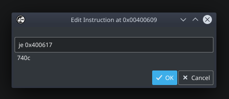

I recently watched [a video][1] by LiveOverflow in which he showed how different tools are used to patch binaries. By demonstrating some of the features that Radare2, Ghidra, and Binary Ninja offer for the task, the viewer can get some sense of the things they can get from using these tools.

While all these tools are great, and although Radare2 was showed there (and oh boy, things went wrong), there was one tool, which is dear to my heart, that wasn&#8217;t there &#8211; [Cutter][2].  Notwithstanding that it is the youngest member of the pack, Cutter is growing up very fast and when it has to do with binary patching &#8211; it does not stay behind.

&#8220;Binary Patching&#8221;, for those the term is unfamiliar, is the process of applying small changes and modifications to a binary file, usually in order to change its behavior. By modifying data or code, the user can change certain values in the program or specific instructions, and adjust the binary to their desired outcome.


**_Wanna skip the boring parts? Jump straight to the methods:_**

[Method 1: Reverse the jump][4]  
[Method 2: Straight from the decompiler][5]  
[Method 3: NOP’ing your way][6]  
[Method 4: Disassemble the instruction][7]  
[Method 5: Assemble the bytes][8]  
[Bonus: Using radare2 console from within Cutter][9]

### Cutter

Cutter is a free and open-source reverse engineering framework powered by [radare2][10]. It offers a wide range of features for reverse-engineers where the most important of them are disassmebler, a grpah, a decompiler (based on Ghidra&#8217;s decompiler), and a hex-editor and from recently &#8211; a **debugger**.

To download the latest release of Cutter, ahead to the [official website][2]. If you want to build Cutter from the source to enjoy the latest improvement and features, and you are up for a ride &#8211; check out the [Building][11] page on the documentation.

_Please note that this article will be quite straight forward and will not cover different features of Cutter._

### Getting to know our target

For this article, we will use the same binary that was used on LiveOverflow&#8217;s video &#8211; `license_1.c`.

[Click here to download the binary for Linux.][12]

The source code can be found here and is also pasted below to make it easy for us.

```c
#include <string.h>
#include <stdio.h>
int main(int argc, char *argv[]) {
        if(argc==2) {
		printf("Checking License: %s\n", argv[1]);
		if(strcmp(argv[1], "AAAA-Z10N-42-OK")==0) {
			printf("Access Granted!\n");
		} else {
			printf("WRONG!\n");
		}
	} else {
		printf("Usage: <key>\n");
	}
	return 0;
}
```


The program is rather simple. It receives a license-key from the user and then compares it to a hardcoded key &#8220;AAAA-Z10N-42-OK&#8221;. If the keys match, it will print &#8220;Access Granted!&#8221;. Otherwise, it will print &#8220;WRONG!&#8221;

```c
$ license_1 test_key
Checking License: test_key
WRONG!
```


Out goal is to patch the program in a way that we will receive the Success message upon entering a wrong key.

Before we start &#8211; because we are going to modify the binary, I prefer to make a backup of the original file.

```c
$ cp license_1 license_1.backup
```


Let&#8217;s open Cutter and select the license_1 binary from our computer. On the next dialog, make sure to select &#8220;Load in write mode (-w)&#8221;. You can leave the other settings as-is and press Ok.

Go to the `main` function by choosing it from the Functions list on the side or by typing &#8220;main&#8221; on the navigation-box at the top of the interface. The \`main()\` function is very small and contains all the logic of the program.


The function \`main()\` only has 6 blocks which makes it very easy for us to find the place we want to patch. And indeed, we see the block with `strcmp` comparison and we want to patch the conditional jump in a way that it will continue to the success message. By modifying \`jne 0x400617\` (**j**ump **n**ot **e**qual) to \`je\` (**j**ump **e**qual) we will get the success message as long as we do not give the right key. Muhahah.

 

### Method 1: Reverse the jump {#method-1}

The easiest and probably the most intuitive way is to right-click the \`jne\` instruction and choose &#8220;Edit -> Reverse jump&#8221;.

[][14]

Cutter is smart and can detect for us the inversed instruction for the condition. In this case, from \`jne\` to \`je\` and vice versa.

Now we can testthat our changes indeed work, with the same input we tried before. The changes we do are automatically apllied to the binary so we can simply test it.

```c
$ license_1 test_key
Checking License: test_key
Access Granted!
```


Yes! Patching is easy. Let&#8217;s see other ways to do the same.

 

### Method 2: Straight from the decompiler {#method-2}

If you downloaded the official release version, your Cutter should come with an integrated Ghidra decompiler via its native implementation called [r2ghidra-dec][15]. _If you build Cutter by yourself, you will need to build r2ghidra-dec as well. Just follow the instructions in the link._

Open the decompiler window from &#8220;Windows -> Decompiler&#8221; and seek to the \`main\` function. Now click on the line where it says `if (iVar1 == 0) {` and again go to &#8220;Edit > Reverse jump.

[][16]

This shows the great power of using the decompiler in Cutter.

 

### Method 3: NOP&#8217;ing your way {#method-3}

This is yet another easy way to skip the check and go straight to the success message. Simply right-click on the condition in the disassembly view, and then select &#8220;Edit -> Nop Instruction&#8221;.

Before:

```asm
0x00400602 call sym.imp.strcmp ; int strcmp(const char *s1, const char *s2)
0x00400607 test eax, eax
0x00400609 jne 0x400617
0x0040060b mov edi, str.Access_Granted
```


After:

```asm
0x00400602 call sym.imp.strcmp ; int strcmp(const char *s1, const char *s2)
0x00400607 test eax, eax
0x00400609 nop
0x0040060a nop
0x0040060b mov edi, str.Access_Granted
```


 

### Method 4: Disassemble the instruction {#method-4}

<p class="_1qeIAgB0cPwnLhDF9XSiJM">
  In this method, we will change the instructions itself from `jne` to <code>je</code>. Again, right-click on the condition and this time choose &#8220;Edit -> Instruction&#8221;. Then simply change the text from `jne 0x400617` to `je 0x400617`. Cutter will automatically fetch a preview of the bytes that are constructing the instruction. Press Ok.
</p>



### Method 5: Assemble the bytes {#method-5}

If you are tired of assembly and want to go back to the old days of bytes-patching and modify the bytes themselves &#8211; you can! Simply go to &#8220;Edit -> Bytes&#8221; and change from \`750c\` to \`740c\` (from \`jne\` to `je`). Cutter will show you a preview of the instruction to make sure you are not making some mess.


### Bonus: Using radare2 console from within Cutter {#bonus}

If you are familiar with radare2, you will likely be happy to know that Cutter is coming with an integrated radare2 console. Open it from &#8220;Windows -> Console&#8221; and start typing your favorite r2 commands. And that&#8217;s right, you can simply patch the bytes from the command-line using the \`w\` commands such as `wx`, `wa` and so on. To know more, check `w?`for help.

 

### Epilogue

In this article, we learned a little bit more about this great tool called Cutter. We faced a problem that reverse-engineers are often faced, and solved it using 5 different methods. There are more methods to patch bytes (for example using the hex-editor in cutter) but these 5 should be enough of a start. Unlike most of my articles, this is a short post and a very straight forward one.  Hopefully, you learned something new. Cheers!

 


 [1]: https://www.youtube.com/watch?v=LyNyf3UM9Yc
 [2]: https://cutter.re/
 [3]: https://www.megabeets.n./patch_cover.png
 [4]: #method-1
 [5]: #method-2
 [6]: #method-3
 [7]: #method-4
 [8]: #method-5
 [9]: #bonus
 [10]: https://github.com/radareorg/radare2
 [11]: https://cutter.re/docs/building
 [12]: https://github.com/LiveOverflow/liveoverflow_youtube/raw/master/0x05_simple_crackme_intro_assembler/license_1
 [13]: https://www.megabeets.n./patching_main_function-4.png
 [14]: https://www.megabeets.n./patching_reverse_jump.gif
 [15]: https://github.com/radareorg/r2ghidra-dec
 [16]: https://www.megabeets.n./patching_decompiler_reverse_jump.gif
 [17]: https://www.megabeets.n./patching_edit_instruction_dialog.png
 [18]: https://www.megabeets.n./patching_edit_bytes_dialog.png