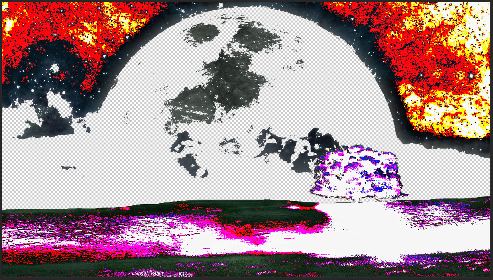
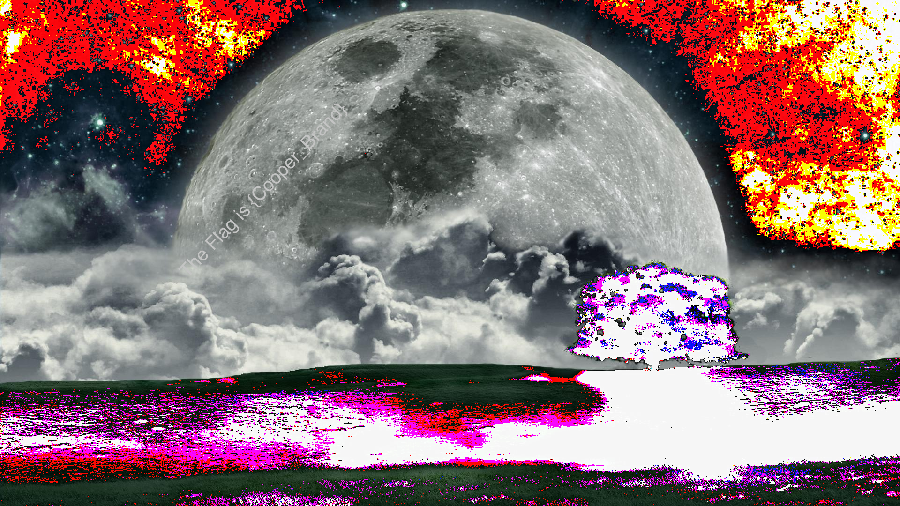

## Description:

> **Forensics 150 pts**
> 
> Dr. Cooper, on another one of his endless journeys encounter a mysterious planet . However when he tried to land on it, the ship gave way and he was left stranded on the planet . Desperate for help, he relays a message to the mothership containing the details of the people with him . Their HyperPhotonic transmission is 10 times the speed of light, so there is no delay in the message . However, a few photons and magnetic particles interefered with the transmission, causing it to become as shown in the picture . Can you help the scientists on the mothership get back the original image?
> 
> transmission.png

We are given with a photo, I opened it in Photoshop and saw that parts of it are transparent.

 

&nbsp;

I grabbed Python and removed the Alpha layer from the image. The Alpha layer controls pixels&#8217; transparency.

```python
from PIL import Image
Image.open('transmission.png').convert('RGB').save('output.png')
```


We got the result with the flag:

 

&nbsp;

The flag was **pragyanctf{Cooper_Brand}**

<div class="nf-post-footer">
  <p style="text-align: right">
    <a href="https://www.megabeets.net/about.html#vegan">Eat Veggies</a>
  </p>
</div>