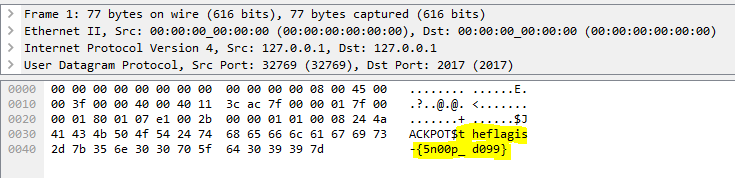

## Description

> **The Karaboudjan | **Forensics 150 pts
> 
> Captain Haddock is on one of his ship sailing journeys when he gets stranded off the coast of North Korea. He finds shelter off a used nuke and decides to use the seashells to engrave a message on a piece of paper. Decrypt the message and save Captain Haddock.
> 
> ->-.>-.&#8212;.&#8211;>-.>.>+.&#8211;>&#8211;..++++.
> 
> 

> 
> .+++.
> 
> 

> 
> .->-.->-.++++++++++.+>+++.++.-[->+++<]>+.+++++.++++++++++..++++[->+++<]>.&#8211;.->&#8211;.>.
> 
> <a class="has-tooltip" title="" href="https://ctf.pragyan.org/download?file_key=c279a3923f124ea36dc67a930a55c996ae14b0661a86f7e61a2db0690d97bd4e&team_key=a500afc4a171f394f280518fefd78d62f976bf8303f77f3431573fce01c983cb" data-toggle="tooltip" data-placement="right" data-original-title="0.28 KB">clue.zip</a>

&nbsp;

This was funny challenge, I struggled with that Brainfuck but all it was is just brainfuck. Nothing more, we don&#8217;t need it to solve the challenge. Sorry guys.

I downloaded the zip file which was encrypted, I then cracked it using &#8220;fcrakzip&#8221; and dictionary attack. And found that the password is &#8220;_dissect_&#8220;. Inside the zip was a pcap file with one packet:

&nbsp;

 

That&#8217;s it, we got the flag 🙂

The flag was **pragyanctf{5n00p_d099}**

  

    <a href="https://www.megabeets.net/about.html#vegan">Eat Veggies</a>
  

