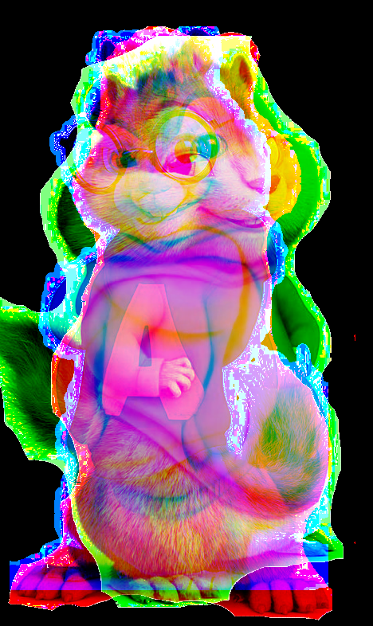
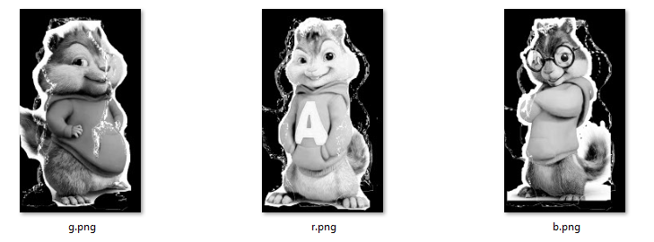

## Description:

> **Lost Friends** **| **Stego 300
> 
> Moana and her friends were out on a sea voyage, spending their summer joyously.  
> Unfortnately, they came across Charybdis, the sea monster. Charybdis, furious over having  
> unknown visitors, wreaked havoc on their ship. The ship was lost.
> 
> Luckily, Moana survived, and she was swept to a nearby island. But, since then, she has not seen her  
> friends. Moana has come to you for help. She believes that her friends are still alive, and that you are the  
> only one who can help her find them
> 
> <span class="challenge-attachment"><a class="has-tooltip" title="" href="https://ctf.pragyan.org/download?file_key=c759dcc0a65f3c7c49a6d6e41148c1dc4d94fe8ebbfbdfe90f0c31b7772c5c6a&team_key=a500afc4a171f394f280518fefd78d62f976bf8303f77f3431573fce01c983cb" data-toggle="tooltip" data-placement="right" data-original-title="467.10 KB">lost_friends.png</a></span>

Moana has lost her friends and we need to help her find them. We are given with an image which is absolutely blank. I opened it in Photoshop and saw that it&#8217;s completely transparent. So I grabbed python and Pillow and canceled the alpha channel (which is responsible for transparency).

```python
from PIL import Image
# convert from RGBA to RGB will cancel transparency
Image.open('lost_friends.png').convert('RGB').save('output.png')

```


I got this image:

 

Wooho, Chipmunks! It seems like every chipmunk is on another channel, lets split the channels:

```python
import cv2
import numpy as n
img = cv2.imread('lost_friends.png',cv2.IMREAD_UNCHANGED)
b,g,r = cv2.split(img)
cv2.imwrite('b.png',b)
cv2.imwrite('g.png',g)
cv2.imwrite('r.png',r)
```


Now we have three images of chipmunks:

 

I played with them, trying to find the flag but found nothing. So I got back to the original image and opened it with Hex Editor. At the bottom of the file I found this hint: **&#8220;Psssst, Director, maybe ??&#8221;. **So the flag is probably the name of the director of chipmunks. According to Wikipedia, Chipmunks has 4 movies, I tried to submit with each director and found that the director of the third movie is the flag.

The flag was **praganctf{MikeMitchell}**

<div class="nf-post-footer">
  <p style="text-align: right">
    <a href="https://www.megabeets.net/about.html#vegan">Eat Veggies</a>
  </p>
</div>