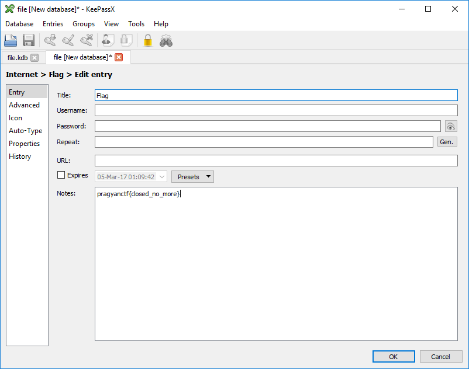

## Description:

> <div class="challenge-description">
>   [!@# a-z $%^ A-Z &* 0-9] [1,3]
> </div>
> 
> <div class="challenge-files">
>   <div>
>     <span class="challenge-attachment"><a class="has-tooltip" title="" href="https://ctf.pragyan.org/download?file_key=e6ddbdba43b6d7d9261769def938d922071984306d03af07005853c26d0739a4&team_key=a500afc4a171f394f280518fefd78d62f976bf8303f77f3431573fce01c983cb" data-toggle="tooltip" data-placement="right" data-original-title="1.15 KB">file</a></span>
>   </div>
> </div>

<div>
</div>

<div>
</div>

<div>
  All we got is a file and regular expression.
</div>

<div>
  Lets run <code>file</code> command on the file to determine its type:
</div>

<div>
  ```diff
$ file ./file.kdb
file: Keepass password database 1.x KDB, 3 groups, 4 entries, 50000 key transformation rounds
```

  
  <p>
    The file is KDB file which is Keepass password database. Keepass is a famous opensource password manager.
  </p>
  
  <p>
    I tried open it using KeePassX for windows, but we need a password to open the database. The password probably should match the regex, so I generated a dictionary with all the possible passwords (more then 300,000 words).
  </p>
  
  ```python
import string
import itertools

# strings match the regex
chars = string.lowercase + string.uppercase + string.digits + '!@#$%^&*'
f = open('dict.txt','a')

all_permutations = list(itertools.permutations(chars,1))+ list(itertools.permutations(chars,2))+ list(itertools.permutations(chars,3))

for p in all_permutations:
    f.write(''.join(p)+'\n')
```

  
  <p>
    &nbsp;
  </p>
</div>

And I the ran John the Ripper to crack the password and went to eat lunch.

```diff
$ keepass2john file.kdb > kp
$ john  --wordlist=dict.txt -format:keepass kp
Using default input encoding: UTF-8
Loaded 1 password hash (KeePass [SHA256 AES 32/64 OpenSSL])
Press 'q' or Ctrl-C to abort, almost any other key for status
k18              (file.kdb)

```


When I came back I saw that John found the password, now lets open the file:

 

&nbsp;

The flag was **pragyanctf{closed\_no\_more}**

<div class="nf-post-footer">
  <p style="text-align: right">
    <a href="https://www.megabeets.net/about.html#vegan">Eat Veggies</a>
  </p>
</div>