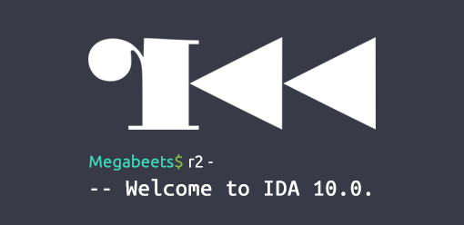
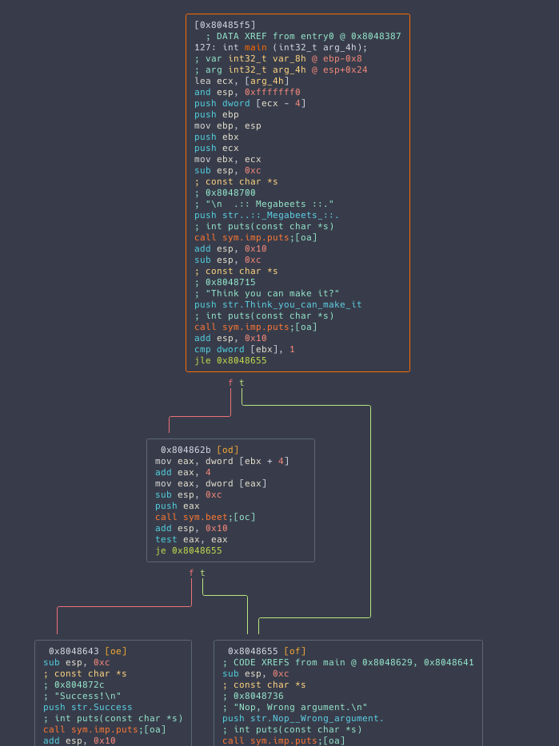
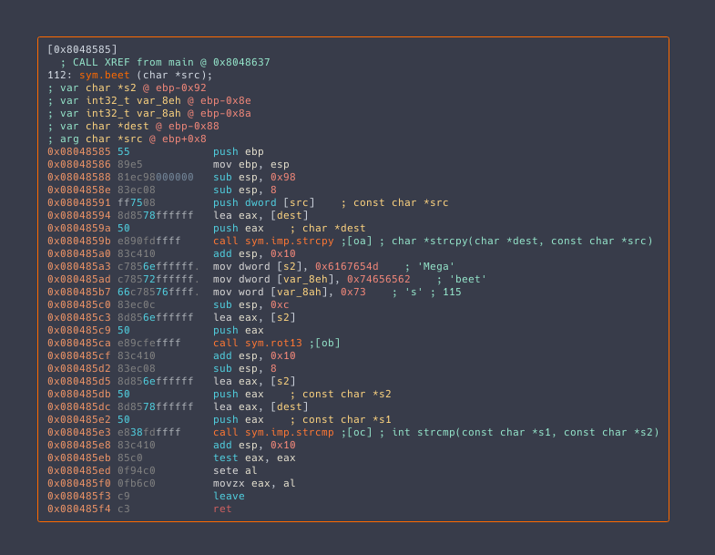

<blockquote class="wp-block-quote">
  <p>
    <strong>Update (2020): </strong><em>Since writing this article, it has become, in a way, the go-to tutorial for learning radare2. Your feedback was amazing and I am very happy for the opportunity to teach new people about radare2.</em>
  </p>
  
  <p>
    <em>A lot has changed since I wrote this tutorial, both with radare2 and with me. I am now, for several years, a core member in the radare2 team and a maintainer of <a href="https://cutter.re/">Cutter</a>, a modern, GUI-based, reverse engineering framework that is powered by radare2.</em>
  </p>
  
  <p>
    <em>This is an updated version of the original tutorial. I will keep it updated every now and then to make sure it is up-to-date with the changes in radare2.</em>
  </p>
  
  <p>
    <em>Enjoy!</em>
  </p>
</blockquote>

<hr class="wp-block-separator is-style-dots" />

## <span class="ez-toc-section" id="Prologue"></span>Prologue<span class="ez-toc-section-end"></span>

I was playing a lot with radare2 in the past years, ever since I began participating in CTFs and got deeper into RE and exploitation challenges. I found radare2 very helpful with many CTFs tasks and my solutions had shortened significantly. It&#8217;s also my go-to tool for malware analysis tasks such as configuration retrievals. Sadly, I believe that only few people are familiar with radare2. It might be because they&#8217;re afraid to break out of their comfort zone (IDA Pro, x64dbg, Ghidra, OllyDBG, gdb) or they have simply not heard of it. Either way, I honestly believe that you must include radare2 in your toolbox.

Because I got really enthusiastic about the project and I want more and more researchers to be familiar with it, use it and hopefully contribute to the project, I decided to create a series of articles and use-cases of r2. Since these articles aim to teach you the basics of radare2, its features, and capabilities, I&#8217;ll explain much more than you actually need to know in order to solve each task.


<div class="wp-block-image wp-image-828 size-full">
  <figure class="aligncenter">Welcome to IDA 10.0. (see radare2/doc/fortunes.fun for more fortunes)</p>
" data-medium-file="http://www.megabeets.n./r2_part1_1-300x146.png" data-large-file="http://www.megabeets.n./r2_part1_1.png" decoding="async" loading="lazy" width="510" height="248" src="http://www.megabeets.n./r2_part1_1.png" alt="" class="wp-image-828" srcset="https://www.megabeets.n./r2_part1_1.png 510w, https://www.megabeets.n./r2_part1_1-150x73.png 150w, https://www.megabeets.n./r2_part1_1-300x146.png 300w" sizes="(max-width: 510px) 100vw, 510px" /><figcaption>Welcome to IDA 10.0. (see radare2/doc/fortunes.fun for more fortunes)</figcaption></figure>
</div>

## <span class="ez-toc-section" id="radare2"></span>radare2<span class="ez-toc-section-end"></span>

radare2 is an open-source framework for reverse engineering and binary analysis which implements a rich command-line interface for disassembling, analyzing data, patching binaries, comparing data, searching, replacing, visualizing and more. It has great scripting capabilities, it runs on all major platforms (GNU/Linux, Windows, *BSD, iOS, OSX, Solaris&#8230;) and it supports tons of architectures and file formats. But maybe above all of its features stands the ideology – radare2 is absolutely free.

This framework is composed of a set of utilities that can be used either together from r2 shell or independently –&nbsp;We&#8217;ll get familiar with tools such as `rahash2`, `rabin2` and `ragg2`. Together they create one of the most powerful toolsets in the field of static and dynamic analysis, hex editing and exploitation (in the following articles I&#8217;ll dive deeper into developing exploits using radare2).

It is important to note that r2&#8217;s learning curve is pretty steep – although it has an amazing GUI called [Cutter][1], which I co-maintain, it is still young to compete with more mature RE applications such as IDA or Ghidra. The CLI, however, including its Visual Mode, is still the core of radare2 and where its power lays. Because of its complexity, I&#8217;ll try to make things as clear and simple as I can.

<div class="wp-block-image wp-image-817 size-full">
  <figure class="aligncenter">This is more or less how r2 learning curve works.</p>
" data-medium-file="http://www.megabeets.n./r2_learning_curve-300x179.png" data-large-file="http://www.megabeets.n./r2_learning_curve.png" decoding="async" loading="lazy" width="692" height="413" src="http://www.megabeets.n./r2_learning_curve.png" alt="This is more or less how r2 learning curve works." class="wp-image-817" srcset="https://www.megabeets.n./r2_learning_curve.png 692w, https://www.megabeets.n./r2_learning_curve-150x90.png 150w, https://www.megabeets.n./r2_learning_curve-300x179.png 300w" sizes="(max-width: 692px) 100vw, 692px" /><figcaption>This is more or less how r2 learning curve works.</figcaption></figure>
</div>

<figure class="wp-block-embed-twitter wp-block-embed is-type-rich is-provider-twitter">

<div class="wp-block-embed__wrapper">
  <blockquote class="twitter-tweet" data-width="550" data-dnt="true">
    <p lang="en" dir="ltr">
      Finally published the first part in a series of articles: A journey into radare2.<br />Check it out @ <a href="https://t.co/MybNPqq2CH">https://t.co/MybNPqq2CH</a><a href="https://twitter.com/radareorg?ref_src=twsrc%5Etfw">@radareorg</a> <a href="https://twitter.com/hashtag/radare2?src=hash&ref_src=twsrc%5Etfw">#radare2</a>
    </p>&mdash; Itay Cohen🌱 (@megabeets_) 
    
    <a href="https://twitter.com/megabeets_/status/846314627059400704?ref_src=twsrc%5Etfw">March 27, 2017</a>
  </blockquote>
</div></figure> 

## <span class="ez-toc-section" id="Getting_radare2"></span>Getting radare2<span class="ez-toc-section-end"></span>

### <span class="ez-toc-section" id="Installation"></span>Installation<span class="ez-toc-section-end"></span>

Radare2’s development is pretty quick –&nbsp;the project evolves&nbsp;every day. Therefore it&#8217;s recommended to use the current git version over the release one.&nbsp;Sometimes the release version is less stable than the current git version because of bug fixes!

```
git clone https://github.com/radare/radare2.git
cd radare2
./sys/install.sh
```


If you don&#8217;t want to install the git version or you want the binaries for another machine (Windows, OS X, iOS, etc) <a href="https://github.com/radareorg/radare2/tags" target="_blank" aria-label="undefined (opens in a new tab)" rel="noreferrer noopener">download the release from github.</a>

### <span class="ez-toc-section" id="Updating"></span>Updating<span class="ez-toc-section-end"></span>

As I said before, it is highly recommended to always use the newest version of r2 from the git repository. All you need to do to update your r2 version from the git is to execute: 

```
./sys/install.sh
```


And you&#8217;ll have the latest version from git. I usually update my version of radare2 in the morning, while watching cat videos.

### <span class="ez-toc-section" id="Uninstalling"></span>Uninstalling<span class="ez-toc-section-end"></span>

I Can&#8217;t think of a reason for you to uninstall radare2 so early in the article but if you do want to, you can simply execute:

```
make uninstall
make purge
```


## <span class="ez-toc-section" id="Getting_Started"></span>Getting Started<span class="ez-toc-section-end"></span>

**[!]** Download the first challenge from [here][2].

Now that radare2 is installed on your system and you have downloaded the binary, we are ready to start exploring the basic usage of radare2. I&#8217;ll work on a Linux machine but most of the commands and explanations (if not all of them) would be the same for Windows machines and others.

### <span class="ez-toc-section" id="Command_Line_Arguments"></span>Command Line Arguments<span class="ez-toc-section-end"></span>

As most command-line utilities, the best approach to reveal the list of the possible arguments is to execute the program with the `-h`&nbsp;flag.

```
r2 -h
```


I won&#8217;t paste here the full output. Instead, I&#8217;ll point out those which I usually use in my daily work:

```
Usage: r2 [-ACdfLMnNqStuvwzX] [-P patch] [-p prj] [-a arch] [-b bits] [-i file]
          [-s addr] [-B baddr] [-m maddr] [-c cmd] [-e k=v] file|pid|-|--|=
 -            same as 'r2 malloc://512'
 -a [arch]    set asm.arch
 -A           run 'aaa' command to analyze all referenced code
 -b [bits]    set asm.bits
 -B [baddr]   set base address for PIE binaries
 -c 'cmd..'   execute radare command
 -d           debug the executable 'file' or running process 'pid'
 -i [file]    run script file
 -k [OS/kern] set asm.os (linux, macos, w32, netbsd, ...)
 -l [lib]     load plugin file
 -p [prj]     use project, list if no arg, load if no file
 -w           open file in write mode
```


<!--more-->

### <span class="ez-toc-section" id="Binary_info"></span>Binary info<span class="ez-toc-section-end"></span>

Whenever I face a new challenge, the first thing I want is to get information about the binary. Let&#8217;s extract it using one of the most powerful tools in r2 framework: `rabin2`.

<blockquote class="wp-block-quote">
  <p>
    rabin2 allows&nbsp;extracting information from binary files including Sections, Headers, Imports, Strings, Entrypoints, etc. It can then export the output in several formats.&nbsp;rabin2 is able to understand many file formats such as ELF, PE, Mach-O, Java CLASS.
  </p>
  
  <p>
    Check <code>man rabin2</code>&nbsp;for more information.
  </p>
</blockquote>

We&#8217;ll call rabin2 with the&nbsp;`-I`&nbsp;flag which prints binary info such as operating system, language, endianness, architecture, mitigations (canary, pic, nx)&nbsp;and more.

```
$ rabin2 -I megabeets_0x1
arch     x86
baddr    0x8048000
binsz    6220
bintype  elf
bits     32
canary   false
class    ELF32
compiler GCC: (Ubuntu 5.4.0-6ubuntu1~16.04.4) 5.4.0 20160609
crypto   false
endian   little
havecode true
intrp    /lib/ld-linux.so.2
laddr    0x0
lang     c
linenum  true
lsyms    true
machine  Intel 80386
maxopsz  16
minopsz  1
nx       false
os       linux
pcalign  0
pic      false
relocs   true
relro    partial
rpath    NONE
sanitiz  false
static   false
stripped false
subsys   linux
va       true
```


As you can clearly see, our binary is a 32bit ELF file, not stripped and dynamically linked. It doesn&#8217;t have exploit mitigation&nbsp; – a piece of useful information for the next articles when we&#8217;ll learn to exploit using radare2.

Now let&#8217;s run it and see what the program does.**Note:** Although I promise you can trust me with running this crackme, it&#8217;s highly recommended not to trust me. Whenever you reverse an unknown binary, please do it inside a virtual environment where nothing can be harmed.&nbsp;

But you can trust me though, you have my dword 😛

```
$ ./megabeets_0x1
 
  .:: Megabeets ::.
Think you can make it?
Nop, Wrong argument.
 
$ ./megabeets_0x1 abcdef
 
  .:: Megabeets ::.
Think you can make it?
Nop, Wrong argument.
```


The first time we run the file we receive a message saying &#8220;Nop, Wrong argument&#8221;. Assuming we need to provide an argument for the program we run it again, this time with &#8216;abcdef&#8217; as an argument. We failed again. Most likely, some password is needed in order to solve this crackme.

Let&#8217;s examine the program using radare2:

```
$ r2 megabeets_0x1
 -- Thank you for using radare2. Have a nice night!
[0x08048370]>
```


We started a radare2 shell and it automatically greets us with one of its fortunes. Some are funny and others are actually very useful, you can execute the `fo` command to print a fortune. Now r2 shell is waiting for our commands and shows us the address in which we&#8217;re currently at (0x08048370). By default, you&#8217;ll automatically be at the entry-point address. Let&#8217;s see if it&#8217;s correct:

```
[0x08048370]> ie
[Entrypoints]
vaddr=0x08048370 paddr=0x00000370 haddr=0x00000018 hvaddr=0x08048018 type=program 1 entrypoints
```


<blockquote class="wp-block-quote">
  <p>
    The <code>ie</code> command stands for &#8220;<strong>i</strong>nfo <strong>e</strong>ntrypoint&#8221; &nbsp;
  </p>
</blockquote>

We used the `ie` command that prints the entry points of the binary. r2 commands are a succession of meaningful letters. In this example `ie` stands for &#8216;**i**nfo >> **e**ntrypoint&#8217;. Hence the commands are easy to remember once you&#8217;re familiar with radare2 capabilities. But you don&#8217;t have to remember all commands – you can simply add `?` after (almost) every letter to get information about the command and its subcommands.


```
[0x00000000]> i?
Usage: i   Get info from opened file (see rabin2's manpage)
Output mode:
| '*'                Output in radare commands
| 'j'                Output in json
| 'q'                Simple quiet output
Actions:
| i|ij               Show info of current file (in JSON)
| iA                 List archs
| ia                 Show all info (imports, exports, sections..)
| ic                 List classes, methods and fields
| iC[j]              Show signature info (entitlements, ...)
| id                 Show DWARF source lines information
| idp [file.pdb]     Load pdb file information
| iD lang sym        demangle symbolname for given language
| ie                 Entrypoint
| iE                 Exports (global symbols)
| ih                 Headers (alias for iH)
| ii                 Imports
| iI                 Binary info
| il                 Libraries
| iM                 Show main address
| ir                 List the Relocations
| iR                 List the Resources
| is                 List the Symbols
| iS [entropy,sha1]  Sections (choose which hash algorithm to use)
| iSS                List memory segments (maps with om)
| it                 File hashes
| iT                 File signature
| iV                 Display file version info
| iz|izj             Strings in data sections (in JSON/Base64)
| izz                Search for Strings in the whole binary
```


The `i` (**i**nfo) command aims to get information&nbsp;from the opened file, it&#8217;s actually rabin2 (mentioned earlier) implemented in the radare2 shell. It is recommended to take a minute or two here, and explore the different sub-commands of `i`, you&#8217;ll find many of these subcommands very useful for your RE journey.

### <span class="ez-toc-section" id="Analysis"></span>Analysis<span class="ez-toc-section-end"></span>

radare2 doesn&#8217;t analyze the file by default because analysis is a complex process that can take a long time, especially when dealing with large files. To read more about analysis and the choice not to perform analysis at startup you can read [my answer][3] on Stack Exchange Reverse Engineering, and visit the links I mentioned inside.

Obviously, analysis is still possible and r2 has lots of analysis types to offer. As I noted before, we can explore the analysis options by adding a question mar `?` to the `a` command.

```
[0x08048370]> a?
Usage: a  [abdefFghoprxstc] [...]
| a                  alias for aai - analysis information
| a*                 same as afl*;ah*;ax*
| aa[?]              analyze all (fcns + bbs) (aa0 to avoid sub renaming)
| a8 [hexpairs]      analyze bytes
| ab[b] [addr]       analyze block at given address
| abb [len]          analyze N basic blocks in [len] (section.size by default)
| ac[?]              manage classes
| aC[?]              analyze function call
| aCe[?]             same as aC, but uses esil with abte to emulate the function
| ad[?]              analyze data trampoline (wip)
| ad [from] [to]     analyze data pointers to (from-to)
| ae[?] [expr]       analyze opcode eval expression (see ao)
| af[?]              analyze Functions
| aF                 same as above, but using anal.depth=1
| ag[?] [options]    draw graphs in various formats
| ah[?]              analysis hints (force opcode size, ...)
| ai [addr]          address information (show perms, stack, heap, ...)
| aj                 same as a* but in json (aflj)
| aL                 list all asm/anal plugins (e asm.arch=?)
| an [name] [@addr]  show/rename/create whatever flag/function is used at addr
| ao[?] [len]        analyze Opcodes (or emulate it)
| aO[?] [len]        Analyze N instructions in M bytes
| ap                 find prelude for current offset
| ar[?]              like 'dr' but for the esil vm. (registers)
| as[?] [num]        analyze syscall using dbg.reg
| av[?] [.]          show vtables
| ax[?]              manage refs/xrefs (see also afx?)
```


I usually begin with executing `aa` (**a**nalyse&nbsp;**a**ll) or `aaa`. The name is misleading because there is a lot more to analyze (check `aa?`) but it&#8217;s enough for most of the binaries I examined. This time we&#8217;ll start straight with `aaa` to make things simpler and due to the small size of our target binary. You can also run radare2 with the `-A` flag to analyze the binary straight at startup using `aaa` (i.e. `r2 -A megabeets_0x1`).

```
[0x08048370]> aaa
[x] Analyze all flags starting with sym. and entry0 (aa)
[x] Analyze function calls (aac)
[x] Analyze len bytes of instructions for references (aar)
[x] Check for objc references
[x] Check for vtables
[x] Type matching analysis for all functions (aaft)
[x] Propagate noreturn information
[x] Use -AA or aaaa to perform additional experimental analysis.

```


### <span class="ez-toc-section" id="Flags"></span>Flags<span class="ez-toc-section-end"></span>

After the analysis, radare2 associates names to interesting offsets in the file such as Sections, Function, Symbols, and Strings. Those names are called &#8216;flags&#8217;. Flags can be grouped into &#8216;flag spaces&#8217;. A flag space is a namespace for flags of similar characteristics or type. To list the flag spaces run&nbsp;`'fs'`.

```
[0x08048370]> aaa
[x] Analyze all flags starting with sym. and entry0 (aa)
[x] Analyze function calls (aac)
[x] Analyze len bytes of instructions for references (aar)
[x] Check for objc references
[x] Check for vtables
[x] Type matching analysis for all functions (aaft)
[x] Propagate noreturn information
[x] Use -AA or aaaa to perform additional experimental analysis.

```


We can choose a flag space using `fs <flagspace>` and print the flags it contains using `f`. To pass several commands in a single line we can use a semicolon (i.e `cmd1; cmd2; cmd3;...`).

```
[0x08048370]> fs imports; f
0x00000000 16 loc.imp.__gmon_start
0x08048320 6 sym.imp.strcmp
0x08048330 6 sym.imp.strcpy
0x08048340 6 sym.imp.puts
0x08048350 6 sym.imp.__libc_start_main

```


As we can see radare2 flagged the imports used by the binary – we can see the well-known &#8216;strcmp&#8217;, &#8216;strcpy&#8217;, &#8216;puts&#8217;, etc., along with their corresponding addresses. We can also list the strings flagspace:

```
[0x08048370]> fs strings 
[0x08048370]> f
0x08048700 21 str..::_Megabeets_::.
0x08048715 23 str.Think_you_can_make_it
0x0804872c 10 str.Success
0x08048736 22 str.Nop__Wrong_argument.

```


Now let&#8217;s get back to the default selection of flagspaces (all of them) by executing `fs *`.

### <span class="ez-toc-section" id="Strings"></span>Strings<span class="ez-toc-section-end"></span>

We see that r2 flagged some offsets as strings, some sort of variable names. Now let&#8217;s have a look at the strings themselves. There are several ways to list the strings of the file, and you should choose the one suits your goal the most.

`iz`&nbsp;&#8211; List strings in data sections  
`izz`&nbsp;&#8211; Search for Strings in the whole binary &nbsp;

```
[0x08048370]> iz
[Strings]
nth paddr      vaddr      len size section type  string
―――――――――――――――――――――――――――――――――――――――――――――――――――――――
0   0x00000700 0x08048700 20  21   .rodata ascii \n  .:: Megabeets ::.
1   0x00000715 0x08048715 22  23   .rodata ascii Think you can make it?
2   0x0000072c 0x0804872c 9   10   .rodata ascii Success!\n
3   0x00000736 0x08048736 21  22   .rodata ascii Nop, Wrong argument.\n

```


We already know most of these strings&nbsp;–&nbsp;we saw them when we executed our binary, remember? We didn&#8217;t see the &#8220;Success&#8221; string though, this is probably our &#8216;_good boy_&#8216; message. Now that we got the strings, let&#8217;s see where they&#8217;re used in the program.

```
[0x08048370]> axt @@ str.*
main 0x8048609 [DATA] push str..::_Megabeets_::.
main 0x8048619 [DATA] push str.Think_you_can_make_it
main 0x8048646 [DATA] push str.Success
main 0x8048658 [DATA] push str.Nop__Wrong_argument.
```


<blockquote class="wp-block-quote">
  <p>
    <code>axt</code> stands for <strong>a</strong>nalyze <strong>x</strong>-refs <strong>t</strong>o
  </p>
</blockquote>

This command reveals us more of radare2 features. The `axt` command is used to _&#8220;find data/code references to this address&#8221;_ (see `ax?`). The special operator `@@` is like a foreach iterator&nbsp;sign, used to repeat a command over a list of offsets (see `@@?`), and `str.*` is a wildcard for all the flags that start with `str.`. This combination helps us not just to list the strings flags but also to list the function name, where they are used and the referencing instruction. Make sure to select the strings flagspace&nbsp;(default, use `'fs *'`) before.

### <span class="ez-toc-section" id="Seeking"></span>Seeking<span class="ez-toc-section-end"></span>

As I mentioned before, all this time&nbsp;we were at the entrypoint of the program, now it&#8217;s time to move on. The strings we just listed are all referenced by &#8216;main&#8217;. in order to navigate from offset to offset we need to use the &#8216;seek&#8217; command, represented by `s`. As you already know, appending `?`&nbsp;to (almost) every command is the answer to all your problems.

```
[0x08048370]> s?
Usage: s    # Help for the seek commands. See ?$? to see all variables
| s                 Print current address
| s.hexoff          Seek honoring a base from core->offset
| s:pad             Print current address with N padded zeros (defaults to 8)
| s addr            Seek to address
| s-                Undo seek
| s-*               Reset undo seek history
| s- n              Seek n bytes backward
| s--[n]            Seek blocksize bytes backward (/=n)
| s+                Redo seek
| s+ n              Seek n bytes forward
| s++[n]            Seek blocksize bytes forward (/=n)
| s[j*=!]           List undo seek history (JSON, =list, *r2, !=names, s==)
| s/ DATA           Search for next occurrence of 'DATA'
| s/x 9091          Search for next occurrence of \x90\x91
| sa [[+-]a] [asz]  Seek asz (or bsize) aligned to addr
| sb                Seek aligned to bb start
| sC[?] string      Seek to comment matching given string
| sf                Seek to next function (f->addr+f->size)
| sf function       Seek to address of specified function
| sf.               Seek to the beginning of current function
| sg/sG             Seek begin (sg) or end (sG) of section or file
| sl[?] [+-]line    Seek to line
| sn/sp ([nkey])    Seek to next/prev location, as specified by scr.nkey
| so [N]            Seek to N next opcode(s)
| sr pc             Seek to register
| ss                Seek silently (without adding an entry to the seek history)

```


So basically the seek command accepts an address or math expression as an argument. The expression can be math operations, flag, or memory access operations. We want to seek to the main function, we can do it by executing `s main` but let&#8217;s see first what other functions radare2 flagged for us using the `afl`&nbsp;command (**A**nalyze&nbsp;**F**unctions&nbsp;**L**ist).

```
[0x08048370]> afl
0x08048370    1 33           entry0
0x08048350    1 6            sym.imp.__libc_start_main
0x080483b0    4 43           sym.deregister_tm_clones
0x080483e0    4 53           sym.register_tm_clones
0x08048420    3 30           sym.__do_global_dtors_aux
0x08048440    4 43   -> 40   entry.init0
0x080486e0    1 2            sym.__libc_csu_fini
0x080483a0    1 4            sym.__x86.get_pc_thunk.bx
0x0804846b   19 282          sym.rot13
0x080486e4    1 20           sym._fini
0x08048585    1 112          sym.beet
0x08048330    1 6            sym.imp.strcpy
0x08048320    1 6            sym.imp.strcmp
0x08048680    4 93           sym.__libc_csu_init
0x080485f5    5 127          main
0x080482ec    3 35           sym._init
0x08048340    1 6            sym.imp.puts

```


Sweet! There are the imports we saw before, some .ctors, the entrypoints, libc, main and two interesting functions named `sym.beet` and `sym.rot13`.

## <span class="ez-toc-section" id="Disassembling"></span>Disassembling<span class="ez-toc-section-end"></span>

### <span class="ez-toc-section" id="main_function"></span>main function<span class="ez-toc-section-end"></span>

It&#8217;s time to look at some assembly (yay!).&nbsp;We first need to seek to the function using `s main`&nbsp;and then disassemble it using `pdf`&nbsp;(**P**rint&nbsp;**D**isassemble&nbsp;**F**unction). Notice how the address at the prompt changed to the address of `main`.

**Tip:** Using a modern OS? cool! Your console supports UTF8. Execute `e scr.utf8=true` and `e scr.utf8.curvy=true` to make the output looks prettier. Add these commands to the `~/.radare2rc` to set this config permanently.

<div class="wp-block-uagb-inline-notice uagb-inline_notice__outer-wrap uagb-inline_notice__align-left uagb-block-9940cbc6">
  <h4 class="uagb-notice-title">
    <span class="ez-toc-section" id="_Tip"></span>&nbsp;&nbsp;Tip<span class="ez-toc-section-end"></span>
  </h4>
  
  <div class="uagb-notice-text">
    <p>
      Using a modern OS? cool! Your console supports UTF8. Execute <code>e scr.utf8=true</code> and <code>e scr.utf8.curvy=true</code> to make the output looks prettier. Add these commands to the <code>~/.radare2rc</code> file to set this config permanently.
    </p>
  </div>
</div>


<div class="wp-block-uagb-inline-notice uagb-inline_notice__outer-wrap uagb-inline_notice__align-left uagb-block-7c689962">
  <h4 class="uagb-notice-title">
    <span class="ez-toc-section" id="_Please_Note"></span> &nbsp;&nbsp;Please Note<span class="ez-toc-section-end"></span>
  </h4>
  
  <div class="uagb-notice-text">
    <p>
      As I said before, the goal of this tutorial is to teach radare2 and present some of its capabilities, not to teach assembly. Therefore I will not go through the code deeply and explain what it does. The binary is really simple, you should get it even with a basic understanding of reverse engineering.
    </p>
  </div>
</div>


Take all the time you need and look at the output of `pdf`.

```
[0x08048370]> s main
[0x080485f5]> pdf
            ; DATA XREF from entry0 @ 0x8048387
  int main (int32_t arg_4h);
       ; var int32_t var_8h @ ebp-0x8
       ; arg int32_t arg_4h @ esp+0x24
       0x080485f5      8d4c2404       lea ecx, [arg_4h]
       0x080485f9      83e4f0         and esp, 0xfffffff0
       0x080485fc      ff71fc         push dword [ecx - 4]
       0x080485ff      55             push ebp
       0x08048600      89e5           mov ebp, esp
       0x08048602      53             push ebx
       0x08048603      51             push ecx
       0x08048604      89cb           mov ebx, ecx
       0x08048606      83ec0c         sub esp, 0xc
       0x08048609      6800870408     push str..::_Megabeets_::.  ; "\n  .:: Megabeets ::." ; const char *s
       0x0804860e      e82dfdffff     call sym.imp.puts           ; int puts(const char *s)
       0x08048613      83c410         add esp, 0x10
       0x08048616      83ec0c         sub esp, 0xc
       0x08048619      6815870408     push str.Think_you_can_make_it  ; "Think you can make it?" ; const char *s
       0x0804861e      e81dfdffff     call sym.imp.puts     ; int puts(const char *s)
       0x08048623      83c410         add esp, 0x10
       0x08048626      833b01         cmp dword [ebx], 1
   ╭─< 0x08048629      7e2a           jle 0x8048655
   │   0x0804862b      8b4304         mov eax, dword [ebx + 4]
   │   0x0804862e      83c004         add eax, 4
   │   0x08048631      8b00           mov eax, dword [eax]
   │   0x08048633      83ec0c         sub esp, 0xc
   │   0x08048636      50             push eax
   │   0x08048637      e849ffffff     call sym.beet
   │   0x0804863c      83c410         add esp, 0x10
   │   0x0804863f      85c0           test eax, eax
  ╭──< 0x08048641      7412           je 0x8048655
  ││   0x08048643      83ec0c         sub esp, 0xc
  ││   0x08048646      682c870408     push str.Success       ; "Success!\n" ; const char *s
  ││   0x0804864b      e8f0fcffff     call sym.imp.puts      ; int puts(const char *s)
  ││   0x08048650      83c410         add esp, 0x10
 ╭───< 0x08048653      eb10           jmp 0x8048665
 │││   ; CODE XREFS from main @ 0x8048629, 0x8048641
 │╰╰─> 0x08048655      83ec0c         sub esp, 0xc
 │     0x08048658      6836870408     push str.Nop__Wrong_argument. ; "Nop, Wrong argument.\n" ; const char *s
 │     0x0804865d      e8defcffff     call sym.imp.puts      ; int puts(const char *s)
 │     0x08048662      83c410         add esp, 0x10
 │     ; CODE XREF from main @ 0x8048653
 ╰───> 0x08048665      b800000000     mov eax, 0
       0x0804866a      8d65f8         lea esp, [var_8h]
       0x0804866d      59             pop ecx
       0x0804866e      5b             pop ebx
       0x0804866f      5d             pop ebp
       0x08048670      8d61fc         lea esp, [ecx - 4]
       0x08048673      c3             re 
```


From reading the assembly we can generate a quick pseudo-code:

```
//f any argument passed to the program AND the result of beet, given the passed argument, is true
// argc is the number of arguments passed to the program
// argc will be at least 1 becuase the first argument is the program name
// argv is the array of parameters passed to the program

if (argc > 1 && beet(argv[1]) == true) 
{
    print "success"
} else { 
     print "fail"
} 
exit
```


### <span class="ez-toc-section" id="Visual_Mode_Graph_Mode"></span>Visual Mode & Graph Mode<span class="ez-toc-section-end"></span>

radare2 is&nbsp;equipped with a very strong and efficient suite of Visual Modes. The Visual Mode is much more user-friendly and takes the reversing experience using r2 to a whole new level. Pressing `V` will bring us to the Visual Mode screen. Use `p`/`P` to change between modes. At the top of the screen you can see the command which was used to generate the view. Navigate to the disassembly view using `p`. To go back from a specific screen, press `q`.

Here are some basic and useful actions you can perform from Visual Mode.

##### <span class="ez-toc-section" id="Help"></span>**Help**<span class="ez-toc-section-end"></span>

As always in radare, pressing `?`&nbsp;will take you to the help screen in which you can explore the commands of the Visual Mode.

##### <span class="ez-toc-section" id="Cross-References"></span>**Cross-References**<span class="ez-toc-section-end"></span>

Use `x`/`X`&nbsp;to list the references to/from (respectively) the current offset. Use the numbers to jump to a reference.

##### <span class="ez-toc-section" id="radare2_commands"></span>**radare2 commands**<span class="ez-toc-section-end"></span>

Use `:command`&nbsp;to execute r2 commands from inside Visual Mode. This is similar to VIM.

**Comment**

You can add a comment using `;<comment>` followed by Enter, remove it using `;-` or even use your default text editor to add the comment using `;!`.

##### <span class="ez-toc-section" id="Mark"></span>**Mark**<span class="ez-toc-section-end"></span>

`m<key>`&nbsp;can be used to mark specific offset with a key of your choice. Press `'<key>`&nbsp;to go to your key. This helps to mark some key addresses that you&#8217;d like to quickly navigate to.

##### <span class="ez-toc-section" id="Quit"></span>**Quit**<span class="ez-toc-section-end"></span>

Press `q` to return to r2 shell.

#### <span class="ez-toc-section" id="Visual_Graphs"></span>**Visual Graphs**<span class="ez-toc-section-end"></span>

As in similar disassemblers, radare2 has a Graph view. You can access Visual Graph mode from your shell by running `VV`,&nbsp;move Left/Down/Up/Right using the arrows or `h`/`j`/`k`/`l`&nbsp;and jump to a function using `g`&nbsp;and the key shown next to the jump call (e.g `gd`).

<div class="wp-block-uagb-inline-notice uagb-inline_notice__outer-wrap uagb-inline_notice__align-left uagb-block-a835bd88">
  <h4 class="uagb-notice-title">
    <span class="ez-toc-section" id="_Tip-2"></span>&nbsp;&nbsp;Tip<span class="ez-toc-section-end"></span>
  </h4>
  
  <div class="uagb-notice-text">
    <p>
      Enable <code>e scr.utf8=true</code> and <code>e scr.utf8.curvy=true</code> to make the outlines beautiful.
    </p>
  </div>
</div>

<figure class="wp-block-image size-large">

 </figure> 

Use `?`&nbsp;to list all the commands and **make sure not to miss the `R`&nbsp;command.**

### <span class="ez-toc-section" id="Disassembling_beet"></span>Disassembling &#8216;beet&#8217;<span class="ez-toc-section-end"></span>

After a short break from disassembling. Let&#8217;s go back to it and explore the function `beet`. As we saw earlier, our binary checks the result of `beet`&nbsp;that is called with the argument we pass to the program. We can print `beet`&nbsp;using several methods, here are some of them:

  * **Seek to `beet`&nbsp;in r2 shell and print the function by using `s sym.beet`**&nbsp;(**`sym.beet`** is a flag for the `beet`&nbsp;function. You can print the &#8216;sym&#8217; flags by running `f sym.<tab>`&nbsp;) and then executing&nbsp;`pdf`&nbsp;(**p**rint**&nbsp;d**isassembled **&nbsp;f**unction).
  * **Print `beet`&nbsp;from r2 shell without seeking by using `pdf @ sym.beet`**&nbsp;. `@`&nbsp;is used as a temporary seeking. i.e &#8220;print the function at offset sym.beet&#8221;.
  * **Jump to `beet` from Visual Mode from** `main` by pressing `2` (the digit next to the jump call).
  * **Jump to `beet` from Visual Graph Mode from** `main`&nbsp;using `oc`(the letters next to the `call sym.beet` instruction).

Here&#8217;s how `beet`&nbsp;looks like in Visual Graph Mode:<figure class="wp-block-image size-large">

 </figure> 

We can see that the given argument is copied to a buffer. The buffer is located at `ebp - local_88h`. &#8216;local_88h&#8217; is actually 0x88 which is 136 in decimal. We can see this by executing `? 0x88`. To execute r2 command from inside Visual Graph mode use `:`&nbsp;and then write the command.

```
:> ? 0x88
int32   136
uint32  136
hex     0x88
octal   0210
unit    136
segment 0000:0088
string  "\x88"
fvalue: 136.0
float:  0.000000f
double: 0.000000
binary  0b10001000
trits   0t12001

```


Hence, 128&nbsp;bytes are allocated for the buffer in the stack, the next 4 bytes would be the saved `ebp` pointer of the previous stack frame, and the next 4 bytes will be the return address, this sums up to 136.

After the buffer is filled with the given argument, it is then compared with the result of a function named `sym.rot13`.&nbsp;[Rot-13][4] is a famous substitution cipher used a lot in CTFs and Crackmes. The function is called with 9 hexadecimal values that seem like radare recognizes for us. In the comments of the disassembly we can see &#8216;Mega&#8217;, &#8216;beet&#8217; and &#8216;s&#8217;, together constructing the string &#8220;Megabeets&#8221;.

The binary performs rot13 on &#8220;Megabeets&#8221; and then compares the result with the argument we passed using `strcmp`. Luckily we don&#8217;t need to work hard because r2 framework already includes rot13 cipher in its `rahash2`&nbsp;utility.

<blockquote class="wp-block-quote">
  <p>
    rahash2 compute checksums of files or strings using various algorithms.
  </p>
  
  <p>
    Check <code>man rahash2</code>&nbsp;for more information.
  </p>
</blockquote>

```
[0x08048585]> !rahash2 -E rot -S s:13 -s "Megabeets\n"
Zrtnorrgf
```


rahash2 performed rot13(&#8220;Megabeets&#8221;) and resulted with &#8220;Zrtnorrgf&#8221;. By using `!`&nbsp;we can execute shell commands from within r2 shell as in&nbsp;`system(3)`.&nbsp;We can assume that &#8220;Zrtnorrgf&#8221; is compared with our input. Let&#8217;s open the binary in debug mode with &#8220;Zrtnorrgf&#8221; as an argument using `ood`&nbsp;(check&nbsp;`ood?`) and see what we&#8217;ll get.

```
[0x08048585]> ood?
Usage: ood   # Debug (re)open commands
| ood [args]      # reopen in debug mode (with args)
| oodf [file]     # reopen in debug mode using the given file
| oodr [rarun2]   # same as dor ..;ood
 
[0x08048585]> ood Zrtnorrgf
Process with PID 26850 started...
= attach 26850 26850
File dbg:///home/beet/megabeets/crackmes/megabeets_0x1  Zrtnorrgf reopened in read-write mode
26850

```


We opened `megabeets_0x1` with an argument in the radare2 debugger. We can now execute the program using `dc` which stands for &#8220;**d**ebug **c**ontinue&#8221;.

```
[0xf7f4a120]> dc

  .:: Megabeets ::.
Think you can make it?
Success!

```


Woohoo! We received the success message and solved the crack me. After getting the success message&nbsp;we can finally say that what the binary is doing is to take the first argument we pass it and&nbsp;compare it with rot13(&#8220;Megabeets&#8221;) which is&nbsp;&#8220;Zrtnorrgf&#8221;.

You can see the full source-code of the crackme [here][5].

## <span class="ez-toc-section" id="Epilogue"></span>Epilogue<span class="ez-toc-section-end"></span>

Here the first part of our journey with radare2 is coming&nbsp;to an end. We learned about&nbsp;radare2 just in a nutshell and explored only the basics of the basics. In the next parts we&#8217;ll learn more about radare2 capabilities including scripting, malware analysis and exploitation. I&#8217;m aware that it&#8217;s hard, at first, to understand the power within radare2 or why should you put aside some of your old habits and get used working with radare2, but I promise that having radare2 in your toolbox is a very smart step whether you&#8217;re a&nbsp;reverse engineer, a CTF player or just security enthusiast.

Above all I want to thank my colleagues in the radare2 community for creating this amazing tool as libre and open, and devoting their time to help, improve and promote&nbsp;the framework.

Please post&nbsp;comments, or message me&nbsp;[privately][6]&nbsp;if something is wrong, not accurate, needs further explanation or you simply don&#8217;t get it. Don&#8217;t hesitate to share your thoughts with me.

[**Part 2: Exploitation**][7]

**Subscribe on the left if you want to get the next articles straight in your inbox.**

<div class="nf-post-footer">
  <p style="text-align: right">
    <a href="https://www.megabeets.net/about.html#vegan">Eat Veggies</a>
  </p>
</div>

 [1]: https://cutter.re
 [2]: https://github.com/ITAYC0HEN/A-journey-into-Radare2/blob/master/Part%201%20-%20Simple%20crackme/megabeets_0x1
 [3]: https://reverseengineering.stackexchange.com/a/16115/18698
 [4]: https://en.wikipedia.org/wiki/ROT13
 [5]: https://github.com/ITAYC0HEN/A-journey-into-Radare2/blob/master/Part%201%20-%20Simple%20crackme/megabeets_0x1.c
 [6]: https://www.megabeets.net/about.html#contact
 [7]: https://www.megabeets.net/a-journey-into-radare-2-part-2/